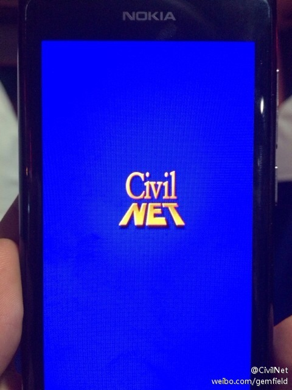
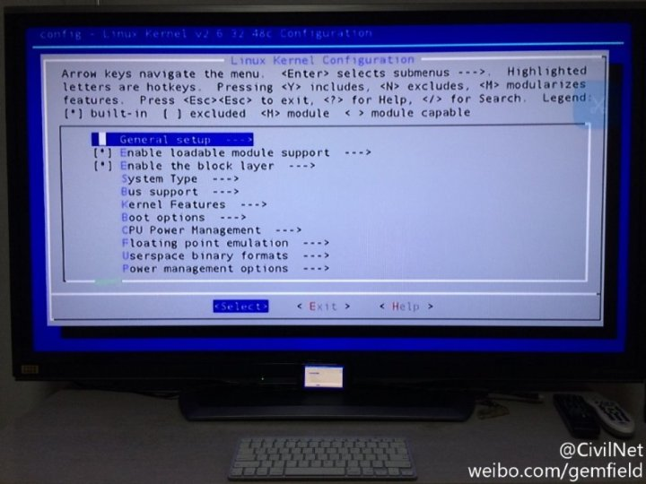
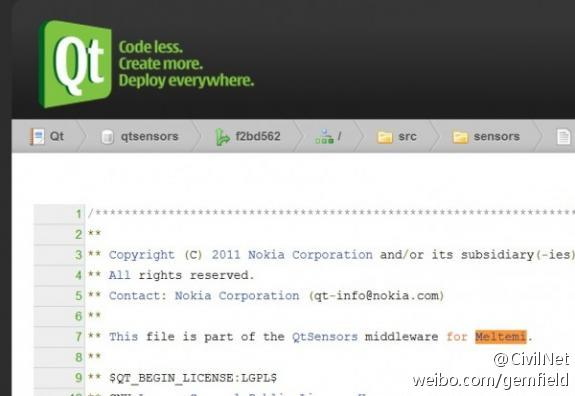
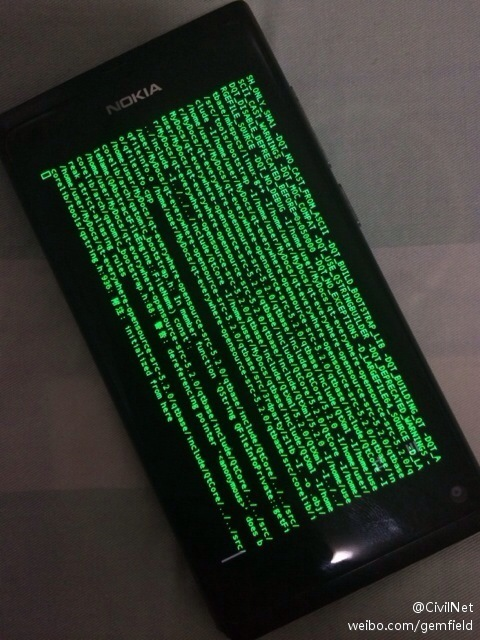

Gemfield最终下定决心要将诺基亚N9购入，是在今年(2011年)的五月份，比埃诺普在新加坡connection大会上发布N9还要早一个月。得益于CivilNet社区对于硬件设备和Qt的关注，各种曝光N9的帖子早已层出不穷。

（N9的开机LOGO）

但是对于Gemfield来说，下定决心购买和最终能够购买是两个截然不同的概念——即使后来N9的惊艳亮相强化了这种购买欲。因为财政的预算制度，要购买N9，还需要Leaflower的批准，Leaflower是Gemfield的立法机构。是的，Leaflower就是Gemfield的国会。这一点可能和你们镇上的感受完全不同，在你们镇上，比如官员花纳税人钱购买ipod作u盘、或者包养情妇什么的，是不需要谁批准的。而在Gemfield这里，最近的一次否决案发生在Gemfield购买2011款mba上。

接下来就是gemfield向leaflower申请购买N9的时间了，考虑到它上市的时间是在十月中旬，gemfield的时间似乎很充裕。

“我的5800最近总是花屏，考虑到它已经服役2年，并且过了保修，”gemfield说道，“我考虑换个N9。”

“维修确实不划算，”leaflower体贴的回答道，“但为什么是N9？”

“考虑到我平常经常在路上使用网络，看看CivilNet BOOK什么的，所以需要wcdma制式的高分辨率手机。”gemfield小心翼翼的说道。

“但为什么是N9？”leaflower不依不饶。

“N9有出色的工业设计，独特的气质让我一见钟情，”gemfield的内心有些拿捏不准，“就像第一次遇到你一样……”

“你这么说也不是没有道理，”leaflower微喜，“但若是美丽的外表下没有内涵，则不免有些轻浮。”

“相比N9出色的外观，它的内涵则更胜一筹，”gemfield似乎等到了机会。

“说说看吧。”leaflower有点疑惑。

Gemfield这才娓娓道来：“诺基亚N9背后搭载的是meego操作系统，meego是linux基金会的商标，meego也是一个开源的项目，也就是说，诺基亚N9拥有世界上最自由的灵魂……”

Leaflower打断了gemfield的话：“可我从CivilNet社区得知，2月份的时候诺基亚就放弃了与intel的合作，转到了微软阵营。”

“没错，但是meego其实是一个linux发行版，我看中meego，是因为其基于linux kernel、Qt
framework和其它各种中间件，”gemfield不敢怠慢，“购买N9，更看重的是基于Qt和linux的软件，这是一个自由的世界。”

“但假若linux和Qt这些项目也不幸放弃了呢？就像之前大家期盼的MeeGo项目一样。”leaflower似乎有点挑衅。

“linux基于GPL协议，Qt基于LGPL协议，我看中它们，是因为GPL文化，”gemfield认真的说道，“要是往深了说，购买N9就是支持GNU
public license。”

长久以来，gemfield在职业生涯或者生活上所受的深刻影响，最大的莫过于Richard
stallman创建的GNU项目。诗曰：“知我者，谓我心忧；不知我者，谓我何求。”在中国，有多少人，关注GNU可以胜过权和钱。

Leaflower紧追不舍：“假设GNU项目也不存在了？”

“我欣赏GNU，是因为它代表了自由、公平、平等、互助的价值观，反对一切的垄断、独裁、不公、要挟”,gemfield说到。

“若是自由、公平这些也变得更糟糕呢？”leaflower似乎想不明白，N9的内涵已经牵扯到普世价值观了。

“还能比当下更糟糕吗？”gemfield反问到。

其实gemfield知道，要通过leaflower这个国会的批准，肯定不是一朝一夕的事。但是对于N9，只是因为在网上多看了一眼，便再也无法忘掉她的容颜。

我记得在诺基亚发布N9的前夕，其CEO埃诺普曾经说过，“诺基亚将要发布一款具有市场破坏力的产品”，其还说过：“Qt是诺基亚的一颗未经加工过的宝石”。那么，埃诺普为什么还要投向微软的阵营呢？其所大力宣扬的生态系统论，难道就是助力wp成为可以和ios、android相抗衡的三大生态系统之一？难道移动平台上的三大生态至此全被美国收入囊中？难道地球上所有的智能手机都将为美国公司打工？难道木马CEO果然名不虚传？难道N9就要用它初生的涉世未深的身躯抗衡帝国的垄断？

从六月份发布N9的盛夏酷暑，时间很快到了“一叶落而知秋”的丝丝寒意。

“你说，诺基亚为什么会落败下来？”leaflower虔诚的问道，“诺基亚的symbian可一度是智能手机的代名词。”

“可能它曾经太过强大了，以至于没有对手可以与其抗衡。”gemfield不敢怠慢，“为什么市场经济是好的，因为它提供了人们选择的权利。有了这个选择，对于服务提供者来说，就有了学习和前进的动力；对于消费者来说，有了这个选择，就显得珍贵而不是那么脆弱，个体就会有尊严而不是那么卑微。所以说，市场经济对经济活动双方都是好事。政府服务是一个镇上的最大服务，比如有国防服务、教育服务、交通服务、社会服务等等，镇政府就是镇上市场中最大的服务提供商，那它有什么理由是不可以选择的呢？对于不能选择政府服务提供商这样的镇子，有什么资格要求被承认为市场经济地位？其提供的政府服务，也必然像过去的诺基亚手机一样，每况愈下。如果不变革的话，最终将被每个人抛弃。”

Leaflower赞许的说到：“能不能具体点？”

“就我这个消费者来说，能给我带来最后一次感动的诺基亚手机是6120，之后，不论是屏幕分辨率、用户体验、硬件性能等，都已满足不了我的需求，”gemfield说到，“还有，渠道太混乱，交易大多停留在讨价还价、勾心斗角、耍小聪明这种最原始、恶心、愚昧的交易方式上！”

“N9是一切变革的开始！”gemfield开始为自己购买N9造势了，“她有很多第一。”就像gemfield在CivilNet
BBS上总结的那样，下面就是N9的荣誉：

第一、N9是世界上第一款meego手机；

第二、N9是世界上唯一一款meego手机；

第三、N9是埃洛普任CEO后发布的第一款手机；

第四、N9是第一款原生由Qt开发应用的手机；

第五、N9是诺基亚3位数字命名手机前的最后一款手机；

第六、N9是发布和上市距离时间最长的手机；

第七、N9是第一款主动放弃大多国家的市场的手机；

第八、N9是第一款在诺基亚专卖店前树立倒计时牌的手机；

第九、N9的模具将被世界上第一款诺基亚wp手机采用（所以提到第一款wp诺基亚手机时，总会提到N9）；

第十、N9是诺基亚第一款在北京地铁投放长达100米长幅广告的手机；

十一、N9是第一款采用swipe手势操作的手机；

十二、N9是诺基亚新战略以来发布的第一款手机；

十三、N9是诺基亚第一款大量铺货的maemo手机（maemo6 Harmatton，由于采用兼容meego的Qt API，也被称作MeeGo
Harmatton）；

十四、N9是诺基亚第一款主频达到1G hz 的手机；

十五、N9是第一款采用凸面屏幕的手机；

十六、N9是被其CEO称作具有市场破坏性作用的手机；

十七、N9是屏幕分辨率最大诺基亚手机；

十八、N9是第一款正面没有任何物理按键的手机；

十九、N9是第一款采用杜比数字+解码和杜比后处理耳机技术的智能手机；

二十、 N9是世界上第一款采用WebKit2作为浏览器引擎的手机 ；

“重要的是，变革已经发生。”gemfield说到。这里需要太多的变革！

“但是,听说N9的软件应用很少,这个真是让人难过,”leaflower说道。

“不要掉入数字陷阱，ios的应用数量从5万到40万，对你来说真的价值提升了很多吗？”Gemfield以惯有的反问语气质疑，甚至有点咄咄逼人，“你们镇政府的财税从4亿狂飙到10亿，就表示你们吃的更安全？住房更容易？交通更方便？看病更便宜？校车更安全？环境更清洁？”

“再说了，iOS、Android、MeeGo都是UNIX家族，本是同根生，相煎何太急？”Gemfield意犹未尽，“只是MeeGo选择了更free（自由）的方式。”

“和自由软件比软件数量？”Gemfield停顿了一会儿，“那是可笑的表现！”

“可笑？”Leaflower追问。

“可笑！”Gemfield依然坚定，“自由软件运行在数不清的服务器上、机顶盒、路由器、车载终端、超级计算机、移动平台、手机上……”

“但是对于N9……”

“拥抱Qt、拥抱Linux、拥抱GNU……软件是会有的，生活也会更美好的。”Gemfield总结到。

（N9上编译Linux kernel）

等待N9的日子实在是煎熬，诺基亚官方所说的上市日期还有一个月了。5800已经彻底花屏，要使用的话必须用热吹风对着5800的屏幕吹上一会儿，或者放在惠普笔记本的cpu风扇口。曾经沧海难为水，因为N9，手机已经被我归为2类：一类是N9，一类是非N9。我只关注前者。

“哈，我听说Intel正式放弃了MeeGo，和三星合作了一个TIZEN项目，用来代替MeeGo。”某日闲暇时刻，leaflower讨论起了这个话题。

“我必须澄清这件事情，”gemfield心急如焚，“为什么elop会说N9是最后一款Meego手机，而且不考虑N9的市场受欢迎程度？”

“为什么？”leaflower再一次疑惑。

“因为N9用的是MeeGo Harmattan系统，而非Meego系统。”gemfield铿锵有力的说到。

“这是什么和什么？”leaflower大为惊讶，“Meego Harmattan难道不是Meego 的harmattan（版本）？”

“人民银行是人民的银行吗？”

“不是……”

“人民医院是人民的医院吗？”

“不是……”

“人民公仆是人民的公仆吗？”

“更不是……”

“人民政……”

“我理解了，”leaflower若有所思，“也就是说meego harmattan不是meego的harmattan？！那你再说详细点。”

“meego项目是由intel的moblin 2.x 和nokia的maemo 6 合并（merge）而来，这个你知道吧？”gemfield似乎在轻描淡写。

“知道，然后呢？”

“那要了解N9的harmattan，就不得不了解诺基亚的maemo系统。”gemfield说到，“Maemo是一个基于 Debian（一个Linux发行版）
的系统平台，它已经被应用在诺基亚N770、N800、N810和N900上。Nokia与很多开源软件项目（如Linux内核，Debian，GNOME）合作，共同开发Maemo平台。Maemo本身基于Debian因此具有很多Debian特性。N9上的deb软件包就是debian系的特性！”

“maemo的第一个有名字的开发代号是Mistral，大约在2006年初，那时候你大学还未毕业，”gemfield说到，“你知道Mistral是什么意思？”

“愿闻其详。”

“密史脱拉风（法国地中海沿岸地带的一种干冷北风），”gemfield回答道，“第二个代号是Scirocco，什么意思？”

“什么意思？”leaflower木然。

“ 热风；从非洲吹向南欧一带的非洲热风，”gemfield说到：“下一个版本的代号是Gregale，知道是什么吗？”

“不会也是风吧？”leaflower将信将疑。

“没错，是格雷大风（地中海中部及西部的一种强烈东北风），”gemfield自信心大增。“下一个代号是Bora，布拉风（吹袭亚德里亚海沿岸的季节性东北冷风）；再下一个代号是Chinook，钦诺克风，美国洛矶山脉东侧的焚风；再下一个是Diablo，是
San Francisco Bay
Area地区的一种热干风；下面的代号你应该就熟悉了，它就是Fremantle，西澳大利亚的一种风，这个版本的maemo就是用在诺基亚N900上的maemo
5。”

Gemfield继续说道：“在maemo 5
的基础上，诺基亚提出了maemo6的框架，开发代号为harmattan，（非洲干燥含沙的）哈麦丹风。也就是说，现在的meego harmattan沿袭自
N900 的 maemo5，包管理系统等主要部分未变，最大的改变是将 GUI 工具包由 GTK+ 换作 Qt。而在最表层的 UI 方面，则与类似 PC
操作系统的maemo 5 有很大不同，带有比较明显的 Peter Skillman 的风格，也就是说有一些
WebOS的影子。而这一切，和Meego没有关系。”

Gemfield继续补充：“将一款大量采用Maemo系统代码的手机称作Meego手机并不准确，但采用了完全兼容Meego1.2的应用程序接口(API)，这意味着系统的差别对用户和开发者来说并不会特别明显。Meego的开发工具meego
sdk实质就是基于Qt Sdk，Qt是诺基亚重点打造的生态系统，maemo 6本来就是要过渡到Qt框架下，所以兼容meego的API是很自然的事情。”

“我到现在才明白MeeGo Harmattan不是meego的harmattan的真正意思，”leaflower恍然大悟。

“不错，之所以叫MeeGo，那是市场营销方面以及合作条约方面的事情，在软件开发上，只是Maemo
Harmattan，而非MeeGo。”gemfield继续说道：“为什么爱诺普在N9发布会上可以不谈操作系统，连MeeGo一个字都没提到？这或许是真相。”

（Qt支持Meltemi）

  

“对了，CivilNet社区里还有一个消息，作为对TIZEN的回应，诺基亚好像在研发一款新的基于linux的手机操作系统，叫作Meltemi系统，这是不是真的？”leaflower
问道。

“傻瓜，meltemi是什么意思？美尔丹风，爱琴海上的强烈的干燥的北风！”gemfield说道，“这或许是‘N9是最后一款meego手机’的真相！！”

…………

“埃诺普所说的新的生态系统确实是wp7吗？”leaflower将信将疑。

“他确实是不惜自己的名誉，为微软的wp鼓与呼。”gemfield继续到：“但对于诺基亚的价值观来说，如果说这个新生态系统是指Qt生态系统，我觉得更合逻辑点。”对于TIZEN来说，继承来自Meego的Qt框架也将会是水到渠成的事情，不管intel和samsung愿不愿意。

如果诺基亚将Qt开发包移植到Windows
Phone7上，那么意味着开发者将可以同时为诺基亚3款主要操作系统开发应用。但埃洛普已经否认诺基亚将在Windows
Phone7上启用Qt。诺基亚对于Windows
Phone7平台上Qt的态度前后矛盾。在N9的发布会上，诺基亚将Qt描述成未来移动开发的关键部分。然而，如果Qt不支持Windows
Phone7，那么很难想象Qt为何会成为诺基亚移动战略的一部分。诺基亚或许会将Qt瞄准Symbian用户，但由于Symbian将于2014年退出市场，因此这样做无法取得成功。

“尽管有上面的矛盾，但我相信，Qt生态系统是诺基亚成功的关键。既然Qt支持windows、wince，那我想，既然Qt已经移交给开发者社区的Meritocratic
governance model模式下，未来凭借nokia地图，也许可以用倒逼的方式支持wp7。”gemfield期许的说道。

（N9上编译Qt）

在“对话诺基亚”的博客于世纪光棍节宣布N9上市消息之前，gemfield的N9最终得到了Leaflower的批准；现在黑色N9已经在gemfield这里服役了，蓝色和红色也将陆续来到CivilNet社区。N9的到来，不光对于诺基亚有着承前启后的重要意义，对于像gemfield这些CivilNet社区的maintainer以及坚定守护CivilNet核心价值观的人来说，也送来了别具一格的精神慰藉:
“我能经得住多大诋毁/就能担得起多少赞美 /如果未来才会精彩 /我也绝不放弃现在/你也许认为我疯狂 /就像我认为你太过平常”。

【Gemfield 2011年发表此文于CivilNet BLOG，随着今年CivilNet BLOG今年停止服务，本文迁移至此专栏。】

