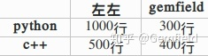
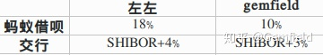

为什么国与国之间总会发生贸易往来？为什么一个人不管多么弱小总有可取之处？有那么一些问题，人们平常并没有给予过多关注，因为这些问题发生的总是太过于自然，人们只是有意无意中就忽略了它们。但是了解这些问题的答案以及内在逻辑，我们就可以获得足够的信念，进而可以确信，从古至今，不管是大到一个国家，还是小到个人，不管表面上看起来多么积贫积弱，甚至微小如蝼蚁，但在内在逻辑上，却总是有可取之处，总有那么一个维度可以让世界依赖，总有些闪光的地方可以照亮某个角落，让他人得以发现并产生合作的意愿。这就是比较优势。

##  **绝对优势和比较优势**

当说到比较优势，大多数人都理解错了。比如说左左一天能写1000行python代码，而gemfield一天能写300行python代码，于是两相比较，便说左左比gemfield在写python代码方面有优势，于是称之为左左对gemfield在写python代码上的比较优势......这是错的！这种优势叫做
**绝对优势** 。亚当·斯密首先将绝对优势这一概念用作国际贸易的基础，但这明显是有缺陷的，因为在这世界如果进行合作依从的是 **绝对优势**
这个理论，那么如果左左不光python比gemfield写的好，c++代码也写的比gemfield好，那左左和gemfield就绝无合作的必要了。然而现实并非这样。因为产生合作的基础是
**比较优势** 。这是经济学领域一个比较反直觉的概念，下面就来详细解释下。

  

假设左左每天能写1000行python代码或者500行c++代码，而gemfield每天能写300行python代码或者400行c++代码；而项目（不管是左左的还是gemfield的项目）既需要python也需要c++，看起来左左不论是在写python还是c++上面都碾压gemfield，那左左在做项目时还需要和gemfield合作吗？

左左和gemfield每天的编码能力

如果左左和gemfield从未产生什么合作，那么左左为了赶自己的项目，每天各花一半的时间在c++和python上，于是一天生产出500行python和250行c++代码；而gemfield也遵守了同样的逻辑在自己的项目上，于是一天生产出了150行python代码和200行c++代码，于是2个人在各自的项目上合计产生了650行python代码和450行c++代码。

按道理来说，gemfield不管是在python还是c++上都被左左碾压，应该是不会和左左有什么合作机会的，可是，gemfield还是找到了左左，提出用自己的c++代码能力交换左左的python能力......

于是，按照gemfield的分工设想，gemfield全天只写c++代码，左左每天10%的时间写c++，而90%的时间写python代码；于是gemfield每天生产出400行c++代码和0行python代码，而左左每天生产出50行c++代码（500
* 10%）和900行python代码（1000 *
90%）。这样两人每天合计生产出450行c++代码和900行python代码，奇迹产生了！比之前各自独立写代码的时代多生产了250行python代码！

这就意味着，两个人的合作可以多产生250行python代码的收益！

至于怎么分享这多出来的250行代码的收益，这是gemfield和左左要谈判的事情了，收益的比例取决于诸多的因素，就不一一描述了（比如看谁更愿意追求这新产生的蛋糕了，谁更诡计多端了，谁谈判实力更强了等等）。总之，即使gemfield每一样都比左左差，但是合作交换也是有价值的，也能产生多余的蛋糕。在这件事情上，我们可以说左左在python和c++上拥有
**绝对优势** ，而gemfield在c++上拥有 **比较优势** （也叫相对优势），左左在python上拥有比较优势。

##  **利率互换**

左左和gemfield不只在编码上会发生有趣的事情，也会探讨如何在艰苦的日子中怎么借钱去吃大餐。gemfield的蚂蚁借呗的利率是10%，交行的利率是SHIBOR+3%；左左的蚂蚁借呗的利率是18%，交行的利率是SHIBOR+4%。

左左和gemfield借钱的利率

看起来，gemfield不管是在蚂蚁借呗还是在交通银行上，借钱的利率都比左左低，也就是gemfield在这两个借款市场上都拥有绝对优势（可能是因为gemfield的芝麻分高吧），而左左自然都是绝对劣势，但在交行上拥有比较优势。现在为了吃大餐，那种很大的大餐，需要很多钱。而gemfield和左左都是月光族，于是需要借钱去吃大餐。

gemfield想吃的大餐是鹿港小镇，只有在交行买单吧App上购买才有折扣优惠，因此gemfield需要从交行借款100元；左左想吃的大餐是火炉火，只有在支付宝的口碑上购买才有折扣优惠，因此左左需要从蚂蚁借呗借款100元。

如果gemfield和左左不相往来，那么gemfield为了吃鹿港小镇而产生的利息是100*(SHIBOR+3%)；左左为了吃火炉火而产生的利息是100*18%;两个人产生的利息总和就是100*(SHIBOR+3%+18%);
如果gemfield和左左合作制定一个互换条款，根据上一章节的比较优势的原理，左左和gemfield为了创造出更大的利益，左左应尽可能的从交行借钱(产生的利息是SHIBOR+4%)，而gemfield应尽可能的从蚂蚁借呗借钱(产生的利息是10%)。然后两者再进行互换，这样产生的利息总和是100*(SHIBOR+4%+10%)。

**奇迹又产生了** ，通过设计互换产品，gemfield和左左可以少产生利息100*(SHIBOR+3%+18%) -
100*(SHIBOR+4%+10%)，
也就是少产生了100*7%的利息。至于这7%的蛋糕利益如何被gemfield和左左分配，取决于各种原因（比如谁更贪吃更期望达成合作，谁更不拘小节等等），但不管怎么说，两人都不同程度的收益，没有人受损。

再回顾一下这个奇迹，按理来说，gemfield在蚂蚁借呗和交行上都可以用更低的利息获得借款，因此直觉上gemfield是不会和左左合作的，但比较优势的内在逻辑却向我们展示了非直觉的魅力。通过互换交易，gemfield和左左或节约了7%的利息。如果左左更贪吃更急于达成合作，愿意以1：6的比例来分享这个收益。这就导致gemfield会节约6%的利息，左左会节约1%的利息。天啊，这之前，gemfield可是在每个借款市场上都拥有更低的借款利息啊！

##  **比较优势的赞歌**

从古至今，不管是大到一个国家，还是小到个人，不管表面上看起来多么积贫积弱，甚至微小如蝼蚁，而在内在逻辑上，每个国家或者个人却总有可取之处，总有那么一个维度可以让世界依赖，总有些闪光的地方可以照亮某个角落，让他人得以发现并产生合作的意愿。这也正是为什么每个人总有可歌可泣的地方，这也是不管国际局势如何风云变幻，国际贸易从未也不会灭绝的本质原因。这是一首比较优势的赞歌。

