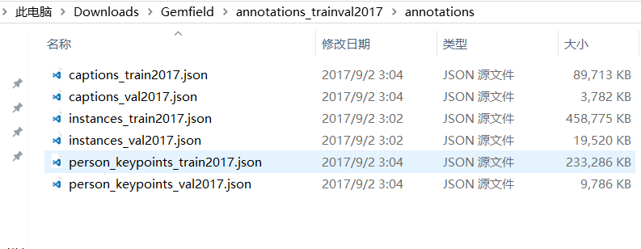

COCO的 全称是Common Objects in COntext，是微软团队提供的一个可以用来进行图像识别的数据集。MS
COCO数据集中的图像分为训练、验证和测试集。COCO通过在Flickr上搜索80个对象类别和各种场景类型来收集图像，其使用了亚马逊的Mechanical
Turk（AMT）。

比如标注 **image captions（看图说话）这种类型** 的步骤如下：

（AMT上COCO标注步骤）

COCO通过大量使用Amazon Mechanical Turk来收集数据。COCO数据集现在有3种标注类型： **object
instances（目标实例）, object keypoints（目标上的关键点）, 和image captions（看图说话）**
，使用JSON文件存储。比如下面就是Gemfield下载的COCO 2017年训练集中的标注文件：

可以看到其中有上面所述的三种类型，每种类型又包含了训练和验证，所以共6个JSON文件。

##  **基本的JSON结构体类型**

object instances（目标实例）、object keypoints（目标上的关键点）、image
captions（看图说话）这3种类型共享这些基本类型：info、image、license。

而annotation类型则呈现出了多态：

    
    
    {
        "info": info,
        "licenses": [license],
        "images": [image],
        "annotations": [annotation],
    }
        
    info{
        "year": int,
        "version": str,
        "description": str,
        "contributor": str,
        "url": str,
        "date_created": datetime,
    }
    license{
        "id": int,
        "name": str,
        "url": str,
    } 
    image{
        "id": int,
        "width": int,
        "height": int,
        "file_name": str,
        "license": int,
        "flickr_url": str,
        "coco_url": str,
        "date_captured": datetime,
    }

1，info类型，比如一个info类型的实例：

    
    
    "info":{
    	"description":"This is stable 1.0 version of the 2014 MS COCO dataset.",
    	"url":"http:\/\/mscoco.org",
    	"version":"1.0","year":2014,
    	"contributor":"Microsoft COCO group",
    	"date_created":"2015-01-27 09:11:52.357475"
    },

2，Images是包含多个image实例的数组，对于一个image类型的实例：

    
    
    {
    	"license":3,
    	"file_name":"COCO_val2014_000000391895.jpg",
    	"coco_url":"http:\/\/mscoco.org\/images\/391895",
    	"height":360,"width":640,"date_captured":"2013-11-14 11:18:45",
    	"flickr_url":"http:\/\/farm9.staticflickr.com\/8186\/8119368305_4e622c8349_z.jpg",
    	"id":391895
    },

3，licenses是包含多个license实例的数组，对于一个license类型的实例：

    
    
    {
    	"url":"http:\/\/creativecommons.org\/licenses\/by-nc-sa\/2.0\/",
    	"id":1,
    	"name":"Attribution-NonCommercial-ShareAlike License"
    },

##  **Object Instance 类型的标注格式**

**1，整体JSON文件格式**

比如上图中的instances_train2017.json、instances_val2017.json这两个文件就是这种格式。

Object Instance这种格式的文件从头至尾按照顺序分为以下段落：

    
    
    {
        "info": info,
        "licenses": [license],
        "images": [image],
        "annotations": [annotation],
        "categories": [category]
    }

是的，你打开这两个文件，虽然内容很多，但从文件开始到结尾按照顺序就是这5段。其中，info、licenses、images这三个结构体/类型
在上一节中已经说了，在不同的JSON文件中这三个类型是一样的，定义是共享的。不共享的是annotation和category这两种结构体，他们在不同类型的JSON文件中是不一样的。

images数组元素的数量等同于划入训练集（或者测试集）的图片的数量；

annotations数组元素的数量等同于训练集（或者测试集）中bounding box的数量；

categories数组元素的数量为80（2017年）；

    
    
    >>> ann_train_file='annotations/instances_train2017.json'
    >>> coco_train = COCO(ann_train_file)
    loading annotations into memory...
    Done (t=19.30s)
    creating index...
    index created!
    
    >>> len(coco_train.dataset['categories'])
    80
    >>> len(coco_train.dataset['images'])
    118287
    >>> len(coco_train.dataset['annotations'])
    860001
    >>>

**2，annotations字段**

annotations字段是包含多个annotation实例的一个数组，annotation类型本身又包含了一系列的字段，如这个目标的category
id和segmentation
mask。segmentation格式取决于这个实例是一个单个的对象（即iscrowd=0，将使用polygons格式）还是一组对象（即iscrowd=1，将使用RLE格式）。如下所示：

    
    
    annotation{
        "id": int,    
        "image_id": int,
        "category_id": int,
        "segmentation": RLE or [polygon],
        "area": float,
        "bbox": [x,y,width,height],
        "iscrowd": 0 or 1,
    }

注意，单个的对象（iscrowd=0)可能需要多个polygon来表示，比如这个对象在图像中被挡住了。而iscrowd=1时（将标注一组对象，比如一群人）的segmentation使用的就是RLE格式。

注意啊，只要是iscrowd=0那么segmentation就是polygon格式；只要iscrowd=1那么segmentation就是RLE格式。另外，每个对象（不管是iscrowd=0还是iscrowd=1）都会有一个矩形框bbox
，矩形框左上角的坐标和矩形框的长宽会以数组的形式提供，数组第一个元素就是左上角的横坐标值。

area是area of encoded masks，是标注区域的面积。如果是矩形框，那就是高乘宽；如果是polygon或者RLE，那就复杂点。

最后，annotation结构中的categories字段存储的是当前对象所属的category的id，以及所属的supercategory的name。

下面是从instances_val2017.json文件中摘出的一个annotation的实例，这里的segmentation就是polygon格式：

    
    
    {
    	"segmentation": [[510.66,423.01,511.72,420.03,510.45......]],
    	"area": 702.1057499999998,
    	"iscrowd": 0,
    	"image_id": 289343,
    	"bbox": [473.07,395.93,38.65,28.67],
    	"category_id": 18,
    	"id": 1768
    },

polygon格式比较简单，这些数按照相邻的顺序两两组成一个点的xy坐标，如果有n个数（必定是偶数），那么就是n/2个点坐标。下面就是一段解析polygon格式的segmentation并且显示多边形的示例代码：

    
    
    import numpy as np
    import matplotlib.pyplot as plt
    import matplotlib
    from matplotlib.patches import Polygon
    from matplotlib.collections import PatchCollection
    fig, ax = plt.subplots()
    polygons = []
    num_sides = 100
    gemfield_polygons = [[125.12, 539.69, 140.94, 522.43......]]
    gemfield_polygon = gemfield_polygons[0]
    max_value = max(gemfield_polygon) * 1.3
    gemfield_polygon = [i * 1.0/max_value for i in gemfield_polygon]
    poly = np.array(gemfield_polygon).reshape((int(len(gemfield_polygon)/2), 2))
    polygons.append(Polygon(poly,True))
    p = PatchCollection(polygons, cmap=matplotlib.cm.jet, alpha=0.4)
    colors = 100*np.random.rand(1)
    p.set_array(np.array(colors))
    
    ax.add_collection(p)
    plt.show()

如果iscrowd=1，那么segmentation就是RLE格式(segmentation字段会含有counts和size数组)，在json文件中gemfield挑出一个这样的例子，如下所示：

    
    
    segmentation : 
    {
        u'counts': [272, 2, 4, 4, 4, 4, 2, 9, 1, 2, 16, 43, 143, 24......], 
        u'size': [240, 320]
    }

COCO数据集的RLE都是uncompressed RLE格式（与之相对的是compact RLE）。
RLE所占字节的大小和边界上的像素数量是正相关的。RLE格式带来的好处就是当基于RLE去计算目标区域的面积以及两个目标之间的unoin和intersection时会非常有效率。
上面的segmentation中的counts数组和size数组共同组成了这幅图片中的分割
mask。其中size是这幅图片的宽高，然后在这幅图像中，每一个像素点要么在被分割（标注）的目标区域中，要么在背景中。很明显这是一个bool量：如果该像素在目标区域中为true那么在背景中就是False；如果该像素在目标区域中为1那么在背景中就是0。对于一个240x320的图片来说，一共有76800个像素点，根据每一个像素点在不在目标区域中，我们就有了76800个bit，比如像这样（随便写的例子，和上文的数组没关系）：00000111100111110...；但是这样写很明显浪费空间，我们直接写上0或者1的个数不就行了嘛（Run-
length encoding)，于是就成了54251...，这就是上文中的counts数组。下面这个python代码片段直观的显示了这些bit：

    
    
    rle = [272, 2, 4, 4, 4, 4, 2, 9, 1, 2, 16, 43, 143, 24, 5, 8......]
    assert sum(rle) == 240*320

也可以使用下面的代码将这个rle数组表示的分割区域画出来：

    
    
    import numpy as np
    import matplotlib.pyplot as plt
    rle = [272, 2, 4, 4, 4, 4, 2, 9, 1, 2, 16, 43, 143, 24, 5, 8......]
    assert sum(rle) == 240*320
    M = np.zeros(240*320)
    N = len(rle)
    n = 0
    val = 1
    for pos in range(N):
        val = not val
        for c in range(rle[pos]):
            M[n] = val
            n += 1
    
    GEMFIELD = M.reshape(([240, 320]), order='F')
    plt.imshow(GEMFIELD)
    plt.show()

**3，categories字段**

categories是一个包含多个category实例的数组，而category结构体描述如下：

    
    
    {
        "id": int,
        "name": str,
        "supercategory": str,
    }

从instances_val2017.json文件中摘出的2个category实例如下所示：

    
    
    {
    	"supercategory": "person",
    	"id": 1,
    	"name": "person"
    },
    {
    	"supercategory": "vehicle",
    	"id": 2,
    	"name": "bicycle"
    },

至2017年的时候，一共有80个category。

##  **Object Keypoint 类型的标注格式**

**1，整体JSON文件格式**

比如上图中的person_keypoints_train2017.json、person_keypoints_val2017.json这两个文件就是这种格式。

Object Keypoint这种格式的文件从头至尾按照顺序分为以下段落，看起来和Object Instance一样啊：

    
    
    {
        "info": info,
        "licenses": [license],
        "images": [image],
        "annotations": [annotation],
        "categories": [category]
    }

是的，你打开这两个文件，虽然内容很多，但从文件开始到结尾按照顺序就是这5段。其中，info、licenses、images这三个结构体/类型
在第一节中已经说了，在不同的JSON文件中这三个类型是一样的，定义是共享的。不共享的是annotation和category这两种结构体，他们在不同类型的JSON文件中是不一样的。

images数组元素数量是划入训练集（测试集）的图片的数量；

annotations是bounding box的数量，在这里只有人这个类别的bounding box；

categories数组元素的数量为1，只有一个：person（2017年）；

**2，annotations字段**

这个类型中的annotation结构体包含了Object Instance中annotation结构体的所有字段，再加上2个额外的字段。

新增的keypoints是一个长度为3*k的数组，其中k是category中keypoints的总数量。每一个keypoint是一个长度为3的数组，第一和第二个元素分别是x和y坐标值，第三个元素是个标志位v，v为0时表示这个关键点没有标注（这种情况下x=y=v=0），v为1时表示这个关键点标注了但是不可见（被遮挡了），v为2时表示这个关键点标注了同时也可见。

num_keypoints表示这个目标上被标注的关键点的数量（v>0），比较小的目标上可能就无法标注关键点。

    
    
    annotation{
        "keypoints": [x1,y1,v1,...],
        "num_keypoints": int,
        "id": int,
        "image_id": int,
        "category_id": int,
        "segmentation": RLE or [polygon],
        "area": float,
        "bbox": [x,y,width,height],
        "iscrowd": 0 or 1,
    }

从person_keypoints_val2017.json文件中摘出一个annotation的实例如下：

    
    
    {
    	"segmentation": [[125.12,539.69,140.94,522.43...]],
    	"num_keypoints": 10,
    	"area": 47803.27955,
    	"iscrowd": 0,
    	"keypoints": [0,0,0,0,0,0,0,0,0,0,0,0,0,0,0,142,309,1,177,320,2,191,398...],
    	"image_id": 425226,"bbox": [73.35,206.02,300.58,372.5],"category_id": 1,
    	"id": 183126
    },

**3，categories字段**

最后，对于每一个category结构体，相比Object
Instance中的category新增了2个额外的字段，keypoints是一个长度为k的数组，包含了每个关键点的名字；skeleton定义了各个关键点之间的连接性（比如人的左手腕和左肘就是连接的，但是左手腕和右手腕就不是）。目前，COCO的keypoints只标注了person
category （分类为人）。

定义如下：

    
    
    {
        "id": int,
        "name": str,
        "supercategory": str,
        "keypoints": [str],
        "skeleton": [edge]
    }

从person_keypoints_val2017.json文件中摘出一个category的实例如下：

    
    
    {
    	"supercategory": "person",
    	"id": 1,
    	"name": "person",
    	"keypoints": ["nose","left_eye","right_eye","left_ear","right_ear","left_shoulder","right_shoulder","left_elbow","right_elbow","left_wrist","right_wrist","left_hip","right_hip","left_knee","right_knee","left_ankle","right_ankle"],
    	"skeleton": [[16,14],[14,12],[17,15],[15,13],[12,13],[6,12],[7,13],[6,7],[6,8],[7,9],[8,10],[9,11],[2,3],[1,2],[1,3],[2,4],[3,5],[4,6],[5,7]]
    }

##  **Image Caption的标注格式**

**1，整体JSON文件格式**

比如上图中的captions_train2017.json、captions_val2017.json这两个文件就是这种格式。

**Image Caption** 这种格式的文件从头至尾按照顺序分为以下段落，看起来和Object
Instance一样，不过没有最后的categories字段：

    
    
    {
        "info": info,
        "licenses": [license],
        "images": [image],
        "annotations": [annotation]
    }

是的，你打开这两个文件，虽然内容很多，但从文件开始到结尾按照顺序就是这4段。其中，info、licenses、images这三个结构体/类型
在第一节中已经说了，在不同的JSON文件中这三个类型是一样的，定义是共享的。不共享的是annotations这种结构体，它在不同类型的JSON文件中是不一样的。

images数组的元素数量等于划入训练集（或者测试集）的图片的数量；

annotations的数量要多于图片的数量，这是因为一个图片可以有多个场景描述；

**2，annotations字段**

这个类型中的annotation用来存储描述图片的语句。每个语句描述了对应图片的内容，而每个图片至少有5个描述语句（有的图片更多）。annotation定义如下：

    
    
    annotation{
        "id": int,
        "image_id": int,
        "caption": str
    }

从captions_val2017.json中摘取的一个annotation实例如下：

    
    
    {
    	"image_id": 179765,
    	"id": 38,"caption": "A black Honda motorcycle parked in front of a garage."
    }

