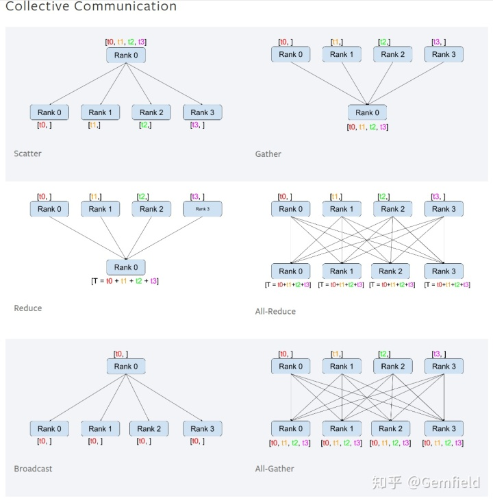

##  **背景**

什么是Pytorch的分布式？试着回答以下问题：

  1. 如果训练数据量太大，我们想要把一大份数据拆分成多份，送给不同的训练进程，通过这种并行处理数据的方式来加快计算速度，那么反向传播中，如何进行权重参数的更新呢？ 
  2. 如果模型网络太大，我们想把一个大的网络拆分成多个片段，每个片段运行在不同的训练进程，那么如何进行前向、反向等逻辑的衔接？如何进行权重参数的更新呢？ 
  3. 如果训练数据量和模型网络都太大，我们既想把一大份数据拆分成多份送往不同的训练进程，又想把一个大的模型网络拆分成多个片段运行在不同的训练进程，那么如何进行前向、反向等逻辑的衔接？如何进行权重参数的更新呢？ 
  4. 如果以上不管网络还是数据的拆分都不止是在同一个机器上（参数在同一个机器的不同CUDA设备中），而且要拆分在不同的机器上（参数在不同的机器的不同CUDA设备中），那么如何进行前向、反向等逻辑的衔接？如何进行权重参数的更新呢？ 
  5. 在一个GTX1080ti卡上基于imagenet训练一个ResNet50需要大约一周的时间，论文 [ https://  arxiv.org/pdf/1706.0267  7.pdf  ](https://link.zhihu.com/?target=https%3A//arxiv.org/pdf/1706.02677.pdf) 在256个GPU上使用8192的batch size训练只需要一个小时，这依靠的是什么？ 

这些问题的答案就是PyTorch的分布式。在你使用PyTorch的过程中，或多或少都遇到了一些关乎分布式的package，比如：

  * THD 
  * C10D 
  * torch.multiprocessing 
  * torch.distributed 
  * DataParallel（DP） 
  * DistributedDataParallel（DDP） 
  * torch.distributed.rpc 

这些package的作用和区别都是什么呢？Gemfield本文基于PyTorch 1.5。

##  **环境准备**

**1，distributed模块介绍**

PyTorch的分布式依赖于torch.distributed模块，但是这个模块并非天然就包含在PyTorch库中。要启用PyTorch
distributed，
需要在源码编译的时候设置USE_DISTRIBUTED=1。目前在Linux系统上编译的时候，默认就是USE_DISTRIBUTED=1，因此默认就会编译distributed模块；而在MacOS上默认是0（你需要手动开启，在PyTorch
1.3的时候才添加了对macOS的支持，使用Gloo
backend）。那么Windows系统呢？Windows不支持distributed（不过没什么关系，现在谁还用Windows呢）。

对于PyTorch的预编译包来说，只有Linux上的包提供了distribute支持，并且CPU版本的backend是Gloo，CUDA版本的backend是NCCL。如果要使用MPI的话，则如上所示我们需要从PyTorch源码进行编译
，也就是在安装有MPI的环境上编译PyTorch。

**2，测试代码准备**

先定义一个数据集，这里直接使用了毫无意义的random数据：

    
    
    import torch
    import torch.nn as nn
    from torch.utils.data import Dataset, DataLoader
    
    class RandomDataset(Dataset):
        def __init__(self, size, length):
            self.len = length
            self.data = torch.randn(length, size)
    
        def __getitem__(self, index):
            return self.data[index]
    
        def __len__(self):
            return self.len

这几个API都是必须的，__getitem__
在for语义里面返回下一次loop的值，__len__是数据集的长度，如果没有定义这个方法，pytorch就会报错：TypeError: object of
type 'RandomDataset' has no len()。

然后定义一个简单的网络：

    
    
    class Model(nn.Module):
        def __init__(self, input_size, output_size):
            super(Model, self).__init__()
            self.fc = nn.Linear(input_size, output_size)
    
        def forward(self, input):
            output = self.fc(input)
            print("\tIn Model: input size", input.size(),"output size", output.size())
            return output

顺便说一句，把数据集从磁盘读到内存中是由DataLoader负责的，DataLoader可以设置worker的数量，Gemfield就不在本文赘述了。此外，如果想要调试GPU的使用率，使用nvprof命令：

    
    
    root@gemfieldhome:/home/gemfield# nvprof --print-gpu-trace -fo gemfield.nvvp python gemfield.py

在本地机器安装nvvp来可视化结果：

    
    
    gemfield@ThinkPad-X1C:~$ sudo apt install nvidia-visual-profiler

这些需要nvidia驱动开启调试支持。

下面开始迎接PyTorch分布式的到来。

##  **torch.multiprocessing**

为了并行的执行计算任务，一个直截了当的思想就是启动多个进程，然后使用IPC的方式进行信息交换——最方便的就是共享内存。PyTorch的multiprocessing模块就来源于此，它封装了python原生的multiprocessing模块，并在API上做到了百分之百的兼容。在此基础上，它注册了定制的reducers,
可以充分使用共享内存的IPC机制来让不同的进程对同一份数据进行读写：

    
    
    import torch.multiprocessing as mp
    from model import MyModel
    
    def train(model):
        for data, labels in data_loader:
            optimizer.zero_grad()
            loss_fn(model(data), labels).backward()
            optimizer.step()  #会更新共享内存中的权重
    
    if __name__ == '__main__':
        num_processes = 4
        model = MyModel()
        #在下面fork新进程之前必须做share_memory的调用
        model.share_memory()
        processes = []
        for rank in range(num_processes):
            p = mp.Process(target=train, args=(model,))
            p.start()
            processes.append(p)
        for p in processes:
            p.join()

但是这种多进程的工作方式在遇到CUDA时有很多局限性，这导致了很多比较突兀的使用限制和代码编写方式：它规定了发送tensor的进程必须怎么怎么样、规定了接收tensor的进程必须怎么怎么样、规定了生产tensor的进程的生命周期必须怎么怎么样、限制不能转发收到的tensor......以至于这些条件只要有一个没有遵守，在CUDA上的multiprocessing就会出现预期之外的行为。为了突破这些限制和掣肘，DataParallel到来了。

##  **DataParallel**

仅仅从模块的名字来看，DataParallel也是为了解决data的并行问题的。DataParallel是为了解决这样的问题的，那就是当输入的batch很大的时候，DataParallel会将模型/网络复制运行到多个CUDA设备上，然后在输入的batch维度上进行切分，这里的切分就是torch
tensor的split()
API。在DataParallel出生的年代，PyTorch官方就开始推荐使用nn.DataParallel来代替multiprocessing。

我们先举个例子——定义数据集的长度为100，batch size为32，fc层的输入是5，输出是2：

    
    
    #数据集的长度为100，batch size为32，fc层的输入是5，输出是2
    input_size = 5
    output_size = 2
    
    batch_size = 32
    data_size = 100
    
    model = Model(input_size, output_size)
    if torch.cuda.device_count() > 1:
        print("Gemfield have ", torch.cuda.device_count(), "GPUs!")
        model = nn.DataParallel(model)
    
    device = torch.device("cuda:0" if torch.cuda.is_available() else "cpu")
    model.to(device)
    rand_loader = DataLoader(dataset=RandomDataset(input_size, data_size),batch_size=batch_size, shuffle=True)
    
    for data in rand_loader:
        input = data.to(device)
        output = model(input)
        print("Outside: input size", input.size(),"output_size", output.size())

本来batch_size是32，但是由于使用了DataParallel，而Gemfield有2个GPU，因此一个batch被划分成了2份，也就是tensor.split(16)，分别送往两个GPU上。值得注意的是：在第一次调用

    
    
    model.to(device)

的时候，模型被加载到了第一个GPU设备上，而在第一次调用

    
    
    output = model(input)

的时候（也就是在进行forward的时候），模型被复制到了其余的GPU上，这里是第2个GPU。程序输出如下（可见大小为32的batch被拆分成了大小为16的batch）：

    
    
    You have 2 GPUs!
            In Model: input size torch.Size([16, 5]) output size torch.Size([16, 2])
            In Model: input size torch.Size([16, 5]) output size torch.Size([16, 2])
    input size torch.Size([32, 5]) output_size torch.Size([32, 2])
            In Model: input size torch.Size([16, 5]) output size torch.Size([16, 2])
            In Model: input size torch.Size([16, 5]) output size torch.Size([16, 2])
    input size torch.Size([32, 5]) output_size torch.Size([32, 2])
            In Model: input size torch.Size([16, 5]) output size torch.Size([16, 2])
            In Model: input size torch.Size([16, 5]) output size torch.Size([16, 2])
    input size torch.Size([32, 5]) output_size torch.Size([32, 2])
            In Model: input size torch.Size([2, 5]) output size torch.Size([2, 2])
            In Model: input size torch.Size([2, 5]) output size torch.Size([2, 2])
    input size torch.Size([4, 5]) output_size torch.Size([4, 2])

我们来总结下DataParallel一次迭代的过程:

  * DataLoader把数据通过多个worker读到主进程的内存中； 
  * 通过tensor的split语义，将一个batch的数据切分成多个更小的batch，然后分别送往不同的CUDA设备； 
  * 在不同的cuda设备上完成前向计算，网络的输出被gather到主CUDA设备上（初始化时使用的设备），loss而后在这里被计算出来； 
  * loss然后被scatter到每个CUDA设备上，每个CUDA设备通过BP计算得到梯度； 
  * 然后每个CUDA设备上的梯度被reduce到主CUDA设备上，然后模型权重在主CUDA设备上获得更新； 
  * 在下一次迭代之前，主CUDA设备将模型参数broadcast到其它CUDA设备上，完成权重参数值的同步。 

上述步骤提到的gather、reduce、scatter、broadcast都是来自MPI为代表的并行计算世界的概念，其中broadcast是主进程将相同的数据分发给组里的每一个其它进程；scatter是主进程将数据的每一小部分给组里的其它进程；gather是将其它进程的数据收集过来；reduce是将其它进程的数据收集过来并应用某种操作（比如SUM），在gather和reduce概念前面还可以加上all，如all_gather，all_reduce，那就是多对多的关系了，如下图所示（注意reduce的操作不一定是SUM，PyTorch目前实现了SUM、PRODUCT、MAX、MIN这四种）：

DataParallel通过复制一个网络到多个cuda设备，然后再split一个batch的data到多个cuda设备，通过这种并行计算的方式解决了batch很大的问题，但也有自身的不足：

  * 它无法跨越机器，DataParallel是单进程多线程的，无法在多个机器上工作； 
  * 它基于多线程的方式，确实方便了信息的交换，但受困于GIL； 
  * 数据集先拷贝到主进程，然后再split到每个CUDA设备上； 
  * 权重参数只在主CUDA上更新，需要每次迭代前向所有的CUDA设备做一次同步； 
  * 每次迭代的网络输出需要gather到主的CUDA设备上； 
  * 如果模型太大需要使用 **model parallel** 的时候，DataParallel目前还不支持； 

这个时候，DistributedDataParallel来了，并且自此之后，不管是单机还是多机，我们都推荐使用DDP来代替DP（DataParallel）。

##  **DistributedDataParallel(DDP)**

DDP基于torch.distributed模块，下面我们通过一个例子来感受下DDP的使用。要使用DDP，需要先熟悉两个概念：Backend和initialization
methods。

**1，initialization methods**

因为DDP是真正的分布式，可以使用多台机器来组成一次并行运算的任务，所以就需要一种方法来给大家传递一个信息——如何联系到其它机器上的进程？目前DDP模块支持3种initialization
methods：

  1. TCP initialization ：init_method **=** 'tcp://10.1.1.20:23456' 
  2. Shared file-system initialization：init_method **=** 'file:///mnt/nfs/sharedfile' 
  3. Environment variable initialization 

**2，Backend**

既然能够在不同的进程间进行通信，那必然是依赖于一些IPC的通信机制，这些通信机制一般是由PyTorch之外的三方实现的。在distributed模块中，一共有4种不同的IPC通信backend：

  * TCP 
  * MPI 
  * Gloo 
  * NCCL 

需要说明的是：

  1. TCP backend已经被废弃了； 
  2. 如果是CPU的训练，则使用MPI或者Gloo，推荐使用Gloo； 
  3. 如果是MPI backend，则不需要指定world_size和rank，因为这两个值由MPI runtime来分配和维护； 
  4. 如果是GPU训练的话，使用NCCL，原厂的库就是快；而且只有NCCL支持InfiniBand和GPUDirect； 
  5. 机器最好使用InfiniBand进行连接，条件不够的话也是支持以太网的（需要设置一下）； 
  6. DDP只支持Gloo和NCCL； 

**3，DDP表演开始**

Gemfield使用下面的脚本作为演示：

[ https://  github.com/CivilNet/Gem
field/blob/master/src/python/ddp/gemfield_ddp.py
](https://link.zhihu.com/?target=https%3A//github.com/CivilNet/Gemfield/blob/master/src/python/ddp/gemfield_ddp.py)

这个脚本是从pytorch/examples项目中的imagenet训练脚本裁剪而来，里面使用了PyTorch的DistributedDataParallel模块。

1，设置环境变量

Gemfield的MLab2.0环境上使用的是CUDA设备，因此使用NCCL
backend；又因为没有IB连接，因此需要设置如下环境变量来禁用IB转而使用以太网（也可以不用设置，NCCL
backend会自动找寻，当然，如果自动找寻失败了，最好就手工来设置）：

    
    
    export NCCL_SOCKET_IFNAME=eth0
    export NCCL_IB_DISABLE=1

将NCCL_IB_DISABLE设置为1来禁止使用InfiniBand，转而使用
IP；如果网络接口不能被自动发现，则手工设置NCCL_SOCKET_IFNAME；如果还有问题，就设置如下的NCCL变量来打印更多的log：

    
    
    export NCCL_SOCKET_IFNAME=eth0
    export NCCL_IB_DISABLE=1
    export NCCL_DEBUG=INFO
    export NCCL_DEBUG_SUBSYS=ALL

比如有时候使用NCCL作为backend的话会遇到如下错误：

    
    
    RuntimeError: NCCL error in: /opt/conda/conda-bld/pytorch_1587428398394/work/torch/lib/c10d/ProcessGroupNCCL.cpp:514, unhandled system error, NCCL version 2.4.8

你就可以设置这些NCCL的环境变量来打印相关日志。

2，启动master进程

也就是启动rank为0的进程（这里我们使用了tcp的初始化方法），我们在Node 0上启动吧：

    
    
    python gemfield_ddp.py -a resnet50 --dist-url 'tcp://172.16.90.44:27030' --gpu 0 --world-size 2 --rank 0 [your_dataset_folder]

DDP的MPI风格的四元组来了：初始化方法、backend、world size、rank。

这里使用了tcp的初始化方法，使用了node 0上的第一块GPU，world-
size为2说明我们group中一共要启动2个进程，rank为0说明这是第1个进程（也就是master进程）。只要group中的进程数还不够，进程就会阻塞在init_process_group调用上。因此，这条命令执行后，master进程就处于等待状态。

3，启动其它非master进程

然后在Node 1上启动rank为1的进程：

    
    
    python gemfield_ddp.py -a resnet50 --dist-url 'tcp://172.16.90.44:27030' --gpu 0 --world-size 2 --rank 1 [your_dataset_folder]

参数不解释了，同上。你也可以看看gemfield_ddp.py的脚本源码，可以看到里面默认使用了nccl的backend，使用了32的batch-
size（那么在这种情况下，整体就相当于batchsize=32 *2 = 64）。因为此时process group中的进程数量达到了world
size，因此训练就开始往前迭代了。

gemfield_ddp.py中使用了DistributedDataParallel模块，本质上来说，我们一共在4处地方引用到了DDP的API：

  * torch.distributed.init_process_group(backend='nccl', init_method=args.dist_url, world_size=args.world_size, rank=args.rank)；这是初始化进程组，参数正好是上面提到的MPI风格的四元组； 
  * model=torch.nn.parallel.DistributedDataParallel(model, device_ids=[args.gpu])，也就是我们的网络需要被DistributedDataParallel wrap起来，DDP封装了分布式计算通信原语，这样ddp后的model看起来如同之前的model一样整洁；被DDP封装的model的参数的grad才会进行all reduce。 
  * train_sampler=torch.utils.data.distributed.DistributedSampler(train_dataset)，我们需要DistributedSampler作为实例传递给DataLoader来配合DDP使用，这样数据集的样本会为每个进程划分，每个进程读取各自的样本。 
  * train_sampler.set_epoch(epoch)，set_epoch是在DDP模式下shuffle数据集的方式； 

当上面横跨2个Node上的训练进程开始工作起来后，一次DistributedDataParallel迭代中的步骤如下所示：

  1. process group中的训练进程都起来后，rank为0的进程会将网络初始化参数broadcast到其它每个进程中，确保每个进程中的网络都是一样的初始化的值（默认行为，你也可以通过参数禁止）； 
  2. 每个进程各自读取各自的训练数据，DistributedSampler确保了进程两两之间读到的是不一样的数据； 
  3. 前向和loss的计算如今都是在每个进程上（也就是每个CUDA设备上）独立计算完成的；网络的输出不再需要gather到master进程上了，这和DP显著不一样； 
  4. 反向阶段，梯度信息通过allReduce的MPI原语，将每个进程中计算到的梯度reduce到每个进程；也就是backward调用结束后，每个进程中的param.grad都是一样的值；注意，为了提高allReduce的效率，梯度信息被划分成了多个buckets； 
  5. 更新模型参数阶段，因为刚开始模型的参数是一样的，而梯度又是all reduced的，这样更新完模型参数后，每个进程/设备上的权重参数也是一样的。因此，就无需DP那样每次迭代后需要同步一次网络参数，这个阶段的broadcast操作就不存在了！注意，Network中的Buffers (比如BatchNorm数据) 需要在每次迭代中从rank为0的进程broadcast到进程组的其它进程上。 

上面的步骤看着熟悉吗？这是不是就是大数据Hadoop生态中经典的map-reduce概念？

##  **ModelParallel**

本文的前述部分主要说的是如何更加并发的处理更多的输入数据，但是如果一个网络本身太大，以至于一个cuda设备都装不下怎么办？那就是 **model
parallel** 了。

ModelParallel的核心思想就是把一个网络拆分成不同的部分，然后分别运行在不同的CUDA设备上。要达到这一点，就需要改造网络的构造和forward部分。引用官方文档里的一个例子，就是：

    
    
    class CivilNet(nn.Module):
        def __init__(self):
            super(CivilNet, self).__init__()
            self.net1 = torch.nn.Linear(10, 10).to('cuda:0')
            self.relu = torch.nn.ReLU()
            self.net2 = torch.nn.Linear(10, 5).to('cuda:1')
    
        def forward(self, x):
            x = self.relu(self.net1(x.to('cuda:0')))
            return self.net2(x.to('cuda:1'))

可以看到ModelParallel的关键之处有2点：

  1. CivilNet内部的不同layer分别放在了不同的CUDA设备上； 
  2. forward中一个layer的输出结果需要通过tensor.to的语义copy到另一个layer所在的CUDA设备上。 

你看，之所以没有提及反向和优化器，就是因为PyTorch的backward和optim优化器模块可以应付这种情况。唯一需要注意的就是，在调用loss函数的时候，网络的输出和label需要放在一个CUDA设备上。

但是上面的ModelParallel实现还是有个问题，就是虽然有多块CUDA设备，但是同一个时刻只有一个设备在参与运算，而其它的CUDA设备此刻都在打酱油，这显然没有充分利用多个CUDA设备，造成平均下来单个CUDA设备的运行效率急剧下降，何况还要牵扯到中间结果的设备间拷贝操作。基于此，我们已经知道接下来我们要解决什么问题了。那就是：如何让一个CUDA设备在工作的时候，而其它CUDA设备不要闲置下来。另外一个问题就是，中间结果（也就是tensor）在CUDA设备之间拷贝的时候到底会牺牲多少性能？

PyTorch中解决第一个问题完全仰仗的是CUDA的异步执行逻辑，也就是说，在CUDA设备上的计算是异步的，只有GPU和CPU以及GPU和GPU之间需要拷贝tensor的时候（比如，一个CUDA设备的结果需要输出给另一个CUDA）才会进行同步操作。如此一来，当我们把model
parallel到多个CUDA设备上时，我们可以将一次前向的batch
size相应的增加，同时，将前向的输入split成多份，以pipeline的语义在loop中不断的同时喂给多个CUDA设备，然后基于前述的CUDA异步逻辑实现多个CUDA设备上的并行计算，然后等结果都出来后再进行同步操作（所以每个cuda的性能要和其上承担的计算量一致）。

PyTorch解决第二个问题仰仗于NCCL库（基于CUDA计算），多个CUDA设备之间的通信方式有很多种，这取决于你自己的硬件支持：

  * 一个机器上，PCIe； 
  * 一个机器上，NVLink（目前有2个版本了）； 
  * 一个机器上，NVLink-SLI； 
  * 一个机器上，NVSwitch（NVIDIA专属机器上）； 
  * 一个机器上，Infiniband with GPUDirect-RDMA； 
  * 多个机器间，Infiniband with GPUDirect-RDMA； 
  * 多个机器间，Infiniband协议； 
  * 多个机器间，以太网协议； 

以上的种种方式无外乎追求的是两点：带宽和延迟。这两个指标的下限是以太网协议，上限大抵就是片上内存了。

**但是上面的ModelParallel是把一个网络拆分到同一个机器上的多个CUDA设备上，如果一个服务器上的所有CUDA设备都装不下该网络怎么办？如果需要将一个网络拆分到不同机器的不同CUDA设备上应该怎么办？RPC！**

##  **RPC**

ModelParallel只能把模型的不同layer拆分在同一个机器的不同的CUDA设备上，如果想进一步拆分到多个机器的CUDA设备上，那怎么办呢？RPC框架来了——这是预料中的事情！我们稍微来回想下这个场景，模型的不同的layer要运行在不同的机器上，而又要对代码维护一个“本地”的感觉，这就不由自主的让我们想到了corba、soap、grpc这些历史上曾经出现过的RPC框架，简单来说，我们需要RPC能够做到以下几点：

  * 代码/服务运行在本地，最少也是看起来运行在本地； 
  * 中间的某些函数的计算实际发生地是在别的机器上； 
  * 输入和输出要能够在不同的机器之间传递； 

好了，围绕着这些简单的本质的逻辑，PyTorch的RPC框架使用了四大金刚：

  * RPC call（远程调用） 
  * RRef（远端引用：跨机器的变量引用） 
  * Distributed Autograd 
  * Distributed Optimizer 

**1，RPC call**

主要就是rpc_sync同步远程调用、rpc_async异步远程调用、remote异步远程调用。我们用一个例子来解释下，首先写个master.py文件：

    
    
    import os
    import torch
    import torch.distributed.rpc as rpc
    
    os.environ['MASTER_ADDR'] = '172.16.138.65'
    os.environ['MASTER_PORT'] = '7030'
    
    def syszuxAdd(t1, t2):
        print("syszuxAdd call in master")
        return torch.add(t1, t2)
    
    rpc.init_rpc("master", rank=0, world_size=2)
    
    rpc.shutdown()

简单几行程序就有很多高密度的信息：

  1. 首先是import rpc的包，目前在1.5.0版本上依然不成熟； 
  2. 其次是设置MASTER的IP和PORT，这是当然了，RPC的底层一定是和TCP/IP协议相关的； 
  3. 要使用init_rpc API来初始化RPC框架，这就是重点了。3个参数，第1个是worker的名字，名字必须是唯一的，不然会报错：RuntimeError: RpcAgent name xxxxxx is not unique；第2、3个参数是rank和world_size，这和前述的DDP一样的概念。如果启动的rank数量还没达到world size，程序就会block在这里；之所以会block在这里，是因为后续的四大金刚都依赖这个啊！不然会抛出如下错误： 

    
    
    RuntimeError: currentRpcAgent_ INTERNAL ASSERT FAILED at /opt/conda/conda-bld/pytorch_1587428398394/work/torch/csrc/distributed/rpc/rpc_agent.cpp:197, please report a bug to PyTorch. Current RPC agent is not set!

master介绍完了，再来写个worker.py文件：

    
    
    import os
    import torch
    import torch.distributed.rpc as rpc
    
    os.environ['MASTER_ADDR'] = '172.16.138.65'
    os.environ['MASTER_PORT'] = '7030'
    
    def syszuxAdd(t1, t2):
        print("syszuxAdd call in worker")
        return torch.add(t1, t2)
    
    rpc.init_rpc("worker", rank=1, world_size=2)
    gemfield1 = rpc.rpc_async("master", torch.add, args=(torch.ones(2), 3))
    gemfield2 = rpc.rpc_async("master", min, args=(1, 2))
    
    result = gemfield1.wait() + gemfield2.wait()
    print("gemfield: ",result)
    
    gemfield3 = rpc.rpc_async("master", syszuxAdd, args=(torch.ones(2), torch.Tensor([7029])))
    print("gemifeld3: ",gemfield3.wait())
    
    rpc.shutdown()

和master一样的内容就不再赘述了，在此之外，worker.py里新增了一些rpc_async函数调用，参数里面携带了真正要执行的函数符号：

    
    
    gemfield1 = rpc.rpc_async("master", torch.add, args=(torch.ones(2), 3))
    gemfield2 = rpc.rpc_async("master", min, args=(1, 2))
    gemfield3 = rpc.rpc_async("master", syszuxAdd, args=(torch.ones(2), torch.Tensor([7029])))

这三个方法是故意这么罗列的，它们分别代表了torch模块的函数、python内置的函数、自定义的函数，它们看似运行在了worker中，但实际上通过远程调用rpc_async，实际执行在了master上：

    
    
    #master上
    root@gemfieldddp2:/home/gemfield# python master.py 
    
    syszuxAdd call in master
    
    #worker上
    root@gemfieldddp5:/home/gemfield# python worker.py 
    gemfield:  tensor([5., 5.])
    gemifeld3:  tensor([7030., 7030.])

通过日志可以很明确的看到rpc_async调用将函数执行在了master所在的机器上，值得说明的是，虽然函数运行在master上，但是函数的定义必须在master和worker中都有，这就是类似存根的概念，如果没有这个定义，在语法层面都resolve不了这个符号。最后我们进行下技术总结：
**RPC call实现了执行远端机器上的进程中的函数、可以把输入传递过去、可以把输出的值拿回来。**

除了rpc_async（及对应的同步调用rpc_sync）之外，还有一个remote()远程调用，它和rpc_async类似，只是返回值不一样，remote返回的是对结果的引用，哪怕这个引用跨越了机器——这说明调用者并不想拿到具体的返回值。这个可以对本地值进行引用、也可以对远端机器上的值进行引用的东西，正是PyTorch
RPC框架中的RRef。

**2，RRef**

首先要再次强调的是，在使用RRef之前，我们必须要先初始化RPC框架。再然后，我们只要谨记RRef的特质，在PyTorch的常见场景下，我们甚至可以简化为：1个RRef就是对1个Tensor的引用，可以是本地tensor的引用，也可以是对远端机器上的tensor的引用。比如：

    
    
    #创建一个远端引用，引用远端机器上的worker1进程中的1个tensor
    rref = rpc.remote("worker1", torch.add, args=(torch.ones(2), 3))
    
    #使用remote本意就是没想把具体的值拿回来，但如果你就是要拿回来，可以copy回来
    x = rref.to_here()
    
    #创建一个本地引用
    rref = RRef(torch.zeros(2, 2))

RRef如果作为rpc call的输入，又会产生什么奇妙的事情呢？我们来看个例子：

rref0.py：

    
    
    import os
    import torch
    import time
    import torch.distributed.rpc as rpc
    from torch.distributed.rpc import RRef
    os.environ['MASTER_ADDR'] = '172.16.138.65'
    os.environ['MASTER_PORT'] = '5678'
    
    def f(rref):
      print("f() called on work0")
      return rref.to_here() + 1
    
    rpc.init_rpc("worker0", rank=0, world_size=2)
    
    rref = RRef(torch.Tensor([0]))
    for i in range(1000):
      x = rpc.rpc_sync("worker1", f, args=(rref,))
      rref = RRef(x)
      print("gemfield0: ",rref.to_here())
      time.sleep(2)
    
    rpc.shutdown()

rref1.py：

    
    
    import os
    import torch
    import time
    import torch.distributed.rpc as rpc
    from torch.distributed.rpc import RRef
    
    os.environ['MASTER_ADDR'] = '172.16.138.65'
    os.environ['MASTER_PORT'] = '5678'
    
    def f(rref):
        print("f() called on work1 with rref from ",rref.owner().name," and value: ",rref.to_here())
        return rref.to_here() + 10
    
    rpc.init_rpc("worker1", rank=1, world_size=2)
    
    time.sleep(2000)
    rpc.shutdown()

日志输出为：

    
    
    root@gemfieldddp2:/home/gemfield# python rref0.py 
    gemfield0:  tensor([10.])
    gemfield0:  tensor([20.])
    gemfield0:  tensor([30.])
    gemfield0:  tensor([40.])
    gemfield0:  tensor([50.])
    gemfield0:  tensor([60.])
    gemfield0:  tensor([70.])
    gemfield0:  tensor([80.])
    gemfield0:  tensor([90.])
    
    root@gemfieldddp5:/home/gemfield# python rref1.py 
    f() called on work1 with rref from  worker0  and value:  tensor([0.])
    f() called on work1 with rref from  worker0  and value:  tensor([10.])
    f() called on work1 with rref from  worker0  and value:  tensor([20.])
    f() called on work1 with rref from  worker0  and value:  tensor([30.])
    f() called on work1 with rref from  worker0  and value:  tensor([40.])
    f() called on work1 with rref from  worker0  and value:  tensor([50.])
    f() called on work1 with rref from  worker0  and value:  tensor([60.])
    f() called on work1 with rref from  worker0  and value:  tensor([70.])
    f() called on work1 with rref from  worker0  and value:  tensor([80.])

这个例子使用RRef结合rpc
call，生动的表达了这样的语义：我们把rref0进程上的一个RRef共享给了rref1进程。如果再基于如下的helper函数：

    
    
    def _call_method(method, rref, *args, **kwargs):
        return method(rref.local_value(), *args, **kwargs)
    
    def _remote_method(method, rref, *args, **kwargs):
        return rpc.rpc_sync(rref.owner(),_call_method,args=[method, rref] + list(args),kwargs=kwargs)

_remote_method就可以实现这样的语义：rref是在哪个机器上创建的，就去那个机器上执行method函数，并将结果拿回到当前的机器上。这是不是在为拆分模型的参数到不同的机器上铺路？

**3，Distributed Autograd和distributed.optim**

为了适用RPC的调用，PyTorch的Autograd也添加了torch.distributed.autograd模块，在模型的训练过程中，我们需要创建distributed
autograd
context。在此上下文中，前向阶段参与RPC调用的Tensor信息会被记录下来，而反向传播的时候我们利用这些信息再通过RPC进行梯度的传递。

distributed.optim模块中的DistributedOptimizer负责这种情况下的参数优化，它面对的不再是传统的parameter
tensor，而是封装之后的RRef，借助_remote_method语义，运算会发生在RRef所在的机器上。

**4，构造一个基于RPC的网络**

在网络的构造阶段，我们可使用remote() rpc call
来将网络的不同部分构造在不同的机器上，并且返回RRef到当前的机器上；至此，在前向和反向的体系中，梯度计算和优化器分别使用的是distributed.autograd和distributed.optim，它俩将不再面对传统的Parameter
tensor，而是封装了Parameter Tensor的RRef。

在前向阶段，记住我们已经面对的是RRef了。我们可以使用上述提到的_remote_method语义，将运算放在构造时候所对应的机器上；也就是说，RRef在哪个机器上，前向运算就在哪个机器上；在反向阶段，我们在distributed
autograd context中使用distributed.optim来处理RRef即可。

##  **PyTorch分布式的历史**

**1，PyTorch伊始**

使用torch.multiprocessing 代替python原生的multiprocessing模块。

**2，PyTorch 0.1.8**

在PyTorch 0.1.8的时候，THD (distributed pytorch)的首个版本发布，pytorch首次有了用于分布式计算的底层库实现。

**3，PyTorch 0.2**

PyTorch
0.2的时候终于发布了torch.distributed模块，它可以允许在不同的机器上交换Tensor的值。使用这个package，你就可以将训练扩展到多台机器上并且可以使用更大的batch。
这个package使用了MPI风格的编程模型，这就意味着它对外提供了一些基本的分布式计算原语（如send、recv、all_reduce等），这些函数可以用来在不同的机器之间交换Tensor的值。

在多台机器之间进行分布式计算首先就意味着一个问题：如何让多个机器感受到彼此的存在？这就是distributed模块中的initialization
methods，用于使用某种方法来获得彼此之间的信息，在这个版本中主要使用3种方法:

  * 共享文件系统 (所有机器的所有进程都要能够访问该文件系统)； 
  * IP multicast (需要在同一个局域网中)； 
  * 环境变量 (手工通知每个进程要联系的IP port，并为每个进程手工分配一个rank)； 

rank、world size这些概念都是来自MPI，其中world
size是总共的进程数量，然后每个进程分配一个独一无二的rank号，值为0和world_size - 1之间。这个rank号就是分布式系统中通信的关键。

分布式计算中用于通信的函数有send、recv（同步，异步的isend、irecv）等低层次的操作原语，但是有些分布式计算的模式出现的太频繁了，于是一些更高层语义的函数被开发出来，通常用于整个进程组并且通信速度更快，比如all_reduce。又由于对于大多数人的训练任务来说，这些偏向原子的操作还是太低层，并且大家的训练模式基本都是通用的——比如并行处理多份数据。
**于是PyTorch又开发了更高层的helper模块：DistributedDataParallel** 。

**4，PyTorch 0.4**

这个版本中，PyTorch增加了DistributedDataParallelCPU模块，和DistributedDataParallel类似，但主要是支持模型运行在CPU上
(DistributedDataParallel是GPU)，并且支持mpi、gloo和tcp这些后端（tcp后端后来被废除了）。

distribute模块还增加了一个工具脚本，用来在一个机器或者多个机器上使用DistributedDataParallel：

    
    
    python -m torch.distributed.launch gemfield_script.py --arg1 --arg2 --arg3

此外，PyTorch正式添加了NCCL2.0作为自己的分布式计算后端，基于NVIDIA的这一CUDA通信库，GPU之间的通信速度获得了巨大提高：

    
    
    torch.distributed.init_process_group("nccl")

**5，PyTorch 1.0**

全新的C10D库发布！ 如今C10D（用来代替THD）成为了torch.distributed
package和torch.nn.parallel.DistributedDataParallel 包的后端支撑。C10D带来了如下改变：

  * 对于所有的backends（Gloo, NCCL, 和 MPI）都获得了性能提升（如今都是基于异步操作）； 
  * 对使用以太网通信的机器来说，性能更是获得了巨大的提升； 
  * 对torch.distributed 包中的所有distributed collective操作添加了异步支持； 
  * 对Gloo后端添加了send、recv、reduce、all_gather、gather、scatter支持； 
  * 对NCCL后端添加了barrier op支持、new_group支持； 

此外，对于torch.distributed模块来说，TCP后端被移除，如今PyTorch推荐使用Gloo和MPI后端用于CPU collectives
，推荐使用NCCL后端用于GPU collectives。还有，旧的基于THD的torch.distributed
包被废弃！旧的基于THD的torch.nn.parallel.DistributedDataParallel包被废弃！

**6，PyTorch 1.1**

PyTorch 1.1的时候，nn.parallel.DistributedDataParallel（DDP）可以支持multi-GPU的model了，
**data的parallel和model的parallel如今可以协作了** ！

**7，PyTorch 1.3**

这个版本添加了torch.distributed对macOS的支持，不过只能使用Gloo后端。

**8，PyTorch 1.5**

新增了torch.distributed.rpc框架。RPC，顾名思义，就是可以在远端机器上运行函数了。该框架用于克服DDP的不足之处，
对于跨机器的distributed model parallel或者实现 parameter
server提供了极大的帮助。更重要的是，除了RPC（远程调用），该框架还提供了Remote Reference（RRef）、Distributed
Autograd、 Distributed Optimizer这四大金刚。总的说来，RPC框架带来了：

  * parameter server training 
  * distributed model parallelism 
  * distributed pipeline parallelism 

##  **参考**

[ https://  pytorch.org/tutorials/i  ntermediate/model_parallel_tutorial.html
](https://link.zhihu.com/?target=https%3A//pytorch.org/tutorials/intermediate/model_parallel_tutorial.html)

