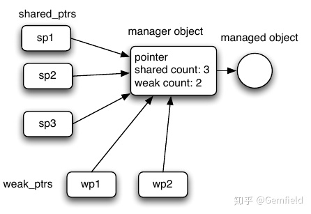
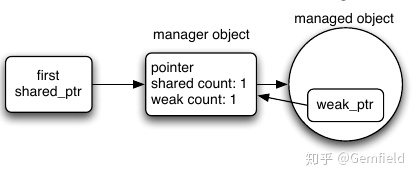

##  **背景**

到C++11的时候，C++的智能指针已经变得很成熟了。具体来说，我们有：

**1，auto_ptr**

C++98引入，C++11开始废弃，C++17中移除。

**2，unique_ptr**

C++11引入，用来代替auto_ptr；在C++14中增加了make_unique（make_shared有性能提升，但是make_unique没有性能提升，"只是"为了代码中不要再出现new）。

**3，shared_ptr**

C++11引入，引用计数。C++17增加了shared_ptr<T[]>。

**4，weak_ptr**

C++11引入。"weak" references。

因为auto_ptr已经废弃，因此在本文中，Gemfield将略去auto_ptr，仿佛它从未出生过一样。另外，Gemfield这里先罗列一些智能指针的通用规则：

  * 传值，而不要传引用； 
  * 返回值，而不是返回引用； 
  * 智能指针的get()方法可以返回raw pointer； 
  * 不要使用传统的new和delete操作符； 

##  **unique_ptr**

**1，基本语义**

智能指针unique_ptr的本质语义是说：对独占资源的管理。

    
    
    template<typename T>
    class unique_ptr {
        T* syszux_p_ = nullptr;
        ~unique_ptr(){
            delete syszux_p_;
        }
    };
    

我们都知道，传统的指针可以随便做任何操作。而到了unique_ptr这里，因为该类disable了copy
constructor，因此你是无法拷贝unique_ptr指针的；但是unique_ptr定义了move constructor（是move
only的），因此你可以将一个资源的管理权从一个unique_ptr指针移交给另外一个unique_ptr指针，移交后，源指针指向的资源就不存在了。

**2，第二个模板参数**

unique_ptr实际上还有第二个模板参数，用来指定deleter。因为该参数有默认值，所以平常使用的时候可以不用关心。所以，unique_ptr实际上相当于:

    
    
    template<typename T, typename Deleter = std::default_delete<T>>
    class unique_ptr {
        T* syszux_p_ = nullptr;
        Deleter d_;
    
        ~unique_ptr(){
            if(syszux_p_){
                d_(syszux_p_);
            }
        }
    };
    
    template<typename T>
    struct default_delete {
        void operator()(T* p) const {
            delete p;
        }
    }

从上面的伪代码可以看到，unique_ptr的第二个参数可以用来定制不同的析构行为，这非常有用。比如我们使用一个unique_ptr来代表对文件句柄资源的管理，那么析构行为中最好要包含将文件句柄关闭的操作，我们可以这样写：

    
    
    class SyszuxFileClose {
        public:
            void operator()(FILE* fp) const{
                if(fp != nullptr){
                    fclose(fp);
                }
            }
    }
    
    FILE* fp = fopen("gemfield.txt", "r");
    std::unique_ptr<FILE, SyszuxFileClose> gemfield_file(fp);

**3，移交资源的ownership**

虽然unique_ptr讲究的是对资源的独占性，以至于为此都禁掉了copy constructor和assignment
operator，但是，我们还是可以移交一个资源的ownership。我们可以把一个资源的管理权从一个unique_ptr移交给另一个unique_ptr（还是做到了在
**同一时刻，只有一个unique_ptr对一个资源有ownership**
)。这是怎么做到的呢？C++11的移动语义，具体来说，就是unique_ptr类的move constructor和move assignment
operator。

还记得函数的函数的返回值是rvalue吗？

    
    
    std::unique_ptr<Gemfield> newGemfield()
    {
        //函数中的临时变量将会交出资源的ownership
        return std::make_unique<Gemfield>();
    }
    
    int main(int argc, char** argv)
    {
        //现在，等号左边的gemfield变量接管了资源的ownership
        auto gemfield = newGemfield();
        gemfield->printSyszux();
    }
    

上述代码中的newGemfield函数的返回值是右值，当它通过赋值符把值赋给等号左边的变量时，根据函数重载的特性，触发的是unique_ptr类的move
assignment operator，于是资源的ownership就从函数返回值这个临时变量（右值）移交给了等号左边的变量。下面的代码展示了move
constructor的调用：

    
    
    std::unique_ptr<Gemfield> p1(newGemfield());

除了函数返回值这种天然的右值外，我们还可以使用std::move将一个左值转换成右值，然后移交ownership：

    
    
    int main(int argc, char** argv)
    {
        std::unique_ptr<Gemfield> p1 = std::make_unique<Gemfield>();
        std::unique_ptr<Gemfield> p2;
        p2 = std::move(p1);
        std::unique_ptr<Gemfield> p3(std::move(p2));
    }

完美。但是，如果不使用std::move，还是上面的代码：

    
    
    int main(int argc, char** argv)
    {
        std::unique_ptr<Gemfield> p1 = std::make_unique<Gemfield>();
        std::unique_ptr<Gemfield> p2;
        p2 = p1;
        std::unique_ptr<Gemfield> p3(p2);
    }

根据函数重载，触发的可是unique_ptr的copy constructor和assignment operator，而非move
constructor和move assignment operator。如前所述，unique_ptr的copy
constructor和assignment operator是被delete掉的，于是编译报错："use of deleted function"：

    
    
    gemfield@ThinkPad-X1C:~$ g++ -std=c++17 civilnet.cpp -o civilnet
    civilnet.cpp: In function ‘int main(int, char**)’:
    civilnet.cpp:205:10: error: use of deleted function ‘std::unique_ptr<_Tp, _Dp>& std::unique_ptr<_Tp, _Dp>::operator=(const std::unique_ptr<_Tp, _Dp>&) [with _Tp = Gemfield; _Dp = std::default_delete<Gemfield>]’
      205 |     p2 = p1;
          |          ^~
    In file included from /usr/include/c++/9/memory:80,
                     from /usr/include/c++/9/thread:39,
                     from civilnet.cpp:12:
    /usr/include/c++/9/bits/unique_ptr.h:407:19: note: declared here
      407 |       unique_ptr& operator=(const unique_ptr&) = delete;
          |                   ^~~~~~~~
    civilnet.cpp:207:36: error: use of deleted function ‘std::unique_ptr<_Tp, _Dp>::unique_ptr(const std::unique_ptr<_Tp, _Dp>&) [with _Tp = Gemfield; _Dp = std::default_delete<Gemfield>]’
      207 |     std::unique_ptr<Gemfield> p3(p2);
          |                                    ^
    In file included from /usr/include/c++/9/memory:80,
                     from /usr/include/c++/9/thread:39,
                     from civilnet.cpp:12:
    /usr/include/c++/9/bits/unique_ptr.h:406:7: note: declared here
      406 |       unique_ptr(const unique_ptr&) = delete;
          |       ^~~~~~~~~~

##  **shared_ptr**

**1，基本语义**

shared_ptr的本质语义是：共享资源的管理。这是什么意思呢？还记得unique_ptr是独占资源的管理吗(为此，unique_ptr禁掉了copy
constructor)？举个例子：办公场所有两种房间：一种是会议室，一个是领导办公室；

领导办公室就是一种独占资源，领导就是一个unique_ptr，领导进到自己的办公室后，开灯（构造）。领导离开自己的办公室后，关灯（析构）；

会议室资源就是一种共享资源，第一个员工（引用计数）进入会议室后，开灯（构造），最后一个员工（引用计数）离开会议室后，关灯（析构）。

所谓的引用计数，指的就是有多少个shared_ptr指向同一个被管理的资源，当最后一个shared_ptr被销毁后，referenced的count就变为了0（相当于会议室里没人了），被管理的资源就自动被析构掉了（相当于会议室的等被关掉了）。那么shared_ptr又是怎么做到的呢？

**2，工作原理**

在下图中，我们使用managed object来代表被管理的资源，manager object代表shared_ptr的meta
data（比如，各种counter）。

manager object包含了指向managed object的指针（这也是shared_ptr的meta
data之一），同时也包含了两个引用计数：shared count和weak count，前者代表有多少个shared_ptr指向manager
object，而后者代表有多少个weak_ptr指向manager object，以上图为例，shared count和weak count分别是3和2。

如果一个新的shared_ptr是通过拷贝或者赋值来创建出来的，那么shared_ptr的copy constructor或者assignment
operator会确保其指向的manager object的shared
count增加1；同理，如果一个新的weak_ptr是通过拷贝或者赋值来创建出来的，那么weak_ptr的copy
constructor或者assignment operator会确保其指向的manager object的weak count增加1。

如果一个shared_ptr被销毁或者是重新赋值成其它的值（指向不同的object），那么shared_ptr的destructor或者assignment
operator会确保其指向的manager object的shared
count减少1（当减少到0的时候，shared_ptr的destructor会delete掉managed object，并且将meta
data中的pointer设置为nullptr）；同理，如果一个weak_ptr被销毁或者是重新赋值成其它的值（指向不同的object），那么weak_ptr的destructor或者assignment
operator会确保其指向的manager object的weak count减少1（当weak count减少到0的时候，manager
object同样被deleted， **但是：如果weak count是大于0的话，manager object会保留** ）。

**重点来了，也就是managed object和manager object的生命周期不同，managed object的生命止步于shared
count降为0，而manager object的生命止步于shared count和weak count都为0。**

这就是weak_ptr发挥作用的方式：它通过查看manager object中的pointer是否为nullptr或者看manager
object中的shared count是否为0，来确定managed object是否还活着。如果pointer为nullptr或者shared
count为0，那么managed
object就已经不存在了（反之则存在），这个时候相当于资源已经销毁了，通过shared_ptr（如果本身还没有被重置为nullptr的话）来操作注定要导致程序崩溃，也就是说，shared_ptr已经变为了dangling
pointer了。通过weak_ptr来观察managed object是否还存活，就相当于weak_ptr的lock方法。而这段描述，就相当于下面的代码：

    
    
    if(auto syszux_ptr = wptr.lock()) {
        use(syszux_ptr);
    }

shared_ptr和weak_ptr的一个本质不同是，因为shared_ptr几乎重载了所有的指针操作，因此你可以像使用raw
pointer那样使用shared_ptr，而weak_ptr并不具备这个功能。实际上，weak_ptr的作用就是来观察managed
object是否还存在，如果不存在，则wptr.lock()返回一个nullptr；如果存在，则wptr.lock()返回一个正常的shared_ptr。

**3，使用shared_ptr**

使用下面的例子来介绍下shared_ptr的基础用法：

    
    
    int main(int argc, char** argv)
    {
        {
            //使用工厂方法构建一个shared_ptr
            std::shared_ptr<Gemfield> p1 = std::make_shared<Gemfield>();
    
            //p2和p1现在共享同一个资源的ownership
            std::shared_ptr<Gemfield> p2 = p1;
            //使用new的方法构建shared_ptr
            std::shared_ptr<Gemfield> p3 (new Gemfield());
    
            std::shared_ptr<Gemfield> p4 = std::make_shared<Gemfield>();
    
            //p1现在管理新的资源了，旧的manager object的shared count要减1；
            //p1和p3指向的manager object的shared count要增1；
            p1 = p3;
    
            //p1和p3指向的manager object的shared count要减1；
            p1.reset();
    
            //p1和p3指向的manager object的shared count要减1；
            //哦，此刻shared count已经为0了，managed object销毁
            p3.reset();
    
            //将nullptr转换为空的shared_ptr，同时p2之前的manager object的shared count减去1；
            //哦，shared count已经为0了，触发managed object销毁
            p2 = nullptr;
    
        }
        //超出作用域，所有的shared_ptr指向的manager object的shared count要减去1；
    }

智能指针出现之前经常会遇到如下的代码：

    
    
    Gemfield* badFunc(){
        Gemfield* raw_ptr = new Gemfield();
        return raw_ptr;
    }

new的资源谁来管理？调用者用完这个返回值（raw
pointer！）怎么办？这就是各种雷。这是非常糟糕的事情。现在有了智能指针，有了shared_ptr，可以这么写了：

    
    
    std::shared_ptr<Gemfield> betterFunc(){
        return std::make_shared<Gemfield>();
    }

**4，最好使用工厂方法来构建shared_ptr**

我们在上面的代码中已经看到了两种构建shared_ptr的方式：

    
    
    //使用new的方法构建shared_ptr
    std::shared_ptr<Gemfield> p3 (new Gemfield());
    
    //使用工厂方法构建一个shared_ptr
    std::shared_ptr<Gemfield> p1 = std::make_shared<Gemfield>();

如果使用new的方法来构建shared_ptr，那么实际上会导致产生两次动态内存的申请分配：一次是用new构建managed
object，一次是由shared_ptr构造函数构建的manager
object。大家都知道，内存分配可是比较慢的，这样以来，创建一个shared_ptr将会显著慢于raw
pointer，也慢于"intrusive"的reference
counted的智能指针。为了解决这个问题，C++11包含了一个模板工厂方法：make_shared，只需一次申请内存就能完成shared_ptr的构造（这个功能的实现要仰仗于可变参数模板和perfect
forwarding）。

##  **weak_ptr**

**1，基本语义**

不像shared_ptr，weak_ptr本身不具备raw pointer的操作（不能dereference，不能->操作），它只是来“观察”managed
object，也就是weak_ptr（及weak counter计数）并不影响被管理资源的生命周期。因此，weak_ptr的岗位职责用一句话来描述就是：
**看managed object是否还存在，如果存在，可以提供负责管理该managed object的shared_ptr** 。

**2,使用weak_ptr**

记住，weak_ptr总是用来观察shared_ptr管理的资源。这就意味着weak_ptr的初始化总是和shared_ptr相关。我们来看几个例子：

    
    
    std::shared_ptr<Gemfield> sp1 = std::make_shared<Gemfield>();
    
    //使用shared_ptr构建一个weak_ptr
    std::weak_ptr<Gemfield> wp1(sp1);
    
    //空的weak_ptr，不观察任何资源
    std::weak_ptr<Gemffield> wp2;
    
    //现在wp2开始观察sp1所管理的资源了
    wp2 = sp1;
    
    //使用一个weak_ptr构建另一个weak_ptr
    std::weak_ptr<Gemfield> wp3(wp2);
    
    //不观察任何资源
    std::weak_ptr<Gemfield> wp4;
    
    //现在wp4开始观察wp2所观察的资源了
    wp4 = wp2;
    
    //现在wp4又不观察任何资源了
    wp4.reset();

前面已经说过，weak_ptr没有指针相关的操作，因此，我们可以通过其上的lock()成员函数来返回一个shared_ptr，继而进行后续的操作：

    
    
    std::shared_ptr<Gemfield> sp2 = wp2.lock();

如果weak_ptr观察的资源已经销毁了，则lock()会返回nullptr。所以，当一个函数接收了传递过来的weak_ptr参数时，需要对lock()的返回值进行判断：

    
    
    void syszuxF(std::weak_ptr<Gemfield> wp){
        std::shared_ptr<Gemfield> sp = wp.lock();
        if(sp){
            sp->doSomething();
        }
    }

有时候只是想简单的看下weak_ptr观察的资源是否已经销毁，而并不想使用该资源，那么可以简单的调用expired()成员函数：

    
    
    bool isSyszuxLive(std::weak_ptr<Gemfield> wp){
        if(wp.expired()){
            return false;
        }
        return true;
    }

C++11的智能指针是线程安全的，但是，在多线程环境下，如果你使用了expired判断了资源是否还有效，紧接着使用lock()去获得shared_ptr的时候，还需要再判断一次——有可能在expired()和lock()调用之间，其它的线程将其销毁或重置。

##  **enable_shared_from_this**

**1，故事由来**

假设我们在Gemfield类中的某个成员函数中，需要将this传递给其它的函数，比如下面例子中的globalDo函数，如果用的是传统的指针，可以非常简单的写出来：

    
    
    class Gemfield;
    void globalDo(Gemfield* ptr);
    
    class Gemfield{
        public:
            Gemfield(){std::cout<<"construct"<<std::endl;}
            ~Gemfield(){std::cout<<"destruct"<<std::endl;}
            void doSomething(){
                globalDo(this);
            }
            void printSyszux(){
                std::cout<<"I am syszux"<<std::endl;
            }
    };
    
    void globalDo(Gemfield* ptr){
        ptr->printSyszux();
    }
    
    int main(int argc, char** argv)
    {
        Gemfield* gemfield =  new Gemfield();
        gemfield->doSomething();
    }

你看，Gemfield类的doSomething()函数中，我们将this传递给globalDo函数，globalDo函数的形参就是Gemfield类的指针，一切都很完美——只不过不符合Gemfield本文的主旨思想：不要用raw
pointer，而要用智能指针！

秉承着这个理念，我们快速将上面的程序重构为下面这个样子：

    
    
    class Gemfield;
    void globalDo(std::shared_ptr<Gemfield> ptr);
    
    class Gemfield{
        public:
            Gemfield(){std::cout<<"construct"<<std::endl;}
            ~Gemfield(){std::cout<<"destruct"<<std::endl;}
            void doSomething(){
                globalDo(this);
            }
            void printSyszux(){
                std::cout<<"I am syszux"<<std::endl;
            }
    };
    
    void globalDo(std::shared_ptr<Gemfield> ptr){
        ptr->printSyszux();
    }
    
    int main(int argc, char** argv)
    {
        std::shared_ptr<Gemfield> gemfield = std::make_shared<Gemfield>();
        gemfield->doSomething();
    }

其实也没做啥......就是将所有出现Gemfield* 这样的raw
pointer的地方换成了shared_ptr，尤其是globalDo的参数类型！好了，现在程序中看不到原始的raw pointer了，但是程序编译会报错：

    
    
    civilnet.cpp: In member function ‘void Gemfield::doSomething()’:
    civilnet.cpp:189:26: error: could not convert ‘(Gemfield*)this’ from ‘Gemfield*’ to ‘std::shared_ptr<Gemfield>’
      189 |             globalDo(this);
          |                          ^
          |                          |
          |                          Gemfield*

没错，doSomething()程序函数中，调用globalDo传递的是this，但是形参接收的应该是 **std::shared_ptr
<Gemfield> **
，而this的类型是Gemfield*啊。于是，自然而然的我们就会这么想，那用this构造出一个shared_ptr不就行了吗？so
easy......如下所示：

    
    
    void doSomething(){
         globalDo( std::shared_ptr<Gemfield>(this));
    }
    

哈哈，然后编译通过！呜呜，然后运行崩溃！

    
    
    #g++ -std=c++17 civilnet.cpp -o civilnet
    gemfield@ThinkPad-X1C:~$ ./civilnet
    construct
    I am syszux
    destruct
    double free or corruption (out)
    已放弃 (核心已转储)

**2，发生了什么？**

当在main函数中创建的shared_ptr，和在doSomething中使用this创建的shared_ptr，属于两个不同的shared_ptr，但是管理的是同一个资源（也就是同一个managed
object）：

    
    
    int main(int argc, char** argv)
    {
        std::shared_ptr<Gemfield> gemfield = std::make_shared<Gemfield>();
        gemfield->doSomething();
    }
    
    
    void doSomething(){
         globalDo( std::shared_ptr<Gemfield>(this));
    }
    

这就意味着，当两个shared_ptr各自销毁的时候，对同一个资源就会double delete——这就是著名的内存double free错误。

**3，怎么解决呢？**

如果，我们能让Gemfield类（也就是该例子中的managed
object)“不知怎么的”就包含一个weak_ptr，并且这个weak_ptr观察的就是在main里创建的那个shared_ptr管理的资源，那么在任何时刻，我们都可以通过这个weak_ptr获得同一个shared_ptr：

正好C++11的library考虑到了这个问题，提供了一个模板基类：std::enable_shared_from_this。这个基类含有一个weak_ptr数据成员，同时有一个shared_from_this()函数成员——返回值为使用weak_ptr构建的shared_ptr。

有了C++11库提供的这个基类，我们重构下Gemfield类，让该类继承自std::enable_shared_from_this，由此Gemfield类就会“含有一个weak_ptr数据成员，同时有一个shared_from_this()函数成员——返回值为使用weak_ptr构建的shared_ptr”（这就是模板的CRTP设计模式）。在下面的代码中：

    
    
    std::shared_ptr<Gemfield> gemfield = std::make_shared<Gemfield>();

当管理Gemfield实例的第一个shared_ptr被创建出来时，shared_ptr的构造函数（使用了一些模板方面的魔法）会探测到std::enable_shared_from_this基类的存在，于是会使用自身(shared_ptr)来初始化该weak_ptr数据成员。当这个初始化完成后，Gemfield类中的weak_ptr成员会开始观察上述shared_ptr所管理的资源，每当你需要一个指向this的Gemfield实例时，你就可以通过shared_from_this()成员函数来获得。

基于此种CRTP设计模式，我们再次重构下上述的代码：

    
    
    class Gemfield;
    void globalDo(std::shared_ptr<Gemfield> ptr);
    
    class Gemfield : public std::enable_shared_from_this<Gemfield>{
        public:
            Gemfield(){std::cout<<"construct"<<std::endl;}
            ~Gemfield(){std::cout<<"destruct"<<std::endl;}
            void doSomething(){
                globalDo( shared_from_this());
            }
            void printSyszux(){
                std::cout<<"I am syszux"<<std::endl;
            }
    };
    
    void globalDo(std::shared_ptr<Gemfield> ptr){
        ptr->printSyszux();
    }
    
    int main(int argc, char** argv)
    {
        std::shared_ptr<Gemfield> gemfield = std::make_shared<Gemfield>();
        gemfield->doSomething();
    }

问题解决。但这种这个解决方案还要注意2点：

1，不能在Gemfield的构造函数中调用shared_from_this()——因为weak_ptr成员的初始化仰仗于Gemfield的构造完成；

2，一定要在shared_ptr上调用含有shared_from_this()的成员；否则，比如，你是在unique_ptr上调用，那么weak_ptr数据成员根本就没有初始化，程序就会崩溃：

    
    
    auto gemfield = std::make_unique<Gemfield>();
    
    //程序在这里崩溃
    gemfield->doSomething();

报错：

    
    
    gemfield@ThinkPad-X1C:~$ ./civilnet
    construct
    terminate called after throwing an instance of 'std::bad_weak_ptr'
      what():  bad_weak_ptr
    已放弃 (核心已转储)

##  **再提weak_ptr的意义**

如果阅读本文至此，你大概已经对智能指针有了初步的轮廓和概念，但是一个问题还在心头挥之不去：那就是，weak_ptr除了观察资源是否还活着，难道就这么点用处啊？这也不足以支撑起C++11标准单独提出来一个weak_ptr指针啊。

    
    
    void testWeak()
    {
        std::shared_ptr<int> sp1;
        sp1.reset(new int);
        *sp1 = 7030;
        std::weak_ptr<int> wp1 = sp1;
    
        sp1.reset(new int);
        *sp1 = 27030;
        std::weak_ptr<int> wp2 = sp1;
    
        if(auto tmp = wp1.lock()){
            std::cout<<*tmp<<std::endl;
        }else{
            std::cout<<"wp1 is expired"<<std::endl;
        }
    
        if(auto tmp = wp2.lock()){
            std::cout<<*tmp<<std::endl;
        }else{
            std::cout<<"wp2 is expired"<<std::endl;
        }
    }
    

上面的代码生动的展示了一个道理：shared_ptr如果指向了新的资源，那么旧的资源就失去了track，而使用weak_ptr就可以一直track指定的managed
object，不管其生命周期是否结束。

**环形引用计数问题**

只要使用智能指针，就再也不担心内存泄露了，谢天谢地。除了一个梦魇还没有消除：环形引用计数问题。比如下面的代码：

    
    
    class Gemfield{
        public:
            Gemfield(){std::cout<<"construct"<<std::endl;}
            void setTrouble(std::shared_ptr<Gemfield> ptr){
                this->ptr = ptr;
            }
            std::shared_ptr<Gemfield> getTrouble(){
                return ptr;
            }
            ~Gemfield(){std::cout<<"destruct"<<std::endl;}
        private:
            std::shared_ptr<Gemfield> ptr;
    };
    
    int main(int argc, char** argv)
    {
        {
            std::shared_ptr<Gemfield> p1 = std::make_shared<Gemfield>();
            std::shared_ptr<Gemfield> p2 = std::make_shared<Gemfield>();
            std::cout<<"shared counter: "<<p1.use_count()<<std::endl;
            std::cout<<p1->getTrouble() <<" | "<< p2<<std::endl;
            std::cout<<p2->getTrouble() <<" | "<< p1<<std::endl;
        }
        std::cout<<"END"<<std::endl;
    }

程序输出：

    
    
    gemfield@ThinkPad-X1C:~$ ./civilnet
    construct
    construct
    shared counter: 1
    0 | 0x561142f123a0
    0 | 0x561142f11f60
    destruct
    destruct
    END

看起来很完美， **log中出现的2个destruct** ，表明shared_ptr p1和p2离开了作用域后，managed
object自动被销毁；但是你注意到了吗？Gemfield类新增了一个setTrouble函数，从函数名字就可以看出意图：想故意制造麻烦呢。但是还没有使用它，于是你已经猜到了我的意图——新的有了麻烦的代码如下所示：

    
    
    int main(int argc, char** argv)
    {
        {
            ......
            p1->setTrouble(p2);
            p2->setTrouble(p1);
            ......
        }
    }
    

程序输出：

    
    
    gemfield@ThinkPad-X1C:~$ ./civilnet
    construct
    construct
    shared counter: 2
    0x556def7ac3a0 | 0x556def7ac3a0
    0x556def7abf60 | 0x556def7abf60
    END

看到有什么不一样了吗？ **log中没有出现destruct**
！p1和p2这两个shared_ptr离开作用域后，并没有自动析构资源，这不是内存泄露吗？！没错，通过setTrouble函数，p1和p2相互依赖上了对方，造成了“死锁”，析构p1的时候，发现其中有p2的生命迹象，停止析构；析构p2的时候，又发现其中有p1的生命迹象，停止析构；于是p1和p2都析构不了。那怎么办呢？

**使用weak_ptr!** Gemfield类的setTrouble函数、getTrouble函数、ptr数据成员因此做了相应的改造，如下所示：

    
    
    class Gemfield{
        public:
            ......
            void setTrouble(std::shared_ptr<Gemfield> ptr){
                this->ptr = std::weak_ptr<Gemfield>(ptr);
            }
            std::shared_ptr<Gemfield> getTrouble(){
                return ptr.lock();
            }
        private:
            std::weak_ptr<Gemfield> ptr;
    };
    

这样一来，在调用setTrouble后，managed object的shared counter并不会增加，取而代之的是，managed
object的weak counter增了1。于是p1和p2之间的shared reference变成了weak reference，于是程序输出：

    
    
    gemfield@ThinkPad-X1C:~$ ./civilnet
    construct
    construct
    shared counter: 1
    0x55e03c0783a0 | 0x55e03c0783a0
    0x55e03c077f60 | 0x55e03c077f60
    destruct
    destruct
    END

**log中的2个destruct** ，清楚的表明了在脱离了作用域后，p1和p2这两个shared_ptr的自动析构！

