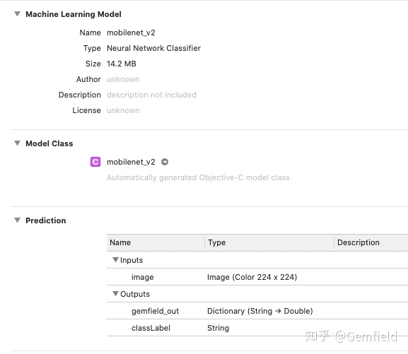

##  **背景**

最近需要将一些神经网络的算法部署到iOS侧，这些事情一年前就做过一次，因此就触发了Gemfield的写专栏机制：“一个事情出现第二次，必须文章记录，以让第三次遇到时处理成本大为降低”。

这篇文章主要说的内容就是，从XCode代码层面，视觉信息是如何到达神经网络的。这些视觉信息有：

  1. 相册中的图片； 
  2. 相册中的视频； 
  3. 摄像头的单张拍照； 
  4. 摄像头的实时预览； 

我们的思路是，先从神经网络模型的视角出发，看看模型需要什么样的输入；再从XCode中object-
c语言、swift语言(还可以使用Vision框架啊）的视角出发，看如何能能够从相册或者摄像头获取视觉信息，并转换为模型所需要的输入。

这些视觉信息在iOS的SDK中由不同的对象代表(OC和Swift中一样），非常有意思，这些对象有：

    
    
    CMSampleBufferRef
    CVPixelBufferRef
    CIImage
    CGImageRef
    UIImage
    

会发现这些对象名称都有那种有规律的前缀，它们的含义是： **CV代表CoreVideo，CI代表CoreImage，CM代表
CoreMedia，CF代表CoreFoundation，CG代表 CoreGraphic，UI代表User Interface** 。

这些类在OC中的转换关系有：

    
    
    //CMSampleBufferRef -> CVPixelBufferRef
    CVPixelBufferRef pixelBuffer = CMSampleBufferGetImageBuffer(inputBuffer);
    
    //CVPixelBufferRef -> CIImage
    CIImage *inputImage = [CIImage imageWithCVPixelBuffer:inputPixels];
    
    //CVPixelBufferRef -> UIImge
    + (UIImage*)uiImageFromPixelBuffer:(CVPixelBufferRef)p {
        CIImage* ciImage = [CIImage imageWithCVPixelBuffer:p];
        CIContext* context = [CIContext contextWithOptions:@{kCIContextUseSoftwareRenderer : @(YES)}];
        CGRect rect = CGRectMake(0, 0, CVPixelBufferGetWidth(p), CVPixelBufferGetHeight(p));
        CGImageRef videoImage = [context createCGImage:ciImage fromRect:rect];
        UIImage* image = [UIImage imageWithCGImage:videoImage];
        CGImageRelease(videoImage);
        return image;
    }

这些类在Swift中的转换关系有：

    
    
    //CMSampleBufferRef -> CVPixelBufferRef
    guard let pixelBuffer = CMSampleBufferGetImageBuffer(inputBuffer)

在开始前，请把XCode项目中的Info.plist先添加上如下权限请求：

    
    
    <key>NSCameraUsageDescription</key>
    <string>CivilNet需要相机权限</string>
    <key>NSMicrophoneUsageDescription</key>
    <string>CivilNet需要麦克风权限</string>
    <key>NSPhotoLibraryAddUsageDescription</key>
    <string>CivilNet需要保存到相册权限</string>
    <key>NSPhotoLibraryUsageDescription</key>
    <string>CivilNet需要相册权限</string>

##  **模型的输入视角**

在iOS上，根据专栏Gemfield的文章：

[ Gemfield：部署PyTorch 1.4到XCode和iOS ](https://zhuanlan.zhihu.com/p/109318529)

Gemfield目前只关注PyTorch模型和CoreML模型。

**1，PyTorch模型的输入视角**

从PyTorch模型的输入视角来看，它需要的是一个at::Tensor实例，比如：

    
    
    #第1个例子，使用from_blob函数
    cv::Mat img = cv::imread("gemfield.jpg");
    cv::resize(img, img, cv::Size(224, 224), cv::INTER_CUBIC);
    ......
    #notice the RGB BGR order, some transpose stuff may needed!!!
    #返回 at::Tensor，从数组构造
    torch::from_blob(imageBuffer, {1, 3, 224, 224}, at::kFloat);
    
    #第2个例子，直接使用tensor的构造函数
    auto img_ = cv::imread(argv[1], cv::IMREAD_COLOR);
    cv::Mat img(480, 640, CV_8UC3);
    cv::resize(img_, img, img.size(), 0, 0, cv::INTER_AREA);
    auto input_ = torch::tensor(at::ArrayRef<uint8_t>(img.data, img.rows * img.cols * 3)).view({img.rows, img.cols, 3});
    
    #第3个例子，随便填充，有如下这些API
    torch::empty()
    torch::randn()
    torch::zeros()
    torch::ones()
    

PyTorch的网络就依据这些输入来进行推理：

    
    
    module.predict(image: UnsafeMutableRawPointer(&buffer));
    at::Tensor tensor = torch::from_blob(imageBuffer, {1, 3, 224, 224}, at::kFloat);
    //_impl是torch::jit::script::Module的实例
    auto outputTensor = _impl.forward({tensor}).toTensor();

**2，从CoreML模型的输入视角**

两个视角，从OC视角看和从swift视角看。

**2.1，OC视角**

只要把CoreML的模型文件，比如mobilenet_v2.mlmodel 添加到XCode项目中，然后单击该文件，XCode IDE中就会出现右侧的图：

看到Model Class了吗？点击右边的➡️，然后XCode直接就会把该mlmodel文件对应的Object-C的类显示出来：

    
    
    // mobilenet_v2.h
    // This file was automatically generated and should not be edited.
    #import <Foundation/Foundation.h>
    #import <CoreML/CoreML.h>
    #include <stdint.h>
    @interface mobilenet_v2Input : NSObject<MLFeatureProvider>
    ......
    
    // mobilenet_v2.m
    // This file was automatically generated and should not be edited.
    #import "mobilenet_v2.h"
    ......

这里面有自动实现了3个interface及其方法：

    
    
    @interface mobilenet_v2Input : NSObject<MLFeatureProvider>
    @interface mobilenet_v2Output : NSObject<MLFeatureProvider>
    @interface mobilenet_v2 : NSObject

如果使用OC的话，CoreML模型的输入应该是下面这样的：

    
    
    - (NSString *)predictImageScene:(UIImage *)image {
        mobilenet_v2 *model = [[mobilenet_v2 alloc] init];
        NSError *error;
        UIImage *scaledImage = [image scaleToSize:CGSizeMake(224, 224)];
        CVPixelBufferRef buffer = [image pixelBufferFromCGImage:scaledImage];
        mobilenet_v2Input *input = [[mobilenet_v2Input alloc] initWithImage:buffer];
        mobilenet_v2Output *output = [model predictionFromFeatures:input error:&error];
        return output.classLabel;
    }

可见输入是需要一个CVPixelBufferRef类型的image（某些CoreML模型转换不正确的话，这里的输入就会变为sequence x batch
x channel x h x w的multi array）。

**2.2 Swift视角**

当然，如果不用OC，而用swift的话，则推荐使用vision框架。

##  **Object-C语言获取视觉信息的视角**

我们必须使用iOS的Object-C语言来获取以下内容：

  1. 相册中的图片； 
  2. 相册中的视频； 
  3. 摄像头的单张拍照； 
  4. 摄像头的实时预览； 

并经过适当转换，分别做到语法上的类型匹配和语义上的内容匹配，然后送给上述的模型去做推理。

**1，摄像头实时获取**

例子很多，gemfield先不说明了。

**2，从相册中获取图片**

先构建UIImagePickerController这个类的实例（比如名为picker），然后设置picker对象的一些属性。然后遵循UIImagePickerControllerDelegate协议：

    
    
    //遵循UIImagePickerControllerDelegate协议
    @interface ViewController : UIViewController<UIImagePickerControllerDelegate,
                         UINavigationControllerDelegate>

并且实现里面的方法：

    
    
    //当用户选择了图片或者视频时，通知到这个delegate的这个方法
    func imagePickerController(UIImagePickerController, didFinishPickingMediaWithInfo: [UIImagePickerController.InfoKey : Any])
    
    //当用户取消了选择到图片或者视频时，通知到这个delegate的这个方法
    func imagePickerControllerDidCancel(UIImagePickerController)

比如，读取相册中的一张照片：

    
    
    //先设置picker对象的一些属性
    if (![UIImagePickerController isSourceTypeAvailable: UIImagePickerControllerSourceTypePhotoLibrary])
        return;
        
    UIImagePickerController* picker = [[UIImagePickerController alloc] init];
    //设置delegate，用户挑选完毕后就会通知delegate上的UIImagePickerControllerDelegate协议中要求的方法
    picker.delegate = self;
    //不设置mediaTypes的话，默认只能挑选照片
    picker.sourceType = UIImagePickerControllerSourceTypePhotoLibrary;
    
    - (void)imagePickerController: (UIImagePickerController*)picker
        didFinishPickingMediaWithInfo:(NSDictionary *)info
    {  
        [picker dismissViewControllerAnimated:YES completion:nil];
        //从相册中获取一张照片，并且内容读到UIImage类型中
        UIImage* temp = [info objectForKey:@"UIImagePickerControllerOriginalImage"];
    
        // 比如OpenCV中的UIImageToMat函数可以将UIImage转换为cv::Mat
        cv::Mat cvImage;
        UIImageToMat(temp, cvImage);
    }

上面是OpenCV的示例，在这篇文章中没有啥用；如果要喂给PyTorch，则需要转换为at::tensor；如果要喂给CoreML，则需要转换为CVPixelBufferRef（前文已经说过）——这就带来一个问题，如何把UIImage转换为CVPixelBufferRef？Gemfield一般使用如下的方法来进行转换：

    
    
    //UIImage *image = [UIImage imageNamed:@"testImage"];
    //UIImage 进行scale操作
    UIGraphicsBeginImageContext(CGSizeMake(224, 224));
    [self drawInRect:CGRectMake(0, 0, size.width, size.height)];
    UIImage* scaledImage = UIGraphicsGetImageFromCurrentImageContext();
    UIGraphicsEndImageContext();
    
    //scale后的image开始转换为CVPixelBuffer
    //UIImage -> CGImageRef -> 创建空的CVPixelBuffer -> 创建context -> context中填充这个buffer
    CGImageRef image = originImage.CGImage;
    NSDictionary *options = [NSDictionary dictionaryWithObjectsAndKeys:
                             [NSNumber numberWithBool:YES], kCVPixelBufferCGImageCompatibilityKey,
                             [NSNumber numberWithBool:YES], kCVPixelBufferCGBitmapContextCompatibilityKey,
                             nil];
    
    CVPixelBufferRef gemfield_buffer = NULL;
    CGFloat frameWidth = CGImageGetWidth(image);
    CGFloat frameHeight = CGImageGetHeight(image);
    CVReturn status = CVPixelBufferCreate(kCFAllocatorDefault,
                                          frameWidth,
                                          frameHeight,
                                          kCVPixelFormatType_32ARGB,
                                          (__bridge CFDictionaryRef) options,
                                          &gemfield_buffer);
    
    NSParameterAssert(status == kCVReturnSuccess && gemfield_buffer != NULL);
    CVPixelBufferLockBaseAddress(gemfield_buffer, 0);
    void *pxdata = CVPixelBufferGetBaseAddress(gemfield_buffer);
    NSParameterAssert(pxdata != NULL);
    CGColorSpaceRef rgbColorSpace = CGColorSpaceCreateDeviceRGB();
    CGContextRef context = CGBitmapContextCreate(pxdata,
                                                 frameWidth,
                                                 frameHeight,
                                                 8,
                                                 CVPixelBufferGetBytesPerRow(gemfield_buffer),
                                                 rgbColorSpace,
                                                 (CGBitmapInfo)kCGImageAlphaNoneSkipFirst);
    NSParameterAssert(context);
    CGContextConcatCTM(context, CGAffineTransformIdentity);
    CGContextDrawImage(context, CGRectMake(0,0,frameWidth,frameHeight),image);
    CGColorSpaceRelease(rgbColorSpace);
    CGContextRelease(context);
    CVPixelBufferUnlockBaseAddress(gemfield_buffer, 0);
    
    //送给coreml模型
    mobilenet_v2Input *input = [[mobilenet_v2Input alloc] initWithImage:buffer];
    mobilenet_v2Output *output = [model predictionFromFeatures:input error:&error];

**3，从相册中获取视频**

这个遵循UIImagePickerControllerDelegate协议，和读取照片一样，不再赘述。区别是picker对象的属性设置稍微有所区别。比如，使用OpenCV来读取相册中的一个视频，代码如下：

    
    
    //先设置picker对象的属性
    if (![UIImagePickerController isSourceTypeAvailable:UIImagePickerControllerSourceTypePhotoLibrary])
        return;
        
    UIImagePickerController* picker = [[UIImagePickerController alloc] init];
    picker.delegate = self;
        
    picker.sourceType = UIImagePickerControllerSourceTypePhotoLibrary;
    //设置只能挑选视频
    picker.mediaTypes = [[NSArray alloc] initWithObjects:(NSString *)kUTTypeMovie, nil];
    
    - (void)imagePickerController: (UIImagePickerController*)picker didFinishPickingMediaWithInfo:(NSDictionary *)info
    {
        [picker dismissViewControllerAnimated:YES completion:nil];
    
        NSString *mediaType = [info objectForKey: UIImagePickerControllerMediaType];
        if (CFStringCompare ((__bridge CFStringRef) mediaType, kUTTypeMovie, 0) == kCFCompareEqualTo) {
           NSURL *videoUrl=(NSURL*)[info objectForKey:UIImagePickerControllerMediaURL];
           NSString *moviePath = [videoUrl path];
    
           cv::VideoCapture capture;
           if(capture.open(std::string([moviePath UTF8String])) ){
               NSLog(@"GEMFIELD Opened");
           }else{
               NSLog(@"GEMFIELD Failed");
           }
    
           double dFps = capture.get(cv::CAP_PROP_FPS); //get the frames per seconds of the video
           std::cout << "Frames per second = " << dFps << std::endl;
        }
    }

既然是视频，和图片相比，主要就多了一步抽帧的工作。

再比如，使用iOS SDK中的AVAssetReader来抽帧：

    
    
    NSError* error;
    int bufferWidth = 0;
    int bufferHeight = 0;
    AVAssetReader *reader = [[AVAssetReader alloc] initWithAsset:asset error:&error];
    if (error) {
        NSLog(@"%@",error.localizedDescription);
        return;
    }
    
    NSArray *videoTracks = [asset tracksWithMediaType:AVMediaTypeVideo];
    if (!videoTracks.count) {
        error = [NSError errorWithDomain:@"AVFoundation error" code:-1 userInfo:@{ NSLocalizedDescriptionKey : @"Can't read video track" }];
        return;
    }
    
    AVAssetTrack *videoTrack = [videoTracks objectAtIndex:0];
    AVAssetReaderTrackOutput *trackOutput = [[AVAssetReaderTrackOutput alloc] initWithTrack:videoTrack outputSettings:CVPixelFormatOutputSettings()];
    [reader addOutput:trackOutput];
    [reader startReading];
    
    CMSampleBufferRef buffer = NULL;
    BOOL continueReading = YES;
    while (continueReading) {
        AVAssetReaderStatus status = [reader status];
        switch (status) {
            case AVAssetReaderStatusUnknown: {
            } break;
            case AVAssetReaderStatusReading: {
                buffer = [trackOutput copyNextSampleBuffer];
    
                if (!buffer) {
                    break;
                }
                //从CVPixelBufferRef获取rgb的data地址
                CVPixelBufferRef pixelBuffer = CMSampleBufferGetImageBuffer(buffer);
                CVPixelBufferLockBaseAddress( pixelBuffer, 0 );
                bufferWidth = (int)CVPixelBufferGetWidth( pixelBuffer );
                bufferHeight = (int)CVPixelBufferGetHeight( pixelBuffer );
                size_t bytesPerRow = CVPixelBufferGetBytesPerRow( pixelBuffer );
                void* baseAddress = CVPixelBufferGetBaseAddress( pixelBuffer );
                CVPixelBufferUnlockBaseAddress( pixelBuffer, 0 );
            } break;
            case AVAssetReaderStatusCompleted: {
                if (_delegateMethods.didFinishReadingSample) {
                    [self.delegate syszuxReader:self didFinishReadingAsset:asset];
                }
                continueReading = NO;
            } break;
            case AVAssetReaderStatusFailed: {
                [reader cancelReading];
                continueReading = NO;
            } break;
            case AVAssetReaderStatusCancelled: {
                continueReading = NO;
            } break;
        }
        if (buffer) {
            CMSampleBufferInvalidate(buffer);
            CFRelease(buffer);
            buffer = NULL;
        }
    }
    
    NS_INLINE NSDictionary *CVPixelFormatOutputSettings() {
        //return @{ (NSString *)kCVPixelBufferPixelFormatTypeKey : [NSNumber numberWithInt:kCVPixelFormatType_32BGRA] };
        return @{ (NSString *)kCVPixelBufferPixelFormatTypeKey : [NSNumber numberWithInt:kCVPixelFormatType_24RGB] };
    }

##  **Swift语言获取视觉信息的视角**

**1，摄像头实时获取**

关键在于这个协议：AVCaptureVideoDataOutputSampleBufferDelegate。这个协议定义了用来代理AVCaptureVideoDataOutput对象的接口，要（可选）实现协议AVCaptureVideoDataOutputSampleBufferDelegate中的如下方法：

    
    
    #当1个video frame写入后通知到这个delegate的这个方法；
    func captureOutput(AVCaptureOutput, didOutput: CMSampleBuffer, from: AVCaptureConnection)
    
    #当1个video frame被扔掉后通知到这个delegate的这个方法；
    func captureOutput(AVCaptureOutput, didDrop: CMSampleBuffer, from: AVCaptureConnection)

这两个方法都是可选的，我们主要需要实现前者：

    
    
    extension CameraController: AVCaptureVideoDataOutputSampleBufferDelegate {
        func captureOutput(_: AVCaptureOutput, didOutput sampleBuffer: CMSampleBuffer, from connection: AVCaptureConnection) {
            connection.videoOrientation = .portrait
            guard let pixelBuffer = CMSampleBufferGetImageBuffer(sampleBuffer) else {
                return
            }
            //对图片做一些预处理
            guard let normalizedBuffer = pixelBuffer.normalized(inputWidth, inputHeight) else {
                return
            }
            //normalizedBuffer快到PyTorch模型的输入了
            if let callback = videoCaptureCompletionBlock {
                callback(normalizedBuffer, nil)
            }
        }
    }

好了，这里的normalizedBuffer对应的就是PyTorch模型输入

    
    
    torch::from_blob(imageBuffer,{1,3,224,224}, at::kFloat);
    

中的imageBuffer。

**2，从相册中获取图片**

和Object-C类似，虽然OC的语法极其丑陋，但swift接口和OC接口但一致方面，还是得表扬下苹果。

先构建UIImagePickerController这个类的实例（比如名为picker），然后设置picker对象的一些属性。然后遵循UIImagePickerControllerDelegate协议：

    
    
    extension ViewController {
      @IBAction func pickImage(_ sender: Any) {
        let pickerController = UIImagePickerController()
        pickerController.delegate = self
        pickerController.sourceType = .savedPhotosAlbum
        present(pickerController, animated: true)
      }
    }
    
    extension ViewController: UIImagePickerControllerDelegate {
      func imagePickerController(_ picker: UIImagePickerController, didFinishPickingMediaWithInfo info: [String : Any]) {
        dismiss(animated: true)
        guard let image = info[UIImagePickerControllerOriginalImage] as? UIImage else {
          fatalError("couldn't load image from Photos")
        }
        scene.image = image
        guard let ciImage = CIImage(image: image) else {
          fatalError("couldn't convert UIImage to CIImage")
        }
        classifyImage(image: ciImage)
      }
    }

如果要喂给PyTorch，则需要转换为at::tensor；如果要喂给CoreML，则需要转换为multi array。

**3，从相册中获取视频**

例子很多，gemfield这里就不解释了。

