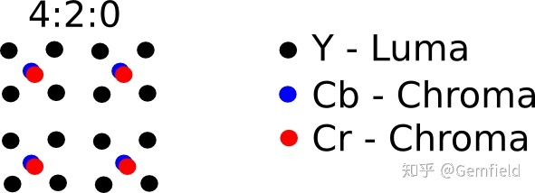
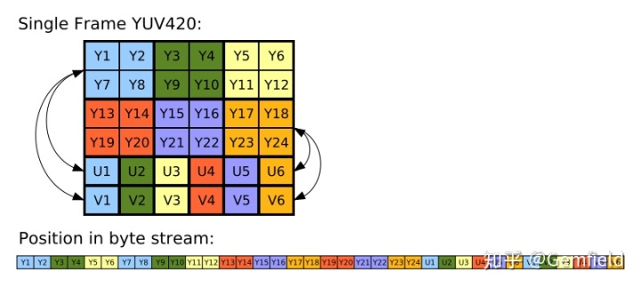

##  **背景**

从视觉信息的来源方面来看：

  1. Android和iOS项目中，从摄像头来的数据都是YUV格式的； 
  2. 解码一个视频时，每一帧中buffer里的data也都是YUV格式的（当你播放一个h264编码的MP4文件时，通过播放器的相关属性显示可以看到视频正以YUV420 planar被解码，什么意思？往后看！ ）。 

从我们想要使用这些数据的角度来看：

  1. UI界面显示画面需要使用RGB格式的data； 
  2. OpenCV等库需要RGB格式的输入； 
  3. 神经网络需要RGB这3个channel的输入； 

这就带来了一些问题，什么是以及为什么是YUV和RGB？如何从YUV转换到RGB？尤其是当了解到YUV本身就有很多种不同的格式。

##  **什么是RGB数据**

RGB
表示红（Red）、绿（Green）、蓝（Blue），也就是光的三原色，将它们以不同的比例叠加，可以产生不同的颜色。屏幕就是由红、绿、蓝三种发光的颜色小点组成的。（注意，颜料和不发光物体的三原色是黄、品红、青）。

比如一张1080p的图片，代表着有 1920 * 1080 个像素点。如果采用 RGB 编码方式，每个像素点都有红、绿、蓝三个原色，其中每个原色占用 1
个字节，每个像素占用3个字节，则一张1080p的图片就占用 1920 * 1280 * 3 / 1024 / 1024 = 7.03125MB
存储空间。比如著名的BMP位图就是这样保存图片的（所谓的RGB888格式，或者24位位图格式）。

**图片的信息量有7.03125MB并不代表对应的图片文件的大小就是7.03125MB** ，因为两点：

  1. 图片的信息会被压缩，减小文件的大小； 
  2. 图片文件会注入meta data，又会稍微增大文件大小； 

总体上图片文件肯定是变小了。而压缩又主要分为两种：

  1. 无损压缩，比如BMP位图文件——顶多是使用行程长度编码（RLE，run-length encoding）来进行轻度的无损数据压缩（COCO数据集的分割data也使用了RLE），所以7.03125MB大小的内容会保存为6MB左右的文件； 
  2. 有损压缩，最流行的就是jpg了，各种复杂的压缩算法，会根据图片内容的不同，使得图片文件的大小降低到几十KB到几百KB左右。 

试想一下，如果没有有损压缩算法，像小米10手机这样的1亿像素摄像头，拍一张照片就是100000000 * 3 /1024 /1024 =
286.1MB的存储（还没包含metadata）。

##  **RGB图片中的CHW和BGR概念**

以著名的图像算法库OpenCV为例，我们常常听到一个概念：一个API输出或者输出的图片格式是CHW还是HWC，是RGB还是BGR......但是这代表什么意思呢?

Gemfield使用一个例子来解释下，在Python中，使用OpenCV来读取一个图片gemfield.jpg（640x640）：

    
    
    >>> img = cv2.imread("gemfield.jpg")
    >>> img.shape
    (640, 640, 3)

(640, 640, 3)这样的结果一看就是 **hwc格式**
(HWC三个字母分别代表Height、Width、Channel)，相当于在内存中，img是个三维数组，从外层向内层依次是height、width、channel；也就是说：
**img是由640个height组成的，每个height是由640个width组成的，每个width是由3个channel组成的**
。而在每个width上， **如果是BGR格式，则一个width就是[B,G,R]** ， **如果是RGB的话，则一个width就是[R,G,B]。**
而OpenCV的imread输出的是BGR格式，因此img对象看起来就是这样的三维数组：

    
    
    #640个height
    [
        #640个width
        [
            [B,G,R],
            ......
            [B,G,R]
        ]
        ......
        [
            [B,G,R],
            ......
            [B,G,R]
        ]
    ]

如果想要把hwc格式转换为chw格式，则使用numpy的transpose：

    
    
    >>> img = img.transpose(2,0,1)
    >>> img.shape
    (3, 640, 640)

那么就是chw格式了，img依然是BGR格式，依然是3维数组：由3个channel组成，每个channel由640个height组成，每个height由640个width组成。img在内存中看起来就是这样：

    
    
    [
        #B
        [
            [w,w,...w],
            ......
            [w,w,...w],
        ],
        #G
        [
            [w,w,...w],
            ......
            [w,w,...w],
        ],
        #R
        [
            [w,w,...w],
            ......640个h
            [w,w,...w],
        ]
    ]

##  **什么是YUV数据**

大家已经知道的是，YUV 编码采用了明亮度和色度表示每个像素的颜色。其中Y表示明亮度（Luminance、Luma），也就是灰阶值。U、V
表示色度（Chrominance 或
Chroma）。Y'UV是工程师希望在黑白基础结构中使用彩色电视时发明的。他们需要一种与黑白（B＆W）电视兼容的信号传输方法，同时又能增加色彩。亮度分量已经以黑白信号形式存在，于是他们添加了UV信号作为解决方案。

Y'UV模型根据一个亮度分量（Y'）和两个色度分量（分别称为U（蓝色投影）和V（红色投影））定义了色彩空间。Y'UV颜色模型用于PAL
复合彩色视频（不包括PAL-N）标准中。先前的黑白系统仅使用亮度（Y'）信息。颜色信息（U和V）是通过副载波单独添加的，因此黑白接收器仍然能够以接收器的本机黑白格式接收和显示彩色图片。

Y'代表亮度分量（亮度），U和V代表色度（颜色）分量；术语Y'UV，YUV，YCbCr，YPbPr等的范围有时是模棱两可和重叠的。历史上，术语YUV和Y'UV用于电视系统中颜色信息的特定模拟编码，而YCbCr用于颜色信息的数字编码，适用于视频和静止图像压缩和传输，例如MPEG和JPEG。如今，
**术语YUV在计算机行业中通常用于描述使用YCbCr编码的文件格式** 。

YUV不是一种格式，而是有多种细分格式。Gemfield从存储格式维度和采样格式维度来分别介绍下。

**YUV的存储格式**

首先，YUV按照储存方法的不同，可以分为packeted formats和planar
formats；前者是YUV分量交叉排着，类似于RGB领域的hwc；后者是YUV分量分成三个数组存放，不掺和在一起，类似于RGB领域的chw。

**YUV的采样格式**

其次，YUV根据采样率和采样方式的不同，又可以划分为各种格式。

要说YUV相比于RGB有什么优势，那就是节省空间。为什么呢？因为YUV分量中，UV分量对人眼来说不敏感，因此可以降低采样率，而对人的视觉又不构成什么影响。以下面的YUV420格式来说：

可以看到UV分量只有Y分量的四分之一，这样每4个像素就是6个字节（而RGB是12个字节），相比RGB节省了一半空间。除了YUV420外，还有YUV444（和RGB一样的空间大小）和YUV422等主流格式。

**主流的YUV420格式**

这些主流YUV格式中，YUV420更常见（因为更节省空间啊），而从YUV420这种采样格式引申出来，叠加上不同的存储格式，就又可以细分为很多。Gemfield没有精力介绍这么多，你可以参考：
[ http://www.  fourcc.org/yuv.php
](https://link.zhihu.com/?target=http%3A//www.fourcc.org/yuv.php) 。

当YUV420采样格式叠加上planar
储存格式后，可以产生出YUV420P和YUV420SP格式。YUV420P是Y之后U之后V来储存，相当于RGB中的chw了，又可以细分为I420（又叫YU12）和YV12格式；而YUV420SP是Y之后UV交替...，又可以细分为NV12和NV21格式。这四种细分格式如下所示：

  * [ NV12 ](https://link.zhihu.com/?target=http%3A//www.fourcc.org/pixel-format/yuv-nv12/) ，FourCC为0x3231564E ，1个像素12 bit， 8-bit Y plane，Y通道平面结束后是交叉进行的 U/V 通道平面，U/V使用2x2的采样率（各是Y的四分之一）。 
  * [ NV21 ](https://link.zhihu.com/?target=http%3A//www.fourcc.org/pixel-format/yuv-nv21/) ，FourCC为0x3132564E ，1个像素12 bit， 和NV12一样——除了U/V交叉的时候是先V再U，也就是U/V和V/U的区别； **这个是Android上摄像头图像的标准** ； 
  * [ I420 ](https://link.zhihu.com/?target=http%3A//www.fourcc.org/pixel-format/yuv-i420/) （也叫YU12），FourCC为0x30323449 ，1个像素12 bit，8 bit Y 通道平面结束后，是U通道平面，最后是V通道平面； 
  * [ YV12 ](https://link.zhihu.com/?target=http%3A//www.fourcc.org/pixel-format/yuv-yv12/) ，FourCC为0x32315659，1个像素12 bit，8 bit Y 通道平面结束后，是V通道平面，最后是U通道平面； 

##  **YUV到RGB的转换**

一边是YUV格式的生产者，一边是RGB格式的消费者。那如何从YUV转换到RGB呢？上文已经说过，YUV的细分格式有很多种（几十种），Gemfield没有那么多的精力，也没必要花那个精力一一介绍，因此，这里只给出主流中的主流YUV格式到RGB的转化。

**Y'UV420p（和Y'V12或YV12）到RGB888的转换**

Y'UV420p是平面格式，这意味着Y'，U和V值组合在一起而不是散布在一起。这样做的原因是，通过将U和V值分组在一起，图像变得更加可压缩。当给定Y'UV420p格式的图像数组时，所有Y'值首先出现，然后是所有U值，最后是所有V值。

Y'V12格式本质上与Y'UV420p相同，但是它切换了U和V数据：Y'值后跟V值，最后是U值。只要注意从适当的位置提取U和V值，就可以使用相同的算法处理Y'UV420p和Y'V12。

与大多数Y'UV格式一样，Y'值与像素一样多。在X为像素数，则数组中的前X个元素是对应于每个单独像素的Y'值。但是，U和V值只有Y的四分之一，这意味着每个U和V元素均适用于四个像素。

如上图所示，Y'UV420中的Y'，U和V分量分别在顺序块中编码。为每个像素存储一个Y'值，而为每个2×2正方形像素块分别存储一个U值和一个V值。上图中使用相同的颜色显示了相应的Y'，U和V值。从设备逐行读取字节流，Y'块位于位置0，U块位于x×y（在此示例中为6×4
= 24），V块位于位置x ×y +（x×y）/ 4（这里6×4 +（6×4）/ 4 = 30）。

**Y′UV420sp (NV21) 到 RGB 的转换 (Android必备)**

NV21是Android camera preview的标准图片格式。Android SDK中AV模块的C++代码展示了NV21到RGB的转换：

    
    
    //Android sdk中的AV模块
    uint8_t clamp(uint8_t v, uint8_t minValue, uint8_t maxValue) {
        CHECK(maxValue >= minValue);
        if (v < minValue) return minValue;
        else if (v > maxValue) return maxValue;
        else return v;
    }
    void YUVImage::yuv2rgb(uint8_t yValue, uint8_t uValue, uint8_t vValue,
            uint8_t *r, uint8_t *g, uint8_t *b) const {
        *r = yValue + (1.370705 * (vValue-128));
        *g = yValue - (0.698001 * (vValue-128)) - (0.337633 * (uValue-128));
        *b = yValue + (1.732446 * (uValue-128));
        *r = clamp(*r, 0, 255);
        *g = clamp(*g, 0, 255);
        *b = clamp(*b, 0, 255);
    }
    

**如果要使用ffmpeg来进行YUV420到RGB的转换**

参考专栏文章：

[ Gemfield：使用ffmpeg库进行YUV420到RGB的转化 ](https://zhuanlan.zhihu.com/p/53305541)

##  **对于iOS上的视频解码有什么帮助呢？**

在iOS上，不论你是从摄像头读取数据，还是从视频文件中抽帧，当使用AVCaptureVideoDataOutput来获得它们的数据时，你需要设置decode出来的每帧buffer的格式：

    
    
    //设置读取的buffer的格式为kCVPixelFormatType_32BGRA
    AVAssetTrack *videoTrack = [videoTracks objectAtIndex:0];
        AVAssetReaderTrackOutput *trackOutput = [[AVAssetReaderTrackOutput alloc] initWithTrack:videoTrack outputSettings:CVPixelFormatOutputSettings()];
    
    NS_INLINE NSDictionary *CVPixelFormatOutputSettings() {
        return @{ (NSString *)kCVPixelBufferPixelFormatTypeKey : [NSNumber numberWithInt:kCVPixelFormatType_32BGRA] };
    }

buffer的格式一般可以设置为如下这几种：

  * kCVPixelFormatType_32BGRA: a single plane where the blue, green, red and alpha values are stored in a 32 bit integer each；这是RGB领域； 
  * kCVPixelFormatType_420YpCbCr8BiPlanarFullRange: Two planes, the first containing a byte for each pixel with the Y (luma) value, the second containing the Cb and Cr (chroma) values for groups of pixels；这是YUV420领域； 
  * kCVPixelFormatType_420YpCbCr8BiPlanarVideoRange: The same as 420YpCbCr8BiPlanarFullRange but the Y values are restricted to the range 16 – 235 (for historical reasons)；这是YUV420领域； 

Apple的官方文档有更多格式的描述：

[ Pixel Format Identifiers
](https://link.zhihu.com/?target=https%3A//developer.apple.com/documentation/corevideo/1563591-pixel_format_identifiers%3Flanguage%3Dobjc)

然后不同格式还可以互相转换：

[ https://  developer.apple.com/doc
umentation/accelerate/conversion?language=objc
](https://link.zhihu.com/?target=https%3A//developer.apple.com/documentation/accelerate/conversion%3Flanguage%3Dobjc)

如果你对颜色空间感兴趣，并且速度也不是问题，那么就使用kCVPixelFormatType_32BGRA格式；反之就使用kCVPixelFormatType_420YpCbCr8BiPlanarFullRange这些YUV420格式（因为视频中的图像就是这种格式）。通过设置这些格式，然后图像数据被decode到CMSampleBufferRef类型的buffer中，然后很快能得到CVPixelBufferRef。然后：

当buffer
format设置为kCVPixelFormatType_32BGRA时，decode出来的CMSampleBufferRef可以这样读到某个像素的BGRA值：

    
    
    //CMSampleBufferRef -> CVPixelBufferRef
    let pixelBuffer: CVPixelBufferRef = CMSampleBufferGetImageBuffer(sampleBuffer)!
    CVPixelBufferLockBaseAddress(pixelBuffer, 0)
    let baseAddress = CVPixelBufferGetBaseAddress(pixelBuffer)
    let int32PerRow = CVPixelBufferGetBytesPerRow(pixelBuffer)
    let int32Buffer = UnsafeMutablePointer<UInt32>(baseAddress)
    
    // Get BGRA value for pixel (43, 17)
    let luma = int32Buffer[17 * int32PerRow + 43]
    
    CVPixelBufferUnlockBaseAddress(pixelBuffer, 0)

如果buffer
format设置为kCVPixelFormatType_420YpCbCr8BiPlanarFullRange时，decode出来的CMSampleBufferRef可以这样读到某个像素的亮度值：

    
    
    //CMSampleBufferRef -> CVPixelBufferRef
    let pixelBuffer: CVPixelBufferRef = CMSampleBufferGetImageBuffer(sampleBuffer)!
    
    CVPixelBufferLockBaseAddress(pixelBuffer, 0)
    let baseAddress = CVPixelBufferGetBaseAddressOfPlane(pixelBuffer, 0)
    let bytesPerRow = CVPixelBufferGetBytesPerRowOfPlane(pixelBuffer, 0)
    let byteBuffer = UnsafeMutablePointer<UInt8>(baseAddress)
    
    // Get luma value for pixel (43, 17)
    let luma = byteBuffer[17 * bytesPerRow + 43]
    
    CVPixelBufferUnlockBaseAddress(pixelBuffer, 0)

