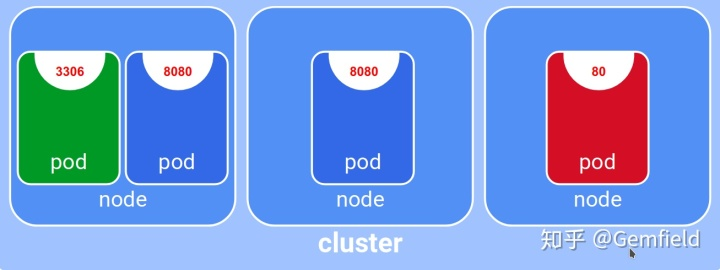
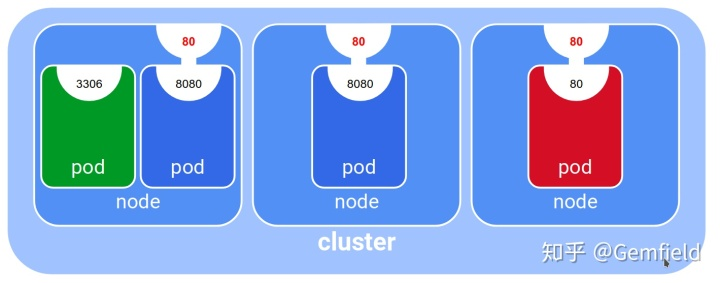
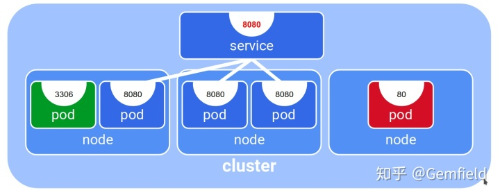
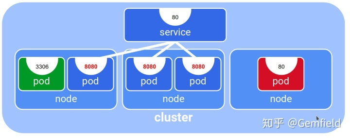
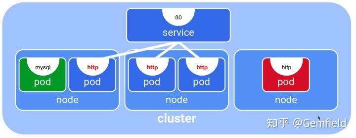
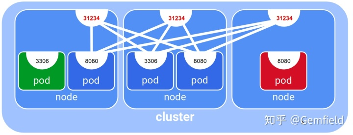

##  **背景**

以前Gemfield使用的是docker
compose来管理容器，但最近的服务要scale到上百个container，并且要跨越多台机器，很显然docker
compose就无能为例了：比如如何进行跨越多台机器的增删改查，比如不同机器之间的container如何通信等等。于是Gemfield开始使用K8s来进行容器的管理维护了。本文中的K8s版本为1.11，安装方式可以参考：
[ 使用kubeadm安装Kubernetes 1.11 ](https://zhuanlan.zhihu.com/p/40931670) 。

##  **最初的K8s yaml文件**

gemfield首先使用kompose来将之前写的docker-compose.yml文件转化为K8s的，kompose可以使用下面的方式来下载：

    
    
    curl -L https://github.com/kubernetes/kompose/releases/download/v1.1.0/kompose-linux-amd64 -o kompose

转换的命令如下：

    
    
    gemfield@ThinkPad-X1C:~$ ./kompose -f docker-compose-test.yml convert

这个命令会将当前的docker-compose yaml文件转换为一大堆k8s的yaml文件。

##  **设置nodeSelector**

因为有些Application是需要Node有GPU卡的，有些Application是需要所在Node的网络有外网访问的。所以我们得设置哪些pod调度在哪些Node上。

首先要向node添加label，之后我们才能在pod/deployment上使用nodeSelector：

    
    
    kubectl get nodes
    kubectl label nodes <your-node-name> disktype=ssd
    kubectl get nodes --show-labels

然后可以像下面这样来使用nodeSelector：

    
    
    apiVersion: v1
    kind: Pod
    metadata:
      name: nginx
      labels:
        env: test
    spec:
      containers:
      - name: nginx
        image: nginx
        imagePullPolicy: IfNotPresent
      nodeSelector:
        disktype: ssd

##  **IP和Port**

K8s的nodes、pods、services都有他们自己的IP。Pod封装容器化的application，运行在宿主机node上，service是pod服务的抽象；而端口配置又有containerPort(用于Pod)、hostPort(用于Pod)、port(用于Service)、targetPort(用于Service)、nodePort(用于Service)。下面简单说一下这几种IP和Port：

1，node IP（也就是hostIP）就是每个物理机或者VM上有默认路由的Iface上的IP；可访问性就等同于该物理机的可访问性；

2，pod IP是K8s的最小单元Pod的IP，来自于创建cluster时候kubeadm的--pod-network-cidr参数设定的CIDR；

3，service IP（CLUSTER IP）来自于-service-cluster-ip-range指定的CIDR，默认值是10.0.0.0/24；

4，containerPort用于pod（或者deployment中的template），就是Application在容器中listen的端口，相当于docker容器中服务listen的端口；也就是你写的应用程序直接socket
listen的端口；containerPort的意义相当于宣称一个端口号的存在；比如，你编码的应用程序将socket
LISTEN在7030端口上，然后在deployment的yaml文件中配置containerPort:7030（在yaml文件中还可以将这个端口起个名字）,意思是告诉K8s和芸芸众生，说道：Hi，我有个服务是socket
LISTEN在7030端口上的，我就是告诉你们一下。

containerPort参数的意义

上图中containerPort分别是3306、8080、8080、80；

5，hostPort用于Pod（或者deployment中的template），containerPort映射到的Node主机的端口，一个pod和一个node一一对应，这个不推荐（除非不得已），因为pod重新调度后映射关系会被破坏。

 hostPort

上图中的hostPort分别是80、80、80；

6，port是service的port，范围由--service-node-port-
range参数指定，默认值是30000-32767；service是抽象出来的，service的IP是cluster
IP，service的port用来和cluster ip组合使用；这个cluster IP + port的组合是很稳定的，不会随着pod的变动而变动；

 port

上图中的port就是8080,由于没有显式的指定targetPort，所以就会指向封装的pod(通常用label selector指定)的8080端口；

7，targetPort用于service，可以将service的port上的traffic 路由到封装的pod(通常用label
selector指定)上的targetPort端口，你可以看到下图，service的port是80,然后将traffic路由到了封装的pod上的8080端口；

 targetPort

上图中targetPort是8080；targetPort也可以是名字，如下图所示：

 targetPort
with name

8，nodePort用于service，可以将所有node的端口（nodePort）映射到一个service的port；nodeport会在每个kubelet节点的宿主机开启一个端口，用于应用集群外部访问。这样，在cluster外部访问nodePort的traffic就会被route到service的port上，进而被route到封装的Pod的containerPort上，如下图所示：

 nodePort

NodeIP:nodePort的访问方式如果使用上了external-
traffic=OnlyLocal属性，那么traffic就只能被route到本机的Pod上，如下图所示：

 nodePort
local

##  **服务的内部访问**

从上面我们得知，Service的<cluster ip>:port
是提供给集群内部客户访问service的入口。比如cluster内部的前端服务访问内部的后端服务(如redis)，或者是内部的解耦的部件通过内部的中间件（如kafka）来访问，这就带来了一些问题，前端如何知道后端的cluster
IP呢？解耦的部件是如何知道中间件的cluster IP呢？这就用到了K8s的服务发现机制。目前，K8s提供了如下的服务发现机制：

1，比如说，我们创建了如下一个Redis的deployment（template代表封装的pod），设置的containerPort是6379；

    
    
    apiVersion: apps/v1 # for versions before 1.9.0 use apps/v1beta2
    kind: Deployment
    metadata:
      name: redis-master
      labels:
        app: redis
    spec:
      selector:
        matchLabels:
          app: redis
          role: master
          tier: backend
      replicas: 1
      template:
        metadata:
          labels:
            app: redis
            role: master
            tier: backend
        spec:
          containers:
          - name: master
            image: k8s.gcr.io/redis:e2e  # or just image: redis
            resources:
              requests:
                cpu: 100m
                memory: 100Mi
            ports:
            - containerPort: 6379

我们又创建了如下的Redis的service，设置的port和targetPort分别是6379：

    
    
    apiVersion: v1
    kind: Service
    metadata:
      name: redis-master
      labels:
        app: redis
        role: master
        tier: backend
    spec:
      ports:
      - port: 6379
        targetPort: 6379
      selector:
        app: redis
        role: master
        tier: backend

问题来了，这个Redis的service的IP怎么拿到呢？cluster内部的application在编程的时候只知道要访问redis的端口是6379,但是cluster
IP是多少呢？ **K8s主要使用2种机制来实现服务发现（Discovering services）：**

1，环境变量

kubelet组件会在所有的Pod中注入该服务（目前已经create的）IP:Port相关的一组环境变量，以上面的redis服务为例，其对外暴露的端口是6379，假定其被分配的cluster
IP是10.0.0.11，那么kubelet会在Pod的环境中注入以下环境变量:

    
    
    REDIS_MASTER_SERVICE_HOST=10.0.0.11
    REDIS_MASTER_SERVICE_PORT=6379
    REDIS_MASTER_PORT=tcp://10.0.0.11:6379
    REDIS_MASTER_PORT_6379_TCP=tcp://10.0.0.11:6379
    REDIS_MASTER_PORT_6379_TCP_PROTO=tcp
    REDIS_MASTER_PORT_6379_TCP_PORT=6379
    REDIS_MASTER_PORT_6379_TCP_ADDR=10.0.0.11

环境变量的方式有个问题，就是对顺序有要求：如果想让某个Pod访问某个service，那么这个service必须先于这个Pod创建，否则Kubelet不会向该Pod注入该服务IP:Port相关的环境变量。

2，DNS

1.11版本开始默认使用coreDNS组件了。可以使用<service_name>.<namespace>来查询服务对应的IP；K8s的DNS功能还支持DNS
SRV，也就是说可以通过 _service._proto. <service_name>.<namespace>来查询host上service的端口。

##  **服务的外部访问**

目前，如果在K8s
cluster的Pod中运行一个服务，应用侦听在clusterIP:Port上，那么这个service的clusterIP:Port是无法从cluster外部访问的，只能从cluster内部使用clusterIP:Port来访问该service。K8s使用ServiceTypes来决定或者改变这一状况。ServiceTypes的取值有
` ClusterIP ` 、
NodePort、LoadBalancer、ExternalName。默认就是ClusterIP，这种情况下，Service只能在cluster内部访问。如果想在cluster外部访问服务，还有以下选择(
**注意这里说的是service，而不是Pod的直接访问。Pod的直接访问使用的方式有2
个，hostPort和hostNetwork，前者相当于docker run -p hostport:containerport，后者相当于docker
run --net=host** ）：

1，nodePort是kubernetes提供给K8s
cluster外部客户访问service入口的一种方式，你在本文的前面已经见过了。这个会将service的端口mapping到每个Node上，然后你在cluster外部可以使用
` <NodeIP>:<NodePort> ` 来访问该服务；

2，LoadBalancer，需要底层的基础设施支持。目前 Google Cloud Platform 和 AWS平台上支持这种类型；

3，ExternalName，通过CNAME；

4，externalIPs，首先K8s
cluster的Node上有外网可以访问的IP，那么像下面这样的配置就可以使用80.11.12.10:80来访问my-service;

    
    
    kind: Service
    apiVersion: v1
    metadata:
      name: my-service
    spec:
      selector:
        app: MyApp
      ports:
      - name: http
        protocol: TCP
        port: 80
        targetPort: 9376
      externalIPs:
      - 80.11.12.10

5，ingress（Gemfield使用的是BareMetal上的安装）

首先得安装ingress controller：

    
    
    #Mandatory command
    gemfield@master:~$ kubectl apply -f https://raw.githubusercontent.com/kubernetes/ingress-nginx/master/deploy/mandatory.yaml
    namespace/ingress-nginx created
    deployment.extensions/default-http-backend created
    service/default-http-backend created
    configmap/nginx-configuration created
    configmap/tcp-services created
    configmap/udp-services created
    serviceaccount/nginx-ingress-serviceaccount created
    clusterrole.rbac.authorization.k8s.io/nginx-ingress-clusterrole created
    role.rbac.authorization.k8s.io/nginx-ingress-role created
    rolebinding.rbac.authorization.k8s.io/nginx-ingress-role-nisa-binding created
    clusterrolebinding.rbac.authorization.k8s.io/nginx-ingress-clusterrole-nisa-binding created
    deployment.extensions/nginx-ingress-controller created
    
    #安装service，Baremetal上（此处你可以选择对应你环境的安装方式，比如minikube、AWS、Azure、GCE-GKE等）
    gemfield@master:~$ kubectl apply -f https://raw.githubusercontent.com/kubernetes/ingress-nginx/master/deploy/provider/baremetal/service-nodeport.yaml
    service/ingress-nginx created
    
    #查看安装的状态
    gemfield@master:~$ kubectl get pods --all-namespaces -l app=ingress-nginx --watch
    NAMESPACE       NAME                                       READY     STATUS    RESTARTS   AGE
    ingress-nginx   nginx-ingress-controller-d658896cd-dkpst   1/1       Running   0          6m
    
    #查看ingress controller的版本
    gemfield@master:~$ POD_NAMESPACE=ingress-nginx
    gemfield@master:~$ POD_NAME=$(kubectl get pods -n $POD_NAMESPACE -l app=ingress-nginx -o jsonpath={.items[0].metadata.name})
    gemfield@master:~$ echo $POD_NAME
    nginx-ingress-controller-d658896cd-dkpst
    gemfield@master:~$ kubectl exec -it $POD_NAME -n $POD_NAMESPACE -- /nginx-ingress-controller --version
    -------------------------------------------------------------------------------
    NGINX Ingress controller
      Release:    0.17.1
      Build:      git-12f7966
      Repository: https://github.com/kubernetes/ingress-nginx.git
    -------------------------------------------------------------------------------

如果你像上面这样直接安装完成的话，在你创建了ingress之后：

    
    
    apiVersion: extensions/v1beta1
    kind: Ingress
    metadata:
      name: web-ingress
      annotations:
        kubernetes.io/ingress.class: "nginx"
    spec:
      rules:
        - http:
           paths:
           - path: 
             backend:
              serviceName: web
              servicePort: 80

然后使用kubectl get ing看看状态，你会发现ADDRESS是空的：

    
    
    gemfield@master:~$ kubectl get ing
    NAME          HOSTS     ADDRESS   PORTS     AGE
    web-ingress   *                   80        8s

这是因为你部署ingress的时候，使用的是NodePort类型的（官网上在BareMetal上默认安装的方式），NodePort类型的ingress没有显式的IP，这种情况下，你仍然可以使用任一node的NodePort来访问ingress；那么如果你想要显式的IP，你需要修改上述官方的ingress
service的yaml文件（从NodePort类型改为：

    
    
    apiVersion: v1
    kind: Service
    metadata:
      name: ingress-nginx
      namespace: ingress-nginx
    spec:
      ports:
      - name: http
        port: 80
        targetPort: 80
        protocol: TCP
      - name: https
        port: 443
        targetPort: 443
        protocol: TCP
      selector:
        app: ingress-nginx
      externalIPs: 
        - 192.168.1.188

重新部署ingress service后，然后再次创建ingress resource，然后等几十秒，然后使用kubectl get
ing看看状态，你会发现ADDRESS已经有值了：

    
    
    gemfield@master:~$ kubectl get ing
    NAME          HOSTS     ADDRESS         PORTS     AGE
    web-ingress   *         192.168.1.188   80        2m

##  **配置项**

Gemfield想说2点，这两点都是一些好的实践：第一，把之前docker-
compose中配置的环境变量全部放到configMap里；第二，把一些application的配置文件（如Nginx的配置文件）放到configMap里。

使用下面的命令来创建configMap:

    
    
    kubectl create configmap <map-name> <data-source>

data-source可以是目录、文件、字符串等。

##  **文件存储**

Gemfield之前的docker-
compose架构中并没有使用对象存储，全部基于文件系统；因此，在重构到K8s框架下的时候，依然使用文件存储。Gemfield需要使用的文件存储有两大类共3种：1,非持久化存储，并且要基于内存文件系统；2,持久化存储，基于本地的（当前Node）上的文件系统；3,持久化存储，基于网络的ceph系统；

1，基于NFS的存储

首先要在每个worker node上安装nfs-common包，在K8s的底层是通过kubelet来执行mount -t nfs 来完成挂载的：

    
    
    gemfield@ML:~$ sudo apt install nfs-common

然后Deployment的yaml文件里存储部分可以这么写：

    
    
    kind: Deployment
    metadata:
      name: web
    spec:
      selector:
        matchLabels:
          app: web
      strategy:
        type: Recreate
      template:
        metadata:
          labels:
            app: web
        spec:
          containers:
          - name: web
            image: gemfield/web
            ports:
            - name: web
              containerPort: 80
            command: ['/bin/bash','-c','sleep 3600'] 
            volumeMounts:
            - name: bigdata
              mountPath: /home/gemfield/mnt
          volumes:
          - name: data
            emptyDir: {}
          - name: bigdata
            nfs:
              server: 192.168.1.188
              path: /bigdata

这就相当于

    
    
    gemfield@ML:~$ sudo mount -t nfs 192.168.1.188:/bigdata <your_container>:/home/gemfield/mnt

##  **资源申请**

Gemfield之前的docker-compose所需要的资源主要有CPU、RAM、GPU。

  

##  **kubectl apply 和 kubectl create**

你可能很快就发现了，在创建object的时候，最常用的kubectl参数就是apply和create了，那么，这两个参数的区别是什么呢？

1，kubectl create

kubectl create为K8s中的imperative
management（命令式管理），用户来命令，K8s你只管执行好命令就行了。我可以命令K8s对一些object进行create、replace 、
delete等操作，那么K8s就相应的create、replace、delete。

    
    
    #增
    kubectl create -f <filename|url>
    
    #删
    kubectl delete -f <filename|url>
    
    #改
    kubectl replace -f <filename|url>
    
    #查
    kubectl get -f <filename|url> -o yaml

这种命令式的管理总体还行，就是replace的操作会有一些局限性，详情可参考 [ Imperative Management of Kubernetes
Objects Using Configuration Files - Kubernetes
](https://link.zhihu.com/?target=https%3A//kubernetes.io/docs/concepts/overview/object-
management-kubectl/imperative-config/) ；

  

2，kubectl apply

这是K8s中的Declarative management（声明式管理），用户声明想要达到的状态，K8s去满足用户的愿望就行了。

    
    
    #创建所有的object，修改也用同样的命令
    kubectl apply -f <directory>/
    kubectl apply -f -R <directory>/
    kubectl apply -f https://k8s.io/examples/application/simple_deployment.yaml
    
    #读
    kubectl get -f https://k8s.io/examples/application/simple_deployment.yaml -o yaml
    
    #删
    kubectl delete -f <filename>
    或者（需要很高水平）
    kubectl apply -f <directory/> --prune -l your=label

