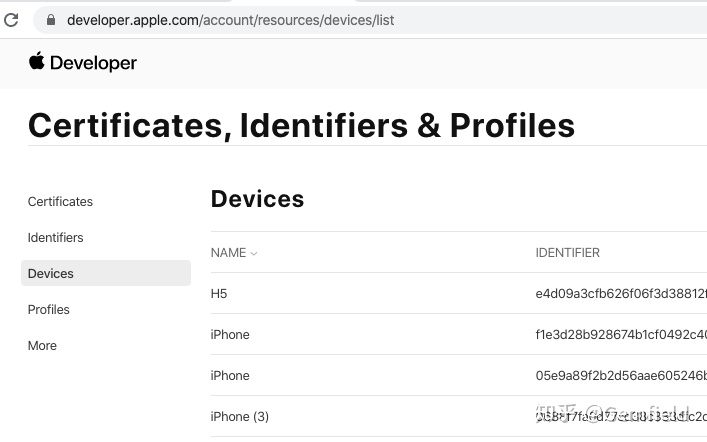
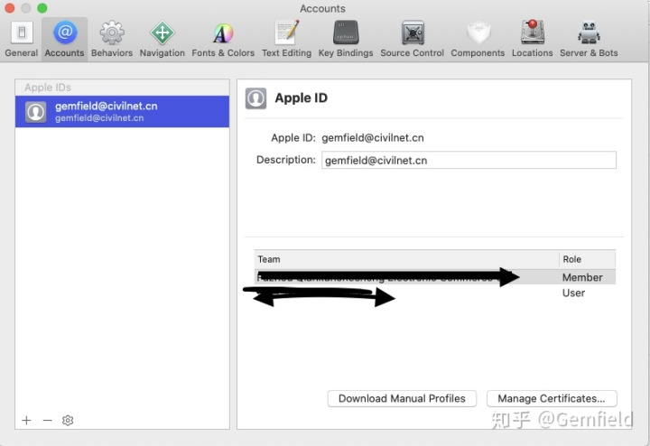
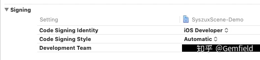
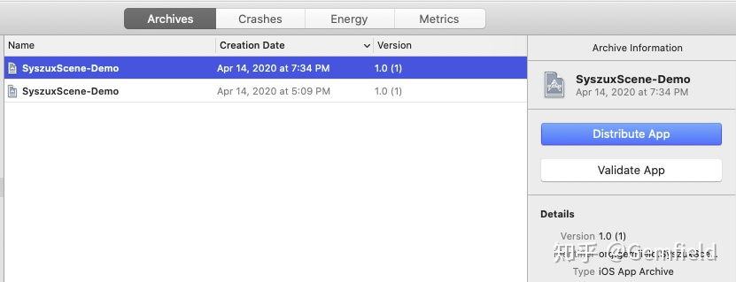
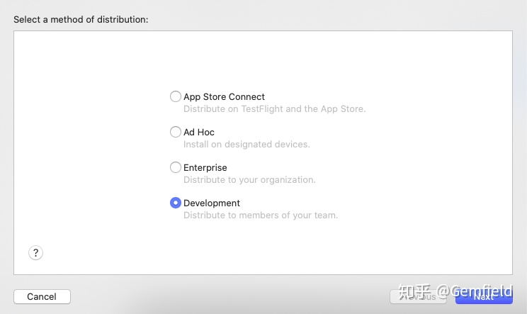
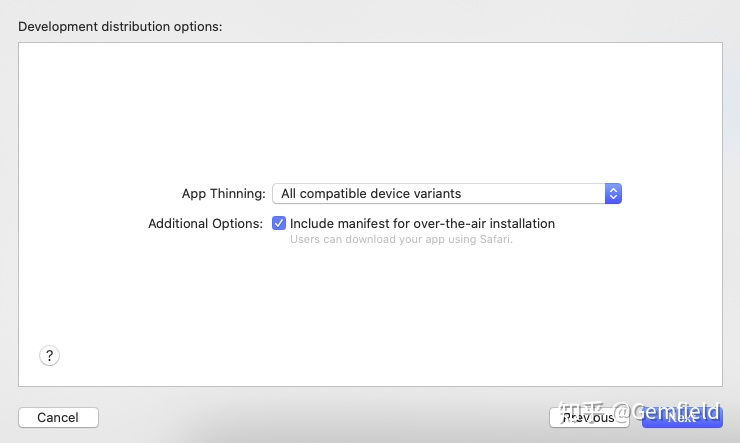
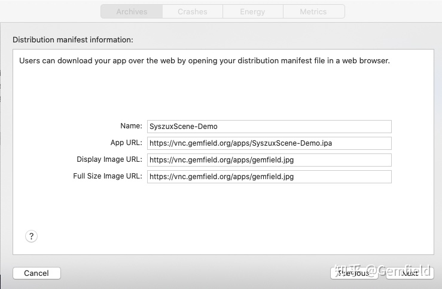
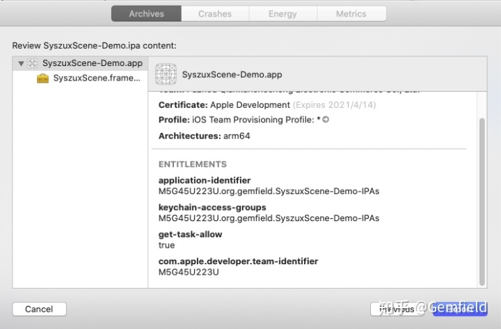

##  **背景**

最近要给远方的客人提供一个iOS
App来进行预览体验，因为不是正式的产品，所以不能发布到苹果商店；又因为iOS不像Android那么开放，可以随随便便下载安装一个外部apk；又因为是远方的人员/iPhone来安装，不可能使用数据线直接接在开发电脑上烧写App到手机上。因此便有了本文，在本文中，Gemfield来介绍如何远程安装一个iPhone上的程序。

如果要实践本文，你需要具备如下的资源：

  1. XCode及所在的开发机（macbook、mac、未来的iPad pro）； 
  2. Linux服务器（有公网IP、可供公网访问、安装有Docker环境）； 
  3. SSL证书（用于HTTPS），至少Safari浏览器承认的SSL证书； 
  4. 付费的苹果开发者账户（个人或企业，免费的不行）； 
  5. 一个有UI界面并且编译成功的项目； 

否则你看看就行了。

##  添加新的iPhone设备

如果远方的人的iPhone需要安装你的iOS程序，则需要首先在你的Profiles中支持该设备。按照如下步骤来增加对远方iPhone的支持。

**1，在苹果账户中添加设备**

访问 [ https://  developer.apple.com/acc  ount/resources/devices/list
](https://link.zhihu.com/?target=https%3A//developer.apple.com/account/resources/devices/list)
，如果你有权限的话，在下面的页面上你可以添加新的iPhone：

注意，Gemfield假设你已经维护了一些Certificates和对应的设备，这里只是在这个基础上新添加一个iPhone设备的UDID，如何获取UDID呢？网上搜下，很简单的。添加完毕后，需要在XCode上重新下载Profiles。

**2，更新Xcode上的Profiles**

点击XCode - Perferences，如下图所示，点击“Download Manual Profiles”：

##  安装Nginx服务器

Gemfield将使用Docker来简化这个安装过程，下面的所有操作都在前言中所说的Linux服务器上。

**1，配置好服务器上的本地目录**

在/root/gemfield下，gemfield有如下文件：

    
    
    root@CivilNet:~/gemfield# ls -l
    total 24
    drwxr-xr-x 2 root root 4096 Apr 15 08:36 cert
    drwxr-xr-x 3 root root 4096 Apr 15 08:36 html
    -rw-r--r-- 1 root root 5351 Apr 15 08:36 mime.types
    -rw-r--r-- 1 root root  938 Apr 15 08:36 ssl.conf

1.1，其中cert目录下存放适合Nginx的https证书：

    
    
    root@CivilNet:~/gemfield# ls -l cert
    total 8
    -rw-r--r-- 1 root root 1675 Apr 15 08:36 3764883_vnc.gemfield.org.key
    -rw-r--r-- 1 root root 3659 Apr 15 08:36 3764883_vnc.gemfield.org.pem

1.2，mime.types下的内容在原本的基础上增加了两行

  * application/vnd.android.package-archive apk; 
  * application/iphone pxl ipa; 

全部看起来如下所示：

    
    
    types {
        text/html                                        html htm shtml;
        text/css                                         css;
        text/xml                                         xml;
        image/gif                                        gif;
        image/jpeg                                       jpeg jpg;
        application/javascript                           js;
        application/atom+xml                             atom;
        application/rss+xml                              rss;
    
        text/mathml                                      mml;
        text/plain                                       txt;
        text/vnd.sun.j2me.app-descriptor                 jad;
        text/vnd.wap.wml                                 wml;
        text/x-component                                 htc;
    
        image/png                                        png;
        image/svg+xml                                    svg svgz;
        image/tiff                                       tif tiff;
        image/vnd.wap.wbmp                               wbmp;
        image/webp                                       webp;
        image/x-icon                                     ico;
        image/x-jng                                      jng;
        image/x-ms-bmp                                   bmp;
    
        font/woff                                        woff;
        font/woff2                                       woff2;
    
        application/java-archive                         jar war ear;
        application/json                                 json;
        application/mac-binhex40                         hqx;
        application/msword                               doc;
        application/pdf                                  pdf;
        application/postscript                           ps eps ai;
        application/rtf                                  rtf;
        application/vnd.apple.mpegurl                    m3u8;
        application/vnd.google-earth.kml+xml             kml;
        application/vnd.google-earth.kmz                 kmz;
        application/vnd.ms-excel                         xls;
        application/vnd.ms-fontobject                    eot;
        application/vnd.ms-powerpoint                    ppt;
        application/vnd.oasis.opendocument.graphics      odg;
        application/vnd.oasis.opendocument.presentation  odp;
        application/vnd.oasis.opendocument.spreadsheet   ods;
        application/vnd.oasis.opendocument.text          odt;
        application/vnd.openxmlformats-officedocument.presentationml.presentation
                                                         pptx;
        application/vnd.openxmlformats-officedocument.spreadsheetml.sheet
                                                         xlsx;
        application/vnd.openxmlformats-officedocument.wordprocessingml.document
                                                         docx;
        application/vnd.wap.wmlc                         wmlc;
        application/x-7z-compressed                      7z;
        application/x-cocoa                              cco;
        application/x-java-archive-diff                  jardiff;
        application/x-java-jnlp-file                     jnlp;
        application/x-makeself                           run;
        application/x-perl                               pl pm;
        application/x-pilot                              prc pdb;
        application/x-rar-compressed                     rar;
        application/x-redhat-package-manager             rpm;
        application/x-sea                                sea;
        application/x-shockwave-flash                    swf;
        application/x-stuffit                            sit;
        application/x-tcl                                tcl tk;
        application/x-x509-ca-cert                       der pem crt;
        application/x-xpinstall                          xpi;
        application/xhtml+xml                            xhtml;
        application/xspf+xml                             xspf;
        application/zip                                  zip;
        application/vnd.android.package-archive          apk;
        application/iphone                               pxl ipa;
    
        application/octet-stream                         bin exe dll;
        application/octet-stream                         deb;
        application/octet-stream                         dmg;
        application/octet-stream                         iso img;
        application/octet-stream                         msi msp msm;
    
        audio/midi                                       mid midi kar;
        audio/mpeg                                       mp3;
        audio/ogg                                        ogg;
        audio/x-m4a                                      m4a;
        audio/x-realaudio                                ra;
    
        video/3gpp                                       3gpp 3gp;
        video/mp2t                                       ts;
        video/mp4                                        mp4;
        video/mpeg                                       mpeg mpg;
        video/quicktime                                  mov;
        video/webm                                       webm;
        video/x-flv                                      flv;
        video/x-m4v                                      m4v;
        video/x-mng                                      mng;
        video/x-ms-asf                                   asx asf;
        video/x-ms-wmv                                   wmv;
        video/x-msvideo                                  avi;
    }

1.3，ssl.conf文件为Nginx的配置文件，用来代替原本的default.conf文件，这个文件主要做了这3件事情：

  1. 启用HTTPS服务（替换http）； 
  2. 添加HTTPS证书； 
  3. 禁止plist文件的直接网页展示； 

文件内容如下所示：

    
    
    server {
            listen 443 ssl;
            server_name vnc.gemfield.org;
            add_header Strict-Transport-Security "max-age=31536000";
            charset utf-8;
            ssl_certificate /etc/nginx/cert/3764883_vnc.gemfield.org.pem;
            ssl_certificate_key /etc/nginx/cert/3764883_vnc.gemfield.org.key;
            ssl_session_timeout 5m;
            ssl_ciphers ECDHE-RSA-AES128-GCM-SHA256:ECDHE:ECDH:AES:HIGH:!NULL:!aNULL:!MD5:!ADH:!RC4;
            ssl_protocols TLSv1 TLSv1.1 TLSv1.2;
            ssl_prefer_server_ciphers on;
    
            error_page   500 502 503 504  /50x.html;
            location = /50x.html {
                root   /usr/share/nginx/html;
            }
            location / {
                root /usr/share/nginx/html;
                index index.html index.htm;
                if ($request_filename ~* ^.*?\.(txt|doc|pdf|rar|gz|zip|docx|exe|xlsx|ppt|pptx|plist)$){
                    add_header Content-Disposition: 'attachment;';
                }
           }
    }

1.4，html目录是一个apps目录，这里目前存放的有：

    
    
    root@CivilNet:~/gemfield# ls -l html/apps
    total 24520
    -rw-r--r-- 1 root root    2493 Apr 15 08:36 gemfield.jpg
    -rw-r--r-- 1 root root     585 Apr 15 08:36 syszuxscene.html

其中gemfield.jpg就是你的logo图片，syszuxscene.html的内容如下：

    
    
    <!doctype html> 
    <html> 
    <head> 
    <meta charset="utf-8"> 
    <meta name="viewport" content="width=device-width; initial-scale=1.0"> 
    <meta name="keywords" content="syszux" /> 
    <meta name="description" content="SyszuxScene, A Product powered by Gemfield." /> 
    <title>SyszuxScene</title> 
    </head> 
    <body> 
    
 
     
     
    

     
     
    

    </body> 
    </html>

**2，启动Nginx容器**

在Linux服务器上，使用docker命令来启动，非常简单：

    
    
    docker run -d -p 443:443 \
      -v /root/gemfield/ssl.conf:/etc/nginx/conf.d/default.conf \
      -v /root/gemfield/html/:/usr/share/nginx/html \
      -v /root/gemfield/cert/:/etc/nginx/cert \
      -v /root/gemfield/mime.types:/etc/nginx/mime.types \
      --restart=always nginx

Nginx服务启动正常后， [ https://  vnc.gemfield.org
](https://link.zhihu.com/?target=https%3A//vnc.gemfield.org) 就可以访问了，下面添加iOS程序。

##  **XCode导出IPA包**

安装包的格式，在Ubuntu上叫deb、Android上叫apk，对应的在iOS上就叫IPA。因此，我们就是要使用XCode来将工程项目导出为IPA文件。下面的所有操作都是在XCode所在的宿主开发机上。

在开始之前，确保工程是成功编译的，并且build settings中的Signing设置如下：

点击Product -> Archive，如下所示：

点击右侧的“Distribute App“，选择Development：

选择All compatible device variants:

这里要开始填写Distribution manifest information，很重要：

这里的Name是自动出现的，3个URL需要你手工填写；虽然Name可以修改，但是最好使用自动填充的那个，是因为如果你在这里修改了，但是导出来的manifest.plist文件和实际的ipa文件的名字就会不一致，你还需要手工修改manifest.plist文件让它们一致。

然后选择Automatically manage signing（这种情况下XCode会自动更新profiles、app
IDs、certificates）：

然后下一步（中间可能需要你输入宿主开发机的登陆密码），最后生成Archive：

然后将Archive存放在本地目录，准备上传到Linux服务器上，要上传的文件有：

    
    
    (base) civilnet:~/Downloads/SyszuxScene3$ ls -l
    total 4176
    drwxr-xr-x  6 civilnet  staff      192  4 15 18:14 Apps
    -rw-r--r--  1 civilnet  staff    12132  4 15 18:12 manifest.plist
    
    
    (base) civilnet:~/Downloads/SyszuxScene3$ ls -l Apps
    total 48992
    -rw-r--r--  1 civilnet  staff  6267349  4 15 18:12 SyszuxScene-Demo-xxx1.ipa
    -rw-r--r--  1 civilnet  staff  6270012  4 15 18:12 SyszuxScene-Demo-xxx2.ipa
    -rw-r--r--  1 civilnet  staff  6270016  4 15 18:12 SyszuxScene-Demo-xxx3.ipa
    -rw-r--r--  1 civilnet  staff  6269947  4 15 18:12 SyszuxScene-Demo.ipa

然后将这些文件上传到Linux服务器的/root/gemfield/html/apps目录下，上传完毕后，Linux服务器该目录下的内容为：

    
    
    root@CivilNet:~/gemfield/html/apps# ls -l
    total 24528
    -rw-r--r-- 1 root root    2493 Apr 14 10:22 gemfield.jpg
    -rw-r--r-- 1 root root   12132 Apr 15 10:21 manifest.plist
    -rw-r--r-- 1 root root 6267349 Apr 15 10:21 SyszuxScene-Demo-xxx1.ipa
    -rw-r--r-- 1 root root 6270012 Apr 15 10:21 SyszuxScene-Demo-xxx2.ipa
    -rw-r--r-- 1 root root 6270016 Apr 15 10:22 SyszuxScene-Demo-xxx3.ipa
    -rw-r--r-- 1 root root 6269947 Apr 15 10:22 SyszuxScene-Demo.ipa
    -rw-r--r-- 1 root root     585 Apr 14 10:54 syszuxscene.html

##  总结

上述的步骤都没有问题后，现在你可以通过 [ https://  vnc.gemfield.org/apps/s  yszuxscene.html
](https://link.zhihu.com/?target=https%3A//vnc.gemfield.org/apps/syszuxscene.html)
来下载安装iOS程序了。如果iOS程序在你的手机上下载完后图标是灰色，并且点击的时候显示无法安装，那么可能是你的设备的UDID没有在前述的步骤中配置好。

你也可以把上述网址转换为二维码，从而让远方的人员扫码安装。

