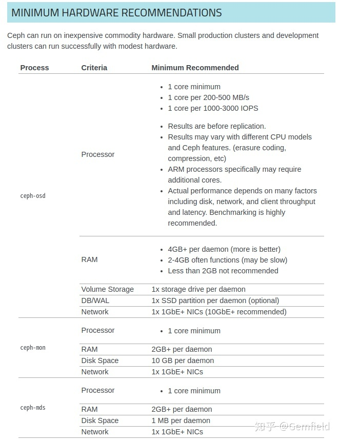

##  **背景**

Rook的最新版本已经更新到了1.3.3，Gemfield就使用这个最新版本来搭建一个用于开发环境的Ceph。阅读本文前，请确保K8s
cluster已经部署完成。

Gemfield本文所使用的软件环境为：Ubuntu 20.04 + K8s 1.18 + Rook 1.3.3。

##  **最小硬件配置**

安装Ceph集群的一个最小硬件推荐，如果小于这个配置的话，你就不用安装了，不然只会更痛苦。尤其是recovery的时候，呵呵，痛不欲生。

简而言之，CPU一般不是问题，主要就是内存和网络。OSD之间的网络最好是10GbE+；内存会消耗多少呢？以ROOK为例，默认配置部署完成后（假设14块磁盘，每块4TB），会启动：

  * 14个ceph-osd； 
  * 3个ceph-mon； 
  * 2个ceph-mds； 
  * 1个ceph-rgw； 
  * 1个ceph-mgr； 

对于OSD进程来说，每个daemon每TB需要1GB，那么在这个上下文里：

  * 每个OSD需要4GB内存，14个OSD就需要56GB内存； 
  * 3个ceph-mon就需要6GB内存； 
  * 2个mds需要4GB内存。 

但是，这是官方最小的内存推荐；下面Gemfield给出自己的推荐：

  * 每个OSD每TB配置2GB内存，因为要考虑recovery，这个是很耗费内存的，于是上述配置需要112GB内存； 
  * 每个ceph-mon配置4GB内存； 
  * 每个ceph-mds需要配置10G内存。 

##  **环境准备**

**1，将每个node上OSD需要使用的磁盘清理干净**

使用下面的命令来将磁盘清理干净：

    
    
    DISK="/dev/sdb"
    # Zap the disk to a fresh, usable state (zap-all is important, b/c MBR has to be clean)
    # You will have to run this step for all disks.
    sgdisk --zap-all $DISK
    dd if=/dev/zero of="$DISK" bs=1M count=100 oflag=direct,dsync
    
    # These steps only have to be run once on each node
    # If rook sets up osds using ceph-volume, teardown leaves some devices mapped that lock the disks.
    ls /dev/mapper/ceph-* | xargs -I% -- dmsetup remove %
    # ceph-volume setup can leave ceph-<UUID> directories in /dev (unnecessary clutter)
    rm -rf /dev/ceph-*

注意删除目录： **/var/lib/rook**

**2，确保每个运行OSD的宿主机系统上安装有lvm**

Ubuntu 20.04上自带的有。如果没有，使用下面的命令来安装：

    
    
    gemfield@ai01:~$ sudo apt install lvm2

**3，确保内核版本大于等于5.3**

不解释。

**4，确保内核模块的路径是在/lib/modules下**

一般的都在。

**5，确保内核编译有RBD模块**

一般发行版的内核都编译有，但你最好确定下：

    
    
    gemfield@ai01:~$ lsmod | grep rbd
    rbd                   106496  0
    libceph               327680  1 rbd

**6，克隆rook项目**

克隆到可以运行kubectl命令的机器上，并切换到你想要的版本的分支上：

[ https://  github.com/rook/rook
](https://link.zhihu.com/?target=https%3A//github.com/rook/rook)

然后切换到 ** <your_rook_dir>/cluster/examples/kubernetes/ceph ** 路径下。

##  **安装ROOK**

**1，安装operator**

第一步就是安装rook operator

    
    
    gemfield@master:~$ kubectl apply -f common.yaml
    gemfield@master:~$ kubectl apply -f operator.yaml

**2，安装ceph**

    
    
    gemfield@master:~$ kubectl apply -f cluster.yaml

cluster.yaml文件里的内容需要修改，一般来说，以下几个部分是你必须关心的：

  * replica的数量； 
  * resource request & limit（如果cluster在刚开始的时候忘记了设置，那么在运行中的集群中可以设置吗？可以参考文末的“备忘”）； 
  * metadataDevice（使用SSD）； 
  * hostNetwork； 
  * 使用哪些磁盘device； 

Gemfield修改了其中storage的部分：

    
    
      storage: # cluster level storage configuration and selection
        useAllNodes: false
        useAllDevices: false
        #deviceFilter:
        config:
          # metadataDevice: "md0" # specify a non-rotational storage so ceph-volume will use it as block db device of bluestore.
          # databaseSizeMB: "1024" # uncomment if the disks are smaller than 100 GB
          # journalSizeMB: "1024"  # uncomment if the disks are 20 GB or smaller
          # osdsPerDevice: "1" # this value can be overridden at the node or device level
          # encryptedDevice: "true" # the default value for this option is "false"
    # Individual nodes and their config can be specified as well, but 'useAllNodes' above must be set to false. Then, only the named
    # nodes below will be used as storage resources.  Each node's 'name' field should match their 'kubernetes.io/hostname' label.
        nodes:
        - name: "ai01"
          devices:
          - name: "sda"
        - name: "ai02"
          devices: # specific devices to use for storage can be specified for each node
          - name: "sda"
          - name: "sdb"
        - name: "ai03"
          devices: # specific devices to use for storage can be specified for each node
          - name: "sda"
          - name: "sdb"
          - name: "sdc"
          - name: "sdd"
          - name: "sde"
          - name: "sdf"
        - name: "ai04"
          devices: # specific devices to use for storage can be specified for each node
          - name: "sda"
          - name: "sdc"
        - name: "ai05"
          devices: # specific devices to use for storage can be specified for each node
          - name: "sda"
          - name: "sdb"

注意useAllNodes: false , useAllDevices: false，如果这两个任意一个为true的话，下面手工配置的磁盘都不会生效
。如果useAllNodes为true的话，则rook仅会使用deviceFilter匹配到的磁盘。如果匹配不到，就会skip掉，比如：

    
    
    gemfield@master:~/github/tmp/rook-1.3.3/cluster/examples/kubernetes/ceph$ kubectl -n rook-ceph logs rook-ceph-osd-prepare-ai01-29hkk | grep -i skip
    2020-05-08 11:05:13.931218 W | inventory: skipping device "loop1" because 'lsblk' failed. unsupported diskType loop
    2020-05-08 11:05:13.948156 I | inventory: skipping device "nvme0n1" because it has child, considering the child instead.
    2020-05-08 11:05:13.966791 W | inventory: skipping device "nbd3" because 'lsblk' failed. exit status 1
    2020-05-08 11:05:13.970806 W | inventory: skipping device "nbd15" because 'lsblk' failed. exit status 1
    2020-05-08 11:05:13.973121 W | inventory: skipping device "nbd1" because 'lsblk' failed. exit status 1
    2020-05-08 11:05:13.975482 W | inventory: skipping device "nbd13" because 'lsblk' failed. exit status 1
    2020-05-08 11:05:13.991985 I | inventory: skipping device "sdb" because it has child, considering the child instead.
    2020-05-08 11:05:14.001508 W | inventory: skipping device "loop6" because 'lsblk' failed. exit status 1
    2020-05-08 11:05:14.004122 W | inventory: skipping device "nbd11" because 'lsblk' failed. exit status 1
    2020-05-08 11:05:14.006393 W | inventory: skipping device "nbd8" because 'lsblk' failed. exit status 1
    2020-05-08 11:05:14.008450 W | inventory: skipping device "loop4" because 'lsblk' failed. unsupported diskType loop
    2020-05-08 11:05:14.010393 W | inventory: skipping device "nbd6" because 'lsblk' failed. exit status 1
    2020-05-08 11:05:14.012651 W | inventory: skipping device "loop2" because 'lsblk' failed. unsupported diskType loop
    2020-05-08 11:05:14.014612 W | inventory: skipping device "nbd4" because 'lsblk' failed. exit status 1
    2020-05-08 11:05:14.016627 W | inventory: skipping device "loop0" because 'lsblk' failed. unsupported diskType loop
    2020-05-08 11:05:14.018971 W | inventory: skipping device "nbd2" because 'lsblk' failed. exit status 1
    2020-05-08 11:05:14.021385 W | inventory: skipping device "nbd14" because 'lsblk' failed. exit status 1
    2020-05-08 11:05:14.024316 W | inventory: skipping device "loop7" because 'lsblk' failed. exit status 1
    2020-05-08 11:05:14.027382 W | inventory: skipping device "nbd0" because 'lsblk' failed. exit status 1
    2020-05-08 11:05:14.030066 W | inventory: skipping device "nbd12" because 'lsblk' failed. exit status 1
    2020-05-08 11:05:14.045866 W | inventory: skipping device "nbd9" because 'lsblk' failed. exit status 1
    2020-05-08 11:05:14.049483 W | inventory: skipping device "loop5" because 'lsblk' failed. exit status 1
    2020-05-08 11:05:14.051903 W | inventory: skipping device "nbd10" because 'lsblk' failed. exit status 1
    2020-05-08 11:05:14.054071 W | inventory: skipping device "nbd7" because 'lsblk' failed. exit status 1
    2020-05-08 11:05:14.056886 W | inventory: skipping device "loop3" because 'lsblk' failed. unsupported diskType loop
    2020-05-08 11:05:14.059885 W | inventory: skipping device "nbd5" because 'lsblk' failed. exit status 1
    2020-05-08 11:05:18.489213 I | cephosd: skipping device "nvme0n1p1": ["Insufficient space (<5GB)"].
    2020-05-08 11:05:18.489239 I | cephosd: skipping device "nvme0n1p2" because it contains a filesystem "ext4"
    2020-05-08 11:05:23.397462 I | cephosd: skipping device "sdb1": ["Insufficient space (<5GB) on vgs", "LVM detected"].
    2020-05-08 11:05:27.832461 I | cephosd: skipping device "sda" that does not match the device filter/list ([{ 1  0  false false}]). <nil>
    2020-05-08 11:05:29.105120 I | cephosd: skipping osd2: "52ccb2e4-f1aa-4a59-b15e-2a92b26fc922" running on a different ceph cluster "3959e5fc-663d-4d75-ba16-401afa6e1d94"
    2020-05-08 11:05:29.105154 I | cephosd: Skipping osd2 as no instances are running on ceph cluster "f4c18790-b9be-4bcb-819a-92f3fb3f9ab9"
    2020-05-08 11:05:29.105172 W | cephosd: skipping OSD configuration as no devices matched the storage settings for this node "ai01"

这一步第一次安装的时候可能会遇到hung住的问题，表现就是rook-ceph-detect-version
pod一直在重启，也不会提示错误。从pod的名字可以看出，这个pod的目的是来检测ceph的版本，有可能rook的某些bug导致（比如，有些服务启动的太慢？)一直检测不成功，遇到这种情况，delete掉cluster.yaml然后重新apply。

metadataDevice配置也很关键，对性能有着直接的影响。

这一步成功后，所有启动的pod有：

    
    
    csi-cephfsplugin-8dr4n                           3/3     Running     0          24m     192.168.0.91     ai04   <none>           <none>
    csi-cephfsplugin-fhcbh                           3/3     Running     0          24m     192.168.0.180    ai02   <none>           <none>
    ......
    csi-cephfsplugin-provisioner-7678bcfc46-k2zxn    5/5     Running     0          24m     172.16.90.60     ai03   <none>           <none>
    csi-cephfsplugin-zpcg4                           3/3     Running     0          24m     192.168.0.168    ai05   <none>           <none>
    csi-rbdplugin-55vtr                              3/3     Running     0          24m     192.168.0.114    ai01   <none>           <none>
    csi-rbdplugin-hwnhc                              3/3     Running     0          24m     192.168.0.168    ai05   <none>           <none>
    ......
    csi-rbdplugin-provisioner-fbd45b7c8-x7lx9        6/6     Running     0          24m     172.16.138.100   ai02   <none>           <none>
    csi-rbdplugin-wb5s2                              3/3     Running     0          24m     192.168.0.180    ai02   <none>           <none>
    rook-ceph-crashcollector-ai01-78766cb8dd-q22z8   1/1     Running     0          23m     172.16.9.28      ai01   <none>           <none>
    rook-ceph-crashcollector-ai02-645bb85f8c-kpknl   1/1     Running     0          4m35s   172.16.138.110   ai02   <none>           <none>
    .......
    rook-ceph-mgr-a-647c856d65-9qrg6                 1/1     Running     0          22m     172.16.138.105   ai02   <none>           <none>
    rook-ceph-mon-a-5c768d477-qsnjj                  1/1     Running     0          23m     172.16.90.63     ai03   <none>           <none>
    rook-ceph-mon-b-cfc86df68-qfkbq                  1/1     Running     0          23m     172.16.138.103   ai02   <none>           <none>
    rook-ceph-mon-c-f54684b99-8vqqt                  1/1     Running     0          23m     172.16.9.18      ai01   <none>           <none>
    rook-ceph-operator-795bd49b69-b6d2k              1/1     Running     0          24m     172.16.90.56     ai03   <none>           <none>
    rook-ceph-osd-0-6b89596bd8-7hncf                 1/1     Running     0          5m54s   172.16.128.160   ai05   <none>           <none>
    rook-ceph-osd-1-d6996d798-w4bjl                  1/1     Running     0          5m54s   172.16.128.161   ai05   <none>           <none>
    rook-ceph-osd-10-57f99bc4f6-bhqzh                1/1     Running     0          3m12s   172.16.90.14     ai03   <none>           <none>
    ......
    rook-discover-27xq4                              1/1     Running     0          24m     172.16.128.156   ai05   <none>           <none>
    rook-discover-2h9j9                              1/1     Running     0          24m     172.16.95.145    ai04   <none>           <none>

**一定注意rook-ceph-osd-N pod的数量，要和你的磁盘数严格一致，否则debug下错误 。**

**3，安装Block存储（块存储）**

Block存储不能在不同的pod之间共享。使用下面的命令来部署Block存储服务，这样Pod就可以通过PVC申请块存储了：

    
    
    gemfield@master:~$ kubectl apply -f csi/rbd/storageclass.yaml

**4，安装Object存储（对象存储）**

Object storage （对象存储）对外提供S3 API，应用程序可以通过REST
API来使用，相当于阿里云的OSS。使用下面的命令来安装object存储服务：

    
    
    gemfield@master:~$ kubectl apply -f object.yaml
    gemfield@master:~$ kubectl apply -f object-user.yaml

安装object存储服务后，用户就可以通过sc来增删改查bucket了，剩下的就是S3 API的事情了。

**5，安装Shared Filesystem**

Shared Filesystem，顾名思义，可以在多个pod之间共享存储了。

    
    
    gemfield@master:~$ kubectl apply -f filesystem.yaml

注意里面的 **preservePoolsOnDelete** :true。

然后创建基于该文件系统的SC：

    
    
    gemfield@master:~$ kubectl apply -f csi/cephfs/storageclass.yaml

这个文件中也要相应修改，Gemfield修改了name、mounter等：

    
    
    apiVersion: storage.k8s.io/v1
    kind: StorageClass
    metadata:
      name: syszux-cephfs
    provisioner: rook-ceph.cephfs.csi.ceph.com
    parameters:
      clusterID: rook-ceph
      fsName: myfs
      pool: myfs-data0
      csi.storage.k8s.io/provisioner-secret-name: rook-csi-cephfs-provisioner
      csi.storage.k8s.io/provisioner-secret-namespace: rook-ceph
      csi.storage.k8s.io/controller-expand-secret-name: rook-csi-cephfs-provisioner
      csi.storage.k8s.io/controller-expand-secret-namespace: rook-ceph
      csi.storage.k8s.io/node-stage-secret-name: rook-csi-cephfs-node
      csi.storage.k8s.io/node-stage-secret-namespace: rook-ceph
      mounter: kernel
    reclaimPolicy: Retain
    allowVolumeExpansion: true
    mountOptions:

有了基于fs的sc后，我们就可以基于该sc创建了：

    
    
    apiVersion: v1
    kind: PersistentVolumeClaim
    metadata:
      name: syszux-pvc
    spec:
      accessModes:
      - ReadWriteOnce
      resources:
        requests:
          storage: 1Gi
      storageClassName: syszux-cephfs

有了pvc后，就可以基于该pvc创建pod下的volumes了：

    
    
    apiVersion: v1
    kind: Pod
    metadata:
      name: civilnet-demo-pod
    spec:
      containers:
       - name: gemfield-server
         image: nginx
         volumeMounts:
           - name: mypvc
             mountPath: /var/lib/www/html
      volumes:
       - name: mypvc
         persistentVolumeClaim:
           claimName: syszux-pvc
           readOnly: false

##  **6，安装dashboard**

dashboard已经在前述的步骤中包含了，这里只需要把dashboard
service的服务暴露出来。有多种方法，gemfield使用的是ingress的方式来暴露：

    
    
    gemfield@master:~$ kubectl create -f dashboard-ingress-https.yaml

注意这个文件的内容需要相应的修改。

访问dashboard的用户名默认是admin，密码通过如下命令获取：

    
    
    gemfield@master:~$ kubectl -n rook-ceph get secret rook-ceph-dashboard-password -o jsonpath="{['data']['password']}" | base64 --decode && echo

**7，安装toolbox**

执行下面的命令：

    
    
    gemfield@master:~$ kubectl apply -f toolbox.yaml

成功后，可以使用下面的命令来确定toolbox的pod已经启动成功：

    
    
    gemfield@master:~$ kubectl -n rook-ceph get pod -l "app=rook-ceph-tools"

然后可以使用下面的命令登录该pod，执行各种ceph命令：

    
    
    gemfield@master:~$ kubectl -n rook-ceph exec -it $(kubectl -n rook-ceph get pod -l "app=rook-ceph-tools" -o jsonpath='{.items[0].metadata.name}') bash

比如：

    
    
    [root@rook-ceph-tools-7bbsyszux-rzkq9 /]# ceph status
      cluster:
        id:     f4c18790-b9be-4bcb-819a-92f3fb3f9ab9
        health: HEALTH_OK
     
      services:
        mon: 3 daemons, quorum a,b,c (age 16h)
        mgr: a(active, since 15h)
        mds: myfs:1 {0=myfs-a=up:active} 1 up:standby-replay
        osd: 13 osds: 13 up (since 16h), 13 in (since 16h)
        rgw: 1 daemon active (my.store.a)
     
      data:
        pools:   10 pools, 176 pgs
        objects: 373 objects, 362 MiB
        usage:   14 GiB used, 46 TiB / 46 TiB avail
        pgs:     176 active+clean
     
      io:
        client:   1.2 KiB/s rd, 2 op/s rd, 0 op/s wr
     
    [root@rook-ceph-tools-7bb5797c8-rzkq9 /]# 
    
    [root@rook-ceph-tools-7bb5797c8-rzkq9 /]# ceph osd status
    +----+------+-------+-------+--------+---------+--------+---------+-----------+
    | id | host |  used | avail | wr ops | wr data | rd ops | rd data |   state   |
    +----+------+-------+-------+--------+---------+--------+---------+-----------+
    | 0  | ai05 | 1175M | 3724G |    0   |     0   |    0   |     0   | exists,up |
    | 1  | ai05 | 1120M | 3724G |    0   |     0   |    2   |   106   | exists,up |
    | 2  | ai04 | 1107M | 3724G |    0   |     0   |    0   |     0   | exists,up |
    | 3  | ai01 | 1233M | 3724G |    0   |     0   |    0   |     0   | exists,up |
    | 4  | ai03 | 1132M | 3724G |    0   |     0   |    0   |     0   | exists,up |
    | 5  | ai02 | 1145M | 2793G |    0   |     0   |    0   |     0   | exists,up |
    | 6  | ai04 | 1160M | 3724G |    0   |     0   |    0   |     0   | exists,up |
    | 7  | ai03 | 1124M | 3724G |    0   |     0   |    0   |     0   | exists,up |
    | 8  | ai02 | 1141M | 3724G |    0   |     0   |    0   |     0   | exists,up |
    | 9  | ai03 | 1091M | 3724G |    0   |     0   |    0   |     0   | exists,up |
    | 10 | ai03 | 1124M | 3724G |    0   |     0   |    0   |     0   | exists,up |
    | 11 | ai03 | 1087M | 3724G |    0   |     0   |    0   |     0   | exists,up |
    | 12 | ai03 | 1077M | 3724G |    0   |     0   |    0   |     0   | exists,up |
    +----+------+-------+-------+--------+---------+--------+---------+-----------+

**8，安装Prometheus对ceph的监控**

    
    
    #安装Prometheus operator
    gemfield@master:~$ kubectl apply -f https://raw.githubusercontent.com/coreos/prometheus-operator/v0.26.0/bundle.yaml
    
    #确认operator的pod已经在running状态
    kubectl get pod
    
    #切换到rook项目的cluster/examples/kubernetes/ceph/monitoring 目录下
    gemfield@master:~$ kubectl create -f service-monitor.yaml
    gemfield@master:~$ kubectl create -f prometheus.yaml
    gemfield@master:~$ kubectl create -f prometheus-service.yaml

##  **重启ROOK**

**1，重启Rook operator**

    
    
    kubectl -n rook-ceph delete pod -l app=rook-ceph-operator

##  **备忘**

**1，如何在运行中的ROOK CEPH集群中设置resource limit？**

这就要使用K8s提供的功能了。K8s不支持对运行中的Pod进行更新（除非你delete掉pod，更新pod对应的yaml，再使用该yaml重新创建Pod），但是支持对运行中的deployment进行resource
limit更新（注意：该更新同样会自动重启该deployment下的Pod！）。

举个例子，假设OSD0之前没有设置resource limit：

    
    
    gemfield@ThinkPad-X1C:~$ kubectl -n rook-ceph describe pod rook-ceph-osd-0-6b89596bd8-tm966 | grep -i limit
          POD_MEMORY_LIMIT:             node allocatable (limits.memory)
          POD_CPU_LIMIT:                node allocatable (limits.cpu)
        SizeLimit:  <unset>

现在针对OSD0的deployment进行resource limit的更新（这里limit了memory）：

    
    
    gemfield@ThinkPad-X1C:~$ kubectl -n rook-ceph set resources deployment.v1.apps/rook-ceph-osd-0 --limits=memory=8192Mi
    deployment.apps/rook-ceph-osd-0 resource requirements updated

然后OSD0的Pod就会重启，你可以看到OSD0的Pod名字上的数字都变了。这个时候再看看该Pod的resource limit：

    
    
    gemfield@ThinkPad-X1C:~$ kubectl -n rook-ceph describe pod rook-ceph-osd-0-74c5dbd8c-h4bdg | grep -i limit
        Limits:
          POD_MEMORY_LIMIT:             8589934592 (limits.memory)
          POD_CPU_LIMIT:                node allocatable (limits.cpu)
        SizeLimit:  <unset>

发现memory limit生效了。

