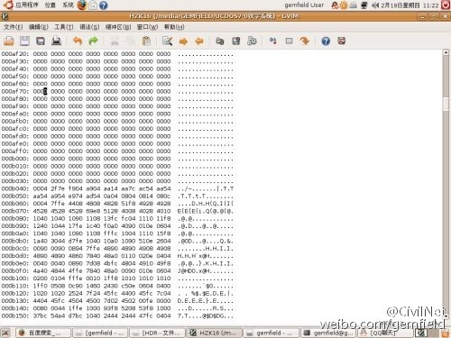
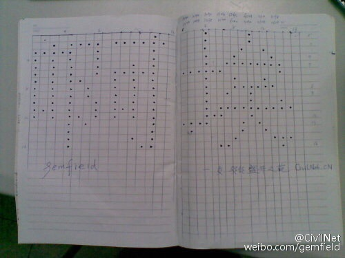

屏幕上的汉字是依据什么显示的？阅读本文前，gemfield先假设你已经知晓了字符编码的学问。即你已经懂得字符编码从ASCII到ANSI再到UNICODE的演变，以及gb2312／gbk等汉字编码国家标准是ANSI标准在中国大陆地区的反映。

这里有个古老传说：关于windows记事本的bug。如果你在记事本输入“联通”这个字符，以ANSI编码保存。再打开，看看该文件变成什么了。很简单，就是个编码问题，你在保存的时侯换成UNICODE或者UTF-8，就不会出这个问题了。同样的BUG：输入“AAAA
BBB CCC DDDDD”(或者任何其它4-3-3-5的字母组合) 看到的都是一个个黑色的格子。输入“this app can
break”（不含双引号，仅输入英文内容）； “this app can
break”变成了乱码：桴獩愠灰挠湡戠敲歡。这些BUG都是ANSI编码的BUG导致的。

当我们的输出函数调用字符库时，字符库究竟是怎么把汉字的形状显示在屏幕上的呢？比如这列字符串“我今天gemfield”，它的ANSI编码（不论是GB2312，GB18030还是GBK）是
“ced2 bdf1 ccec 6765 6d66 6965
6c64”。其中，汉字是区位码的形式，这些16进制的数表示的是”我今天“这些汉字在字符库中的位置。区位码的位置与GB2312这些内码的对应关系或者算法非常简单，但不是本文的内容。这里Gemfield要说的就是，电脑上存储”我今天“的时候，实际上存放的是它对应的内码信息，而内码信息对应区位码，表示的是该汉字在字符库中的相对位置。

当我们可以在操作系统里随自己的意愿输出楷体或者隶书等汉字时，汉字的形状分明不一样，这就表明这个系统上拥有不止一个字符库，甚至可以多达上百个。我们以dos纯真年代的火爆的ucdos软件采用的hzk16字符库举例。hzk16是万千汉字库中的一个，是“汉字库16×16点阵“的意思。这个字符库大约262KB，那么它里面放的什么东西，可以让程序根据内码给出的地址到自身中调取汉字形状？

gemfield花费了一个小时的时间探究了其内部，现在得出了一些直观的结果来和一支GELE盛开之葩(如今的CivilNet社区 :-)
)的网友分享。首先假设这个hzk16文件摆在了你的面前，如果你用的是windows系统，这个连后缀名都没有文件是不是让你难以下手？没错的，即使你用记事本程序将其打开，得到的不过是一对乱码而已。这些乱码根本反应不出汉字库的信息。（那么这些乱码是什么含义？如果你实在不懂的话就在下面留言）我们需要一个能以二进制（16进制）形式阅读其内容的软件。Gemfield用的是ubuntu
linux系统，自带的gvim文本编辑器我很喜欢，用它可以轻松阅读hzk16中的二进制信息（你可以用任何二进制编辑器）。打开后的截图如下：

  

  

hzk16这个文件很有意思，我们看到每一行二进制数据一共有16个字节，而hzk16一共有16727行二进制信息，你可以算一下这个文件多大。对，刚好和文中开头说的262KB吻合。

hzk16一共有94个区，而每个区有94个位。其中，1～9区是符号字母数字区（也就是ascii字符区）,10～15是空白（你可以从文件里看到，在2000多行时候，一连出现了7页的空白信息区，也就是00000000……）。真正的汉字区是从第2821行开始的。对于hzk16来说，因为表示一个汉字需要16×16的点阵，也就是需要16×16位的信息才能存储下一个汉字的字模。16×16位就是32字节。前面说了，一行二进制信息是16字节大。那么表示出一个汉字的字模需要2行二进制（16进制）信息。也就是说2821行和2822行表示的是这个字库中的第一个汉字。

这个汉字是什么呢？自己画……

这里以第三个汉字举例，让你能尽快的了解这个过程。第三个汉字对应第2825和2826行16进制数据。数据形式如下：

104010401090110813fcfc04111011f81240104417fe1c40f0a04090010e0604

接下来当然是化成二进制的形式，并且在数字电路中，1代表高电平，0代表低电平，也就是说1对应的液晶显示器亮，0对应的灭（一种模型而已，真实的要复杂）。好，现在把上面的16进制换成2进制，注意是16×16点阵，也就是每一行只需要4个16进制数就表示完毕了。顺便说一句，汉字字模是从左到右，从上到下的顺序表示的。换算开始：

0001000001000000

0001000001000000

0001000010010000

0001000100001000

0001001111111100

1111110000000100

0001000100010000

0001000111111000

0001001001000000

0001000001000100

0001011111111110

0001110001000000

1111000010100000

0100000010010000

0000000100001110

0000011000000100

  

也许你还没发现什么，这怪1长的太瘦了。我们把1换成O（不是零），再将0（零）换成空格，看看，是不是“埃”出来了。

  

下面的图是Gemfield手工画出的（右边的字正好是“埃”）：

  

今天gemfield带领大家到了离字符库最近的地方，如果你也画出了文中提到的第一个汉字，请将答案留在留言簿上，在这离汉字库最近的地方留个纪念吧。

  

[ 此文于2009年2月19日被Gemfield22.6.0发表于CivilNet
BLOG（那时的CivilNet社区还叫做一支GELE盛开之葩）。随着CivilNet BLOG今年初停止服务，Gemfield将本文迁移至此专栏。]

