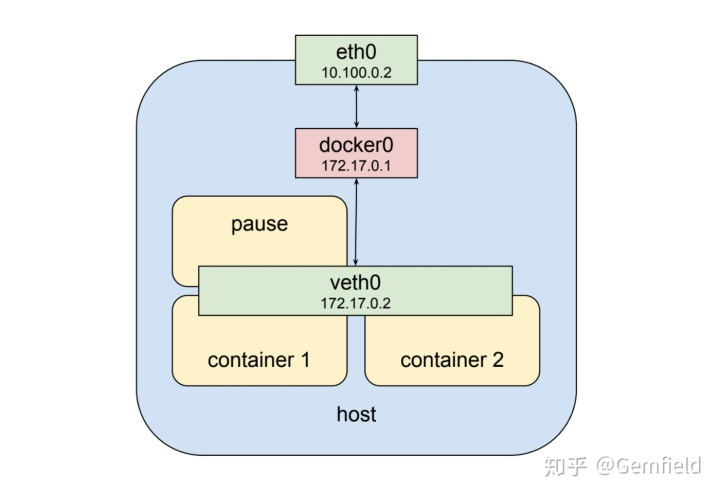
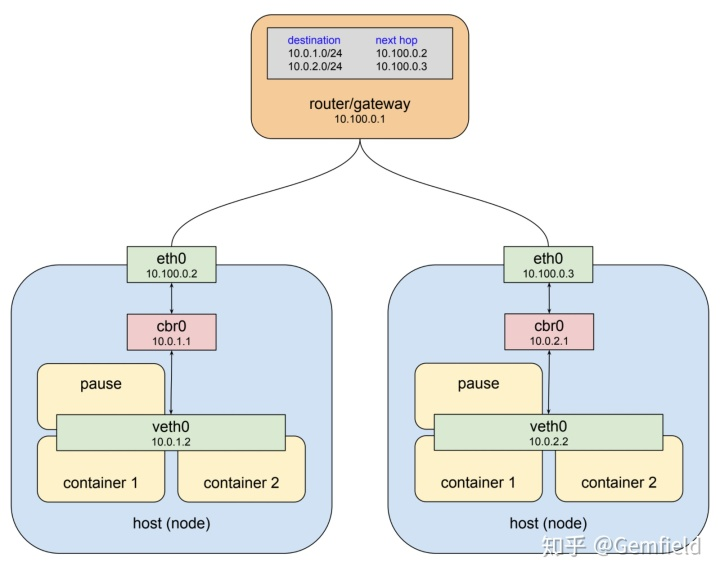
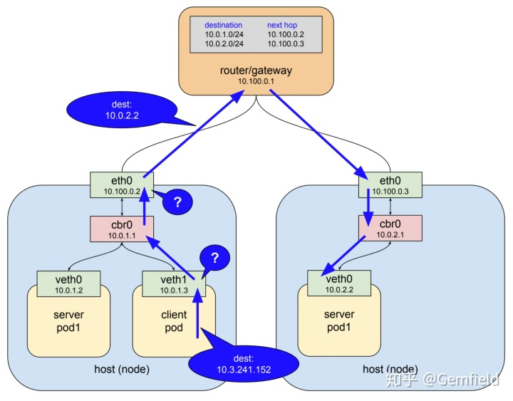
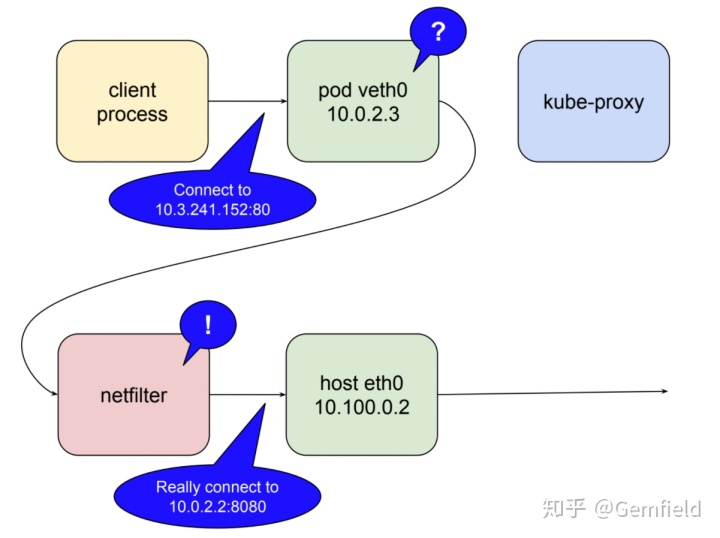
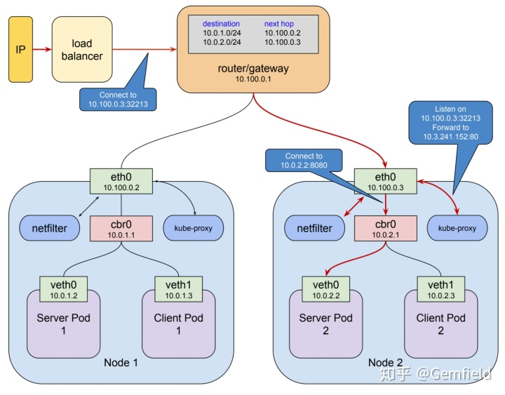

##  **背景**

在 [ https://  zhuanlan.zhihu.com/p/41  071320
](https://zhuanlan.zhihu.com/p/41071320)
一文之后，Gemfield团队有越来越多的服务开始运行在了Kubernetes集群之上了，日复一日。而后在这个周末，Gemfield读到了 [
https://  medium.com/google-cloud  /understanding-kubernetes-networking-
pods-7117dd28727
](https://link.zhihu.com/?target=https%3A//medium.com/google-
cloud/understanding-kubernetes-networking-pods-7117dd28727)
这一系列共三篇讲述K8s网络的文章，甚是欣喜，Mark Betz字里行间表述的逻辑如行云流水，原理娓娓道来，和Gemfield之前写的文章

[ Gemfield：从docker compose到Kubernetes ](https://zhuanlan.zhihu.com/p/41071320)

放在一起读来，感觉相互辉映，共鸣感强烈，不能自已。遂下笔再写一篇短小的文章来总结下，以飨K8s的使用者。

##  **Pods**

Pods中的多个container共享一个网络栈，这是基础了。Pods的网络namespace和宿主机的物理网络的namespace不是一个，之间通过docker
bridge相连。

在pods的namespace中，pods的虚拟网络接口为veth0；在宿主机上，物理网络的网络接口为eth0。docker
bridge作为veth0的默认网关，用于和宿主机网络的通信。

所有pods的veth0所能分配的IP是一个独立的IP地址范围，来自于创建cluster时候kubeadm的--pod-network-
cidr参数设定的CIDR，这里看起来像是172.17.0.0/24，是一个B类局域网IP地址段；所有宿主机的网络接口eth0所能分配的IP是实际物理网络的设定，一般来自于实际物理网络中的路由器通过DHCP分配的，这里看起来是10.100.0.0/24，是一个A类局域网IP地址段。

docker
bridge建立起pod和其宿主机之间的通信，但是并没有解决完问题，事实上，直到这里还属于Docker自身的范畴，K8s的pods还要能够与其它宿主机节点上的pods通信，这怎么做到呢？通过添加路由信息！如下图所示：

注意上图中，docker0的名字被改成了cbr0，意思是custom bridge，没错，K8s使用custom bridge代替了docker
bridge。由此，如果左侧的pod想访问右侧的pod，则IP包会通过bridge
cbr0来到左侧宿主机的eth0，然后查询宿主机上新增的路由信息，继而将IP包送往右侧的宿主机的eth0，继而再送往右侧的bridge
cbr0，最后送往右侧的pod。

上面说了IP层相通的逻辑基础，就像前文说的那样，这个IP就是Pod的IP，是pods的veth0所能分配的IP是一个独立的IP地址范围，来自于创建cluster时候kubeadm的
--pod-network-
cidr参数设定的CIDR；而端口就是容器中服务实实在在listen端口，我们称之为containerPort。到目前为止，我们就可以通过pod ip +
containerPort的方式来访问pod的服务了。

访问是可以访问了，但是问题就来了，而且还很多，以至于根本没法在实际项目中使用：

  1. 一个服务经常会起多个pod，你到底访问那个pod的ip呢？ 
  2. pod经常会因为各种原因被调度，调度后一个pod的ip会发生变化... 
  3. pod的ip是虚拟的且局域的，在集群内部访问没有问题，但是从k8s集群的外部如何访问pod的ip呢？ 

解决1、2问题的答案就是反向代理和负载均衡，这是由来已久的惯例，由此我们引入了K8s的service。

##  **services**

我们可以使用service封装多个pods的一类服务，对外提供同一的service的ip和port，岂不解决了上述的问题？

在上图中，我们将右边pod的服务抽象为了service，service的ip段来自于创建集群时kubeadm的-service-cluster-ip-
range指定的CIDR，在本案例中该service分配了10.3.241.152的ip。但是，如果通过该service的ip访问目标pod时，如何确保ip包能够到达这个莫名其妙的ip呢？birdge
cbr0 不认识，只管往上扔，eth0还是不认识，一看路由表，也不知道怎么走，那这条路不就断了吗？答案就是kube-
proxy通过用户空间的iptable来和内核中的netfilter进行转发规则的实时同步，这样当一个ip包匹配上了iptable规则中的某一条规则时，就会被转发到对应的新地址上，从而做到了将ip包送往目标pod。没错，netfilter就是内核空间的ip包的proxy：Netfilter规则是路由规则，工作在3层上。路由规则决定packet的行进路径靠的是packet中本身包含的信息，一般来说就是这个packet从哪里来要到哪里去。
以上述案例来说，每个来到宿主机节点eth0网口的要去往 ` **10.3.241.152:80** ` 的包都将会被netfilter处理,
进而packet会被送往一个服务正常的pod上。

**要值得注意的是，netfilter的规则是用来匹配目的地地址为service ip的packet的。**

前面已经说过了service的ip，而service的port（对，就叫port，不像pod的containerPort那样叫servicePort）范围由
--service-node-port-
range参数指定，默认值是30000-32767，再通过targetPort指定pod的containerPort，从而建立起service端口到pod端口的映射关系。由此，service
IP + port的组合开始提供访问服务，并且还是很稳定的，不会随着pod的变动而变动。那么service封装pod来提供服务究竟可靠吗？我们重温一遍：

  1. kube-proxy作为一个systemd的服务在运行，所以及时异常也会被重启，所以提供的服务还是比较可靠的； 
  2. kube-proxy接收k8s master API服务的通知以响应集群中的变动，当收到更新通知后，kube-proxy通过iptables来同步netfilter中的规则； 
  3. 当一个新的service及其endpoints被创建后，kube-proxy收到通知，通过iptables在netfilter中新建必备的匹配规则；当一个service被删除后，同理该规则会被kube-proxy删除； 
  4. 每个宿主机节点上运行的kubelet组件会对各个endpoints进行健康检查，当某个endpoint被发现不正常后，kubelet会通过master的api server来通知kube-proxy，然后kube-proxy会修改netfilter的规则来去除这个不正常的endpoint；当endpoint重新恢复正常后，规则又再次被编辑来将该endpoint添加回来。 

到目前为止，service已经能够应付上一章节最后三问中的前两问，也就是多个pod的负载均衡被解决了，pod因为各种原因更换ip也被service封装在内部解决了，但是第三个问题还没有解决：

  1. pod的ip是虚拟的且局域的，在集群内部访问没有问题，但是从k8s集群的外部如何访问pod的ip呢？ 

要解决这个问题，k8s提供了以下几种方法：

  1. 带nodePort的service； 
  2. 带externalIPs的service； 
  3. ingress； 
  4. LoadBalancer，需要底层的基础设施支持。目前 Google Cloud Platform 和 AWS平台上支持这种类型；比如在GCP上，当创建一个LB时，GCP会创建一个external IP、forwarding rule、target proxy、backend service、instance group。 当这个external IP创建好后，你可以配置域名指向它，然后将域名告诉客户端即可； 

##  **带nodePort的service**

nodePort是kubernetes提供给K8s
cluster外部客户访问service入口的一种方式，你在本文的前面已经见过了。这个会将service的端口mapping到每个Node上，然后你在cluster外部可以使用<NodeIP>:<NodePort>
来访问该服务。

当kubernetes创建一个NodePort service时，kube-proxy从端口范围30000–32767
中分配一个，并且打开这个端口侦听在每个宿主机节点的 ` **eth0** `
网口上，所有通往这个端口的packet都被转发到对应的service的（cluster）ip上 。

上图中客户端通过公网IP连接到LB，LB然后分发到一个宿主机node上，也就是 ` **10.100.0.3:32213** ` ，kube-
proxy收到后将其转发到service所在的cluster IP **` 10.3.241.152:80 ` ， **
像前文所说的，“netfilter的规则是用来匹配目的地地址为service
ip的packet的“，这个时候就匹配上了netfilter规则，然后被转发到了服务所在的pod，也就是 **` 10.0.2.2:8080 ` 。 **

这种类型的service目前看起来有如下的缺点：

  1. 端口都是乱七八糟的端口，不是标准端口，如80； 
  2. 端口数量有限，才2768个； 
  3. 端口随机。 

##  **带externalIPs的service**

首先K8s cluster的Node上有外网可以访问的IP，那么像下面这样的配置就可以使用80.11.12.10:80来访问civilnet-
service;

    
    
    kind: Service
    apiVersion: v1
    metadata:
      name: civilnet-service
    spec:
      selector:
        app: Gemfield
      ports:
      - name: http
        protocol: TCP
        port: 80
        targetPort: 9376
      externalIPs:
      - 222.128.5.170

##  **ingress**

ingress是个资源类型，要在k8s上管理这种类型的资源，你需要安装ingress controller。目前用的最多的ingress
controller就是nginx实现的：

[ kubernetes/ingress-nginx
](https://link.zhihu.com/?target=https%3A//github.com/kubernetes/ingress-
nginx)

这种ingress的使用体验，就相当于把nginx的配置规则和k8s的configMap进行了结合。

值得注意的是，ingress的这种proxy主要针对的还是http，想象一下普通的Nginx服务是怎么工作的就清楚多了。如果你要进行其它协议的proxy（比如rtmp流媒体协议，比如mqtt物联网协议等），先确保目前的ingress
controller是否支持。

如果有时候你使用kubectl get ing看状态，你会发现刚创建的ingress资源的ADDRESS是空的：

    
    
    gemfield@master:~$ kubectl get ing
    NAME          HOSTS     ADDRESS   PORTS     AGE
    web-ingress   *                   80        8s

这是因为你部署ingress的时候，使用的是NodePort类型的（官网上在BareMetal上默认安装的方式），NodePort类型的ingress没有显式的IP，这种情况下，你仍然可以使用任一node的NodePort来访问ingress；那么如果你想要显式的IP，你需要修改上述官方的ingress
service的yaml文件（从NodePort类型改为：

    
    
    apiVersion: v1
    kind: Service
    metadata:
      name: ingress-nginx
      namespace: ingress-nginx
    spec:
      ports:
      - name: http
        port: 80
        targetPort: 80
        protocol: TCP
      - name: https
        port: 443
        targetPort: 443
        protocol: TCP
      selector:
        app: ingress-nginx
      externalIPs: 
        - 192.168.1.188

重新部署ingress service后，然后再次创建ingress resource，然后等几十秒，然后使用kubectl get
ing看看状态，你会发现ADDRESS已经有值了：

    
    
    gemfield@master:~$ kubectl get ing
    NAME          HOSTS     ADDRESS         PORTS     AGE
    web-ingress   *         192.168.1.188   80        2m

