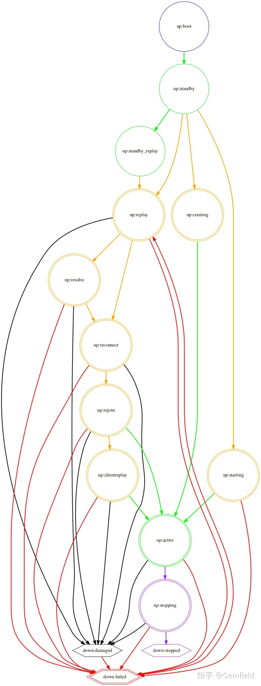
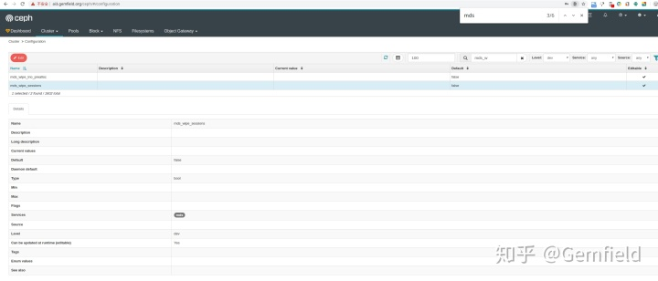

##  **背景**

今天整个白天都在止不住的思念一个姑娘，所谓求之不得，寤寐思服，优哉游哉，辗转反侧。为了让自己不要陷入这种空洞的情绪旋涡中，Gemfield决定做些什么来转移下自己的注意力。不一会儿就想到了——鉴于最近在和ROOK
CEPH存储打交道，何不故意kill一些OSD进程，来看看CEPH存储服务会发生什么？

**注意！作死操作！模仿有严重风险！责任自负！**

##  **环境准备**

为了更刺激些，Gemfield抛弃了测试环境，直接来到了线上环境（内部服务的线上环境），测试环境没有压力，估计转移不了Gemfield的注意力；而如果线上服务crash掉并且不能恢复，那么团队所有的服务和数据：代码管理、文档管理、模型管理、数据集管理、炼丹服务、对外REST
API服务等，都将被核灭。

但是Gemfield觉得还是不够刺激，毕竟ceph
pool的replica默认是3，还是有一定的数据安全保证的！那何不设置为1呢？让ceph存储更容易丢失数据！试验了下，不幸的发现CEPH禁止把replica设置为1。最后Gemfield只好把replica降到了2，这是replica的合法最小值。

##  **删除OSD**

**1，确定一个k8s worker node，挨个删除其上的所有OSD pod**

    
    
    gemfield@ThinkPad-X1C:~$ kubectl -n rook-ceph delete pod rook-ceph-osd-3-7d7675bc6d-7l4j8
    gemfield@ThinkPad-X1C:~$ kubectl -n rook-ceph delete pod rook-ceph-osd-13-7985768d96-5crd9

上述命令所示，Gemfield删除的是osd-3和osd-13进程。

**2，当前集群状态**

    
    
    [root@rook-ceph-tools-7gemfield-ns4bw /]# ceph -s
      cluster:
        id:     f4c18790-b9be-4bcb-819a-92f3fb3f9ab9
        health: HEALTH_ERR
                1 scrub errors
                Possible data damage: 1 pg inconsistent
     
      services:
        mon: 3 daemons, quorum c,g,h (age 35h)
        mgr: a(active, since 35h)
        mds: myfs:2 {0=myfs-a=up:active,1=myfs-d=up:active} 2 up:standby-replay
        osd: 14 osds: 14 up (since 4h), 14 in (since 35h)
        rgw: 1 daemon active (my.store.a)
     
      data:
        pools:   10 pools, 176 pgs
        objects: 12.13M objects, 288 GiB
        usage:   1.9 TiB used, 48 TiB / 50 TiB avail
        pgs:     175 active+clean
                 1   active+clean+inconsistent
     
      io:
        client:   13 MiB/s rd, 95 KiB/s wr, 120 op/s rd, 15 op/s wr

哈哈，ceph health命令告诉我如愿以偿：

    
    
    [root@rook-ceph-tools-7gemfield-ns4bw /]# ceph health
    HEALTH_ERR 1 scrub errors; Possible data damage: 1 pg inconsistent

再使用ceph health detail仔细看下故障：

    
    
    [root@rook-ceph-tools-7gemfield-ns4bw /]# ceph health detail
    HEALTH_ERR 1 scrub errors; Possible data damage: 1 pg inconsistent
    OSD_SCRUB_ERRORS 1 scrub errors
    PG_DAMAGED Possible data damage: 1 pg inconsistent
        pg 9.b is active+clean+inconsistent, acting [2,12]

确定有pg损坏。

**3，确定损坏的pg**

咦？为什么不一致的pg是在osd 2和12上？我不是kill的osd 3和13吗？？？再用ceph pg dump命令验证下：

    
    
    [root@rook-ceph-tools-7gemfield-ns4bw /]# ceph pg dump | grep -E "9.b|PG_STAT"
    dumped all
    PG_STAT OBJECTS MISSING_ON_PRIMARY DEGRADED MISPLACED UNFOUND BYTES       OMAP_BYTES* OMAP_KEYS* LOG  DISK_LOG STATE                     STATE_STAMP                VERSION      REPORTED     UP        UP_PRIMARY ACTING    ACTING_PRIMARY LAST_SCRUB   SCRUB_STAMP                LAST_DEEP_SCRUB DEEP_SCRUB_STAMP           SNAPTRIMQ_LEN 
    9.b        5523                  0        0         0       0    37748736   171069413     370275 3084     3084 active+clean+inconsistent 2020-05-22 10:49:50.937683  5405'179248 5405:1367729    [2,12]          2    [2,12]              2  5394'175276 2020-05-22 10:49:50.937600     5394'175276 2020-05-22 10:49:50.937600             0
    

再仔细看看其它在osd 2和12上的pg状态，发现除了上述的pg9.b外，其它pg并没有影响：

    
    
    [root@rook-ceph-tools-7gemfield-ns4bw /]# ceph pg dump | grep 2,12
    dumped all
    8.9           4                  0        0         0       0     1740572           0          0    8        8              active+clean 2020-05-22 03:02:54.358738       5392'8    5404:2790  [2,12,0]          2  [2,12,0]              2       5392'8 2020-05-22 03:02:54.358666             0'0 2020-05-19 10:24:43.966833             0 
    9.b        5521                  0        0         0       0    29360128   171069413     370275 3030     3030 active+clean+inconsistent 2020-05-22 10:49:50.937683  5405'179294 5405:1367847    [2,12]          2    [2,12]              2  5394'175276 2020-05-22 10:49:50.937600     5394'175276 2020-05-22 10:49:50.937600             0 
    2.4           1                  0        0         0       0           0           0          0 2606     2606              active+clean 2020-05-22 10:56:13.282664    5394'2613  5405:253389  [1,2,12]          1  [1,2,12]              1    5394'2613 2020-05-22 10:56:13.282573       5394'2613 2020-05-22 10:56:13.282573             0 
    [root@rook-ceph-tools-7gemfield-ns4bw /]# ceph pg dump | grep 12,2
    dumped all
    12.10         0                  0        0         0       0           0           0          0    0        0              active+clean 2020-05-22 07:23:07.938124          0'0    5404:2950  [0,12,2]          0  [0,12,2]              0          0'0 2020-05-22 07:23:07.938043             0'0 2020-05-15 10:23:03.577525             0 
    9.6        5812                  0        0         0       0    16777216   172276989     480719 3019     3019              active+clean 2020-05-22 12:07:23.843720  5405'429427 5405:1628857    [12,2]         12    [12,2]             12  5404'422542 2020-05-22 12:07:23.843662     3647'317979 2020-05-19 10:21:11.875752             0 
    10.0     373243                  0        0         0       0  9585061079           0          0 3099     3099              active+clean 2020-05-22 08:11:02.048834 5405'1170894 5405:3192819    [12,2]         12    [12,2]             12 5394'1157982 2020-05-22 08:11:02.048773    4805'1086813 2020-05-19 12:15:36.311501             0

再通过rados list-inconsistent-pg命令来交叉验证下：

    
    
    [root@rook-ceph-tools-7gemfield-ns4bw /]# rados list-inconsistent-pg myfs-metadata
    ["9.b"]
    

嗯，是pg 9.b无疑了，且该pg的数据replica在osd 2和12上。

**4，确定损坏的pg上损坏的原因**

通过rados list-inconsistent-obj
命令，我们可以看到pg发生损坏的原因，可以看到pg中哪些object发生了损坏。一般错误会分为两种：

  1. errors 
  2. union_shard_errors 

前者是说，pg中有一个replica上的数据坏了，但是ceph决定不了是哪个坏了；后者字面意思看起来是说，pg的所有replica上汇总得出了pg级别的错误。在这里，我们得知损坏的原因是前者，并且具体的错误是omap_digest_mismatch，在未来，你也有可能得到类似data_digest_mismatch、size_mismatch的错误。

    
    
    [root@rook-ceph-tools-7gemfield-ns4bw /]# rados list-inconsistent-obj 9.b --format=json-pretty   
    {
        "epoch": 5096,
        "inconsistents": [
            {
                "object": {
                    "name": "10000ba5c01.068c0000",
                    "nspace": "",
                    "locator": "",
                    "snap": "head",
                    "version": 77685
                },
                "errors": [
                    "omap_digest_mismatch"
                ],
                "union_shard_errors": [],
                "selected_object_info": {
                    "oid": {
                        "oid": "10000ba5c01.068c0000",
                        "key": "",
                        "snapid": -2,
                        "hash": 728025771,
                        "max": 0,
                        "pool": 9,
                        "namespace": ""
                    },
                    "version": "2437'77685",
                    "prior_version": "2431'76388",
                    "last_reqid": "mds.0.3353:9356279",
                    "user_version": 77685,
                    "size": 0,
                    "mtime": "2020-05-15 07:46:59.059362",
                    "local_mtime": "2020-05-15 07:46:59.072604",
                    "lost": 0,
                    "flags": [
                        "dirty",
                        "omap"
                    ],
                    "truncate_seq": 0,
                    "truncate_size": 0,
                    "data_digest": "0xffffffff",
                    "omap_digest": "0xffffffff",
                    "expected_object_size": 0,
                    "expected_write_size": 0,
                    "alloc_hint_flags": 0,
                    "manifest": {
                        "type": 0
                    },
                    "watchers": {}
                },
                "shards": [
                    {
                        "osd": 2,
                        "primary": true,
                        "errors": [],
                        "size": 0,
                        "omap_digest": "0x2dd20e32",
                        "data_digest": "0xffffffff"
                    },
                    {
                        "osd": 12,
                        "primary": false,
                        "errors": [],
                        "size": 0,
                        "omap_digest": "0x486215fe",
                        "data_digest": "0xffffffff"
                    }
                ]
            }
        ]
    }
    

**5，修复pg**

使用ceph pg repair命令开始修复：

    
    
    [root@rook-ceph-tools-7gemfield-ns4bw /]# ceph pg repair 9.b

大多数情况下，Ceph可以算出pg在哪个osd上的replica数据更权威，然后进行修复操作。但也有例外，这个时候你就看出来了，
**replica数量越大，例外的情况就越少** ！因此Ceph默认都使用3，可以想见，如果replica是1的话，这个时候数据已经彻底丢失而无法修复。

这个时候再使用ceph -s命令来查看集群的状态，发现pg 9.b在reparing中。再过一会儿，就修复好了，真是有惊无险：

    
    
    [root@rook-ceph-tools-7gemfield-ns4bw /]# ceph -s
      cluster:
        id:     f4c18790-b9be-4bcb-819a-92f3fb3f9ab9
        health: HEALTH_WARN
                clock skew detected on mon.g
     
      services:
        mon: 3 daemons, quorum c,g,h (age 36h)
        mgr: a(active, since 36h)
        mds: myfs:2 {0=myfs-a=up:active,1=myfs-d=up:active} 2 up:standby-replay
        osd: 14 osds: 14 up (since 4h), 14 in (since 36h)
        rgw: 1 daemon active (my.store.a)
     
      data:
        pools:   10 pools, 176 pgs
        objects: 12.13M objects, 288 GiB
        usage:   1.9 TiB used, 48 TiB / 50 TiB avail
        pgs:     176 active+clean
     
      io:
        client:   4.1 MiB/s rd, 1.4 MiB/s wr, 163 op/s rd, 46 op/s w

##  同时删除两个OSD

在上面的步骤中，Gemfield删除的是一个node上的2个OSD，并且是一前一后，这个不够刺激。在接下来的旅程中，Gemfield将同时delete
2个node上的各1个OSD，来看看会发生什么情况。在这个上下文中，Gemfield将pool的replica依然设置的是2，以此寻求刺激。值得说明的是，在rook下，OSD的Pod被delete后会自动启动（好吧，K8s的语义也必然导致Pod会再次启动）。

**1，删除2个OSD**

删除不同机器上的OSD的过程就不再赘述了，delete了OSD的Pod后，即使在稍后OSD的Pod恢复后，集群也出现了recovery_unfound的错误：

    
    
    [root@rook-ceph-tools-gemfield8-ns4bw /]# ceph -s
      cluster:
        id:     f4c18790-b9be-4bcb-819a-92f3fb3f9ab9
        health: HEALTH_ERR
                5 clients failing to respond to cache pressure
                2 MDSs report slow metadata IOs
                2 MDSs report slow requests
                1/13685914 objects unfound (0.000%)
                Possible data damage: 1 pg recovery_unfound
                Degraded data redundancy: 2/27372866 objects degraded (0.000%), 1 pg degraded
     
      services:
        mon: 3 daemons, quorum c,g,h (age 36h)
        mgr: a(active, since 36h)
        mds: myfs:2 {0=myfs-a=up:active,1=myfs-d=up:active} 2 up:standby-replay
        osd: 11 osds: 11 up (since 4h), 11 in (since 36h)
        rgw: 1 daemon active (my.store.a)
     
      data:
        pools:   10 pools, 176 pgs
        objects: 13.69M objects, 446 GiB
        usage:   2.3 TiB used, 37 TiB / 39 TiB avail
        pgs:     2/27372866 objects degraded (0.000%)
                 1/13685914 objects unfound (0.000%)
                 175 active+clean
                 1   active+recovery_unfound+degraded
                 
      io:
        client:   5.3 KiB/s rd, 5.2 KiB/s wr, 2 op/s rd, 2 op/s w

可见replica设置为2确实更容易导致Ceph丢失数据。

在这种情况下，有多个在Pod中以CephFS挂载的目录出现了无法访问的情况。相关的目录出现了cd阻塞、ls阻塞、rm阻塞等情况，也就是所有和文件访问相关的操作都出现了阻塞，并且相关的进程也无法kill。出现这种情况的目录是所有目录的一部分，意思是也有很多目录在此时是可以正常访问的。

**2，修复pg**

通过ceph pg dump命令可以看到损坏的pg是9.5，于是执行下面的命令来修复出现unfound错误的pg：

    
    
    [root@rook-ceph-tools-gemfield8-ns4bw /]# ceph pg 9.5 mark_unfound_lost revert
    pg has 1 objects unfound and apparently lost marking

执行完成后，Ceph的状态变成了：

    
    
    [root@rook-ceph-tools-gemfield8-ns4bw /]# ceph -s
      cluster:
        id:     f4c18790-b9be-4bcb-819a-92f3fb3f9ab9
        health: HEALTH_WARN
                5 clients failing to respond to cache pressure
     
      services:
        mon: 3 daemons, quorum c,g,h (age 36h)
        mgr: a(active, since 36h)
        mds: myfs:2 {0=myfs-a=up:active,1=myfs-d=up:active} 2 up:standby-replay
        osd: 11 osds: 11 up (since 4h), 11 in (since 36h)
        rgw: 1 daemon active (my.store.a)
     
      data:
        pools:   10 pools, 176 pgs
        objects: 13.69M objects, 446 GiB
        usage:   2.3 TiB used, 37 TiB / 39 TiB avail
        pgs:     175 active+clean
                 1   active+clean+scrubbing+deep+repair
                 
      io:
        client:   3.5 MiB/s rd, 2.5 MiB/s wr, 362 op/s rd, 306 op/s w

再过了一会儿，Ceph的状态就恢复正常了：

    
    
    [root@rook-ceph-tools-gemfield8-t9cbl /]# ceph -s
      cluster:
        id:     f4c18790-b9be-4bcb-819a-92f3fb3f9ab9
        health: HEALTH_OK
     
      services:
        mon: 3 daemons, quorum c,i,j (age 43h)
        mgr: a(active, since 6d)
        mds: myfs:2 {0=myfs-b=up:active,1=myfs-d=up:active} 2 up:standby-replay
        osd: 11 osds: 11 up (since 3h), 11 in (since 8d)
        rgw: 1 daemon active (my.store.a)
     
      data:
        pools:   10 pools, 176 pgs
        objects: 13.66M objects, 412 GiB
        usage:   2.3 TiB used, 37 TiB / 39 TiB avail
        pgs:     176 active+clean
     
      io:
        client:   13 MiB/s rd, 112 KiB/s wr, 84 op/s rd, 7 op/s wr

##  **机器关机**

CEPH集群恢复回来后，思念未除。于是Gemfield决定将Ceph集群中的一个node直接关机掉。说干就干，这个不幸被挑中的机器上面运行着2个OSD
Pod，而当这个不幸被选中的机器被Gemfield关闭后，kubectl get node命令立即就显示该机器not
ready。这个时候再看CEPH集群的状态：

    
    
    [root@rook-ceph-tools-gemfield8-t9cbl /]# ceph -s
      cluster:
        id:     f4c18790-b9be-4bcb-819a-92f3fb3f9ab9
        health: HEALTH_WARN
                1 MDSs report oversized cache
                3 MDSs report slow metadata IOs
                2 MDSs report slow requests
                2 osds down
                1 host (2 osds) down
                Reduced data availability: 33 pgs inactive
                Degraded data redundancy: 6982575/27909154 objects degraded (25.019%), 43 pgs degraded, 19 pgs undersized
    
      services:
        mon: 3 daemons, quorum c,j,k (age 5m)
        mgr: a(active, since 25s)
        mds: myfs:2 {0=myfs-b=up:active,1=myfs-d=up:active} 2 up:standby-replay
        osd: 11 osds: 9 up (since 33s), 11 in (since 3m); 42 remapped pgs
        rgw: 1 daemon active (my.store.a)
    
      data:
        pools:   10 pools, 176 pgs
        objects: 13.95M objects, 416 GiB
        usage:   1.7 TiB used, 31 TiB / 33 TiB avail
        pgs:     18.750% pgs not active
                 6982575/27909154 objects degraded (25.019%)
                 372/27909154 objects misplaced (0.001%)
                 82 active+clean
                 42 active+clean+remapped
                 33 undersized+degraded+peered
                 10 active+undersized+degraded
                 9  active+undersized

哈哈，立刻就看到1 host (2 osds) down、2 osds
down等错误信息，这让Gemfield高兴坏了。高兴完后，现在又该怎么办呢？如果这个时候就立刻把该机器开机，那岂不是便宜了CEPH，哼！我就让它关机，就这么一直关机，关足180分钟，再关180分钟。就这样过了很久后，CEPH集群的状态如下所示：

    
    
    [root@rook-ceph-tools-7gemfield-t9cbl /]# ceph -s
      cluster:
        id:     f4c18790-b9be-4bcb-819a-92f3fb3f9ab9
        health: HEALTH_WARN
                1 MDSs report oversized cache
                1 MDSs report slow metadata IOs
                2 MDSs report slow requests
                Reduced data availability: 16 pgs inactive
                Degraded data redundancy: 5708810/27909738 objects degraded (20.455%), 33 pgs degraded, 24 pgs undersized
    
      services:
        mon: 3 daemons, quorum c,j,k (age 8h)
        mgr: a(active, since 8h)
        mds: myfs:2 {0=myfs-b=up:active,1=myfs-d=up:active} 2 up:standby-replay
        osd: 11 osds: 9 up (since 111m), 9 in (since 8h); 24 remapped pgs
        rgw: 1 daemon active (my.store.a)
    
      data:
        pools:   10 pools, 176 pgs
        objects: 13.95M objects, 416 GiB
        usage:   1.8 TiB used, 31 TiB / 33 TiB avail
        pgs:     9.091% pgs not active
                 5708810/27909738 objects degraded (20.455%)
                 142 active+clean
                 9   undersized+degraded+remapped+backfilling+peered
                 9   active+recovery_wait+degraded
                 8   active+undersized+degraded+remapped+backfill_wait
                 7   undersized+degraded+remapped+backfill_wait+peered
                 1   active+recovery_wait
    
      io:
        client:   6.4 KiB/s rd, 0 B/s wr, 8 op/s rd, 3 op/s wr
        recovery: 884 KiB/s, 35 objects/s

过了12个小时后，再缓缓开启那个不幸的机器，等待机器启动完成后，CEPH集群的状态如下所示：

    
    
    [root@rook-ceph-tools-7gemfield-t9cbl /]# ceph -s
      cluster:
        id:     f4c18790-b9be-4bcb-819a-92f3fb3f9ab9
        health: HEALTH_WARN
                1 filesystem is degraded
                1 MDSs report oversized cache
                1 MDSs report slow requests
     
      services:
        mon: 3 daemons, quorum c,j,k (age 2m)
        mgr: a(active, since 52s)
        mds: myfs:2/2 {0=myfs-b=up:active,1=myfs-c=up:rejoin} 1 up:standby-replay 1 up:standby
        osd: 11 osds: 11 up (since 5m), 11 in (since 5m)
        rgw: 1 daemon active (my.store.a)
     
      data:
        pools:   10 pools, 176 pgs
        objects: 13.95M objects, 416 GiB
        usage:   2.4 TiB used, 37 TiB / 39 TiB avail
        pgs:     175 active+clean
                 1   active+clean+scrubbing+deep

看起来每个PG都恢复了服务，只不过又出现了“1 filesystem is degraded”的警告信息， **并且mds服务是rejoin状态**
，然后就发现各种使用CephFS的业务Pod还是不正常，表现为：服务hung住、ls目录hung住、以及一些Pod困在了Terminating状态下：

    
    
    gemfield@ThinkPad-X1C:~$ kubectl -n gemfield-admin get po
    NAME                              READY   STATUS        RESTARTS   AGE
    docker-registry-6888dc79c-db878   1/1     Running       3          26d
    gitlab-55bc484d9-2sjwj            1/1     Terminating   1          7d22h
    gitlab-55bc484d9-jkjkw            0/1     Terminating   0          51m

看来是要逼迫Gemfield使用蛮力了，使用kubectl delete pod的--grace-period=0 --force 参数：

    
    
    gemfield@ThinkPad-X1C:~$ kubectl -n gemfield-admin delete pod gitlab-55bc484d9-jkjkw --grace-period=0 --force
    warning: Immediate deletion does not wait for confirmation that the running resource has been terminated. The resource may continue to run on the cluster indefinitely.
    pod "gitlab-55bc484d9-jkjkw" force deleted

Pod被顺利删除，然后重新apply这些服务，然后就发现业务Pod一直困在ContainerCreating状态下，然后describe
pod就发现了错误：Warning FailedMount 52s kubelet, ai01 Unable to attach or mount
volumes: unmounted volumes=[gitlab-pvc], unattached volumes=[gitlab-pvc
default-token-zmcxj]: timed out waiting for the condition。

看起来是CephFS不正常了，不正常的很严重，以至于拒绝对外提供服务了。这时候Gemfield就自然而然的联系到了“1 filesystem is
degraded”错误，以及mds服务一直所处的rejoin状态，估计这个也是业务Pod无法Terminating的原因呀！

我们使用ceph health detail来看看此时的warning：

    
    
    [root@rook-ceph-tools-gemfield8-t9cbl /]# ceph health detail
    HEALTH_WARN 1 filesystem is degraded; 1 MDSs report oversized cache; 1 MDSs report slow requests
    FS_DEGRADED 1 filesystem is degraded
        fs myfs is degraded
    MDS_CACHE_OVERSIZED 1 MDSs report oversized cache
        mdsmyfs-a(mds.0): MDS cache is too large (1GB/1GB); 0 inodes in use by clients, 0 stray files
    MDS_SLOW_REQUEST 1 MDSs report slow requests
        mdsmyfs-b(mds.0): 5 slow requests are blocked > 30 secs

看下ceph fs的状态：

    
    
    [root@rook-ceph-tools-7gemfield-t9cbl /]# ceph fs status
    myfs - 37 clients
    ====
    +------+----------------+--------+---------------+-------+-------+
    | Rank |     State      |  MDS   |    Activity   |  dns  |  inos |
    +------+----------------+--------+---------------+-------+-------+
    |  0   |     active     | myfs-b | Reqs:   24 /s |  412k |  412k |
    |  1   |     rejoin     | myfs-c |               | 12.4k | 12.2k |
    | 0-s  | standby-replay | myfs-a | Evts:   20 /s |  710k |  710k |
    +------+----------------+--------+---------------+-------+-------+
    +---------------+----------+-------+-------+
    |      Pool     |   type   |  used | avail |
    +---------------+----------+-------+-------+
    | myfs-metadata | metadata | 6566M | 16.7T |
    |   myfs-data0  |   data   | 2395G | 16.7T |
    +---------------+----------+-------+-------+
    +-------------+
    | Standby MDS |
    +-------------+
    |    myfs-d   |
    +-------------+
    MDS version: ceph version 14.2.9 (581f22da52345dba46ee232b73b990f06029a2a0) nautilus (stable)

找不到什么有效线索，再看看fs的一些信息：

    
    
    [root@rook-ceph-tools-7gemfield-t9cbl /]# ceph fs get myfs                     
    Filesystem 'myfs' (1)
    fs_name myfs
    epoch   197870
    flags   32
    created 2020-05-08 11:32:55.660765
    modified        2020-06-09 06:51:48.435739
    tableserver     0
    root    0
    session_timeout 60
    session_autoclose       300
    max_file_size   1099511627776
    min_compat_client       -1 (unspecified)
    last_failure    0
    last_failure_osd_epoch  6204
    compat  compat={},rocompat={},incompat={1=base v0.20,2=client writeable ranges,3=default file layouts on dirs,4=dir inode in separate object,5=mds uses versioned encoding,6=dirfrag is stored in omap,8=no anchor table,9=file layout v2,10=snaprealm v2}
    max_mds 2
    in      0,1
    up      {0=46454770,1=46454452}
    failed
    damaged
    stopped 2
    data_pools      [10]
    metadata_pool   9
    inline_data     disabled
    balancer
    standby_count_wanted    1
    46454770:       [v2:172.16.90.54:6800/171706188,v1:172.16.90.54:6801/171706188] 'myfs-b' mds.0.197862 up:rejoin seq 26
    46454452:       [v2:172.16.138.66:6800/1289461159,v1:172.16.138.66:6801/1289461159] 'myfs-a' mds.1.197856 up:rejoin seq 41

还是没啥线索，于是祭出重启大法！重启所有的MDS服务后，发现问题并没有得到消除。观察MDS服务的log，这时候Gemfield发现了端倪：

    
    
    debug 2020-06-09 06:51:21.344 7fbe9b364700  1 mds.myfs-a Updating MDS map to version 197858 from mon.1
    debug 2020-06-09 06:51:21.344 7fbe9b364700  1 mds.1.197856 handle_mds_map i am now mds.1.197856
    debug 2020-06-09 06:51:21.344 7fbe9b364700  1 mds.1.197856 handle_mds_map state change up:resolve --> up:reconnect
    debug 2020-06-09 06:51:21.344 7fbe9b364700  1 mds.1.197856 reconnect_start
    debug 2020-06-09 06:51:21.344 7fbe9b364700  1 mds.1.server reconnect_clients -- 35 sessions
    debug 2020-06-09 06:51:21.344 7fbe9b364700  0 log_channel(cluster) log [DBG] : reconnect by client.2099133 v1:172.16.128.128:0/2794586391 after 0
    ......
    debug 2020-06-09 06:51:21.372 7fbe9b364700  0 log_channel(cluster) log [DBG] : reconnect by client.45313102 v1:172.16.95.128:0/2053910364 after 0.0280015
    debug 2020-06-09 06:51:21.372 7fbe9b364700  1 mds.1.197856 reconnect_done
    debug 2020-06-09 06:51:22.412 7fbe9b364700  1 mds.myfs-a Updating MDS map to version 197859 from mon.1
    debug 2020-06-09 06:51:22.412 7fbe9b364700  1 mds.1.197856 handle_mds_map i am now mds.1.197856
    debug 2020-06-09 06:51:22.412 7fbe9b364700  1 mds.1.197856 handle_mds_map state change up:reconnect --> up:rejoin
    debug 2020-06-09 06:51:22.412 7fbe9b364700  1 mds.1.197856 rejoin_start
    debug 2020-06-09 06:51:22.412 7fbe9b364700  1 mds.1.197856 rejoin_joint_start
    debug 2020-06-09 06:51:23.820 7fbe9c5f0700  1 mds.myfs-a asok_command: status (starting...)
    debug 2020-06-09 06:51:23.820 7fbe9c5f0700  1 mds.myfs-a asok_command: status (complete)
    debug 2020-06-09 06:51:27.624 7fbe9b364700  1 mds.myfs-a Updating MDS map to version 197861 from mon.1
    debug 2020-06-09 06:51:27.624 7fbe9b364700  1 mds.1.cache handle_mds_failure mds.0 : recovery peers are 0
    debug 2020-06-09 06:51:27.644 7fbe9b364700  1 mds.myfs-a Updating MDS map to version 197862 from mon.1
    debug 2020-06-09 06:51:27.644 7fbe9b364700  1 mds.1.cache handle_mds_failure mds.0 : recovery peers are 0
    debug 2020-06-09 06:51:28.672 7fbe9b364700  1 mds.myfs-a Updating MDS map to version 197863 from mon.1
    debug 2020-06-09 06:51:29.740 7fbe9b364700  1 mds.myfs-a Updating MDS map to version 197864 from mon.1
    debug 2020-06-09 06:51:29.740 7fbe9b364700  1 mds.1.197856  recovery set is 0
    debug 2020-06-09 06:51:30.780 7fbe9b364700  1 mds.myfs-a Updating MDS map to version 197865 from mon.1
    debug 2020-06-09 06:51:31.804 7fbe9b364700  1 mds.myfs-a Updating MDS map to version 197866 from mon.1
    debug 2020-06-09 06:51:31.804 7fbe9b364700  1 mds.1.197856 rejoin_joint_start
    debug 2020-06-09 06:51:33.813 7fbe9c5f0700  1 mds.myfs-a asok_command: status (starting...)
    debug 2020-06-09 06:51:33.813 7fbe9c5f0700  1 mds.myfs-a asok_command: status (complete)
    debug 2020-06-09 06:51:38.045 7fbe9b364700  1 mds.myfs-a Updating MDS map to version 197868 from mon.1
    debug 2020-06-09 06:51:43.813 7fbe9c5f0700  1 mds.myfs-a asok_command: status (starting...)
    debug 2020-06-09 06:51:43.813 7fbe9c5f0700  1 mds.myfs-a asok_command: status (complete)
    debug 2020-06-09 06:51:46.393 7fbe9b364700  1 mds.myfs-a Updating MDS map to version 197869 from mon.1
    debug 2020-06-09 06:51:48.501 7fbe9b364700  1 mds.myfs-a Updating MDS map to version 197870 from mon.1
    debug 2020-06-09 06:51:53.822 7fbe9c5f0700  1 mds.myfs-a asok_command: status (starting...)
    debug 2020-06-09 06:51:53.822 7fbe9c5f0700  1 mds.myfs-a asok_command: status (complete)
    ......

我去，在rejoin_join_start后，我们没有看到应该看到的rejoin_done ！取而代之的是：“mds.1.cache
handle_mds_failure mds.0 : recovery peers are 0”。正常情况下，MDS服务在重启后的状态应该如下所示：

    
    
    handle_mds_map state change up:boot --> up:replay
    replay_start
    Finished replaying journal
    making mds journal writeable
    handle_mds_map state change up:replay --> up:resolve
    resolve_start
    resolve_done
    handle_mds_map state change up:resolve --> up:reconnect
    reconnect_start
    reconnect_done
    handle_mds_map state change up:reconnect --> up:rejoin
    rejoin_start
    rejoin_joint_start
    rejoin_done
    handle_mds_map state change up:rejoin --> up:active
    recovery_done -- successful recovery!
    active_start
    cluster recovered.

再来张状态图吧看着更清楚：

  

可见，当前的MDS服务在重启后就一直阻塞在了rejoin状态！看文档，这个状态的解释如下：The MDS enters rejoin status
fromup:reconnect. In rejoin state, the MDS is rejoining the MDS cluster cache.
In particular, all inter-MDS locks on metadata are
reestablished.也就是说，在reconnect之后，MDS服务试图遍历在出事之前所有client（就是挂载CEPHFS的Pod）打开的inode，可能那个时候client打开的inode太多，所以此时就一直rejoin出不来了。那怎么解决这个问题呢？分3步：

第1步，在CEPH GUI上关闭mds_wipe_sessions，设置global为true（注意：第3步之后再把该值复原回来）：

第2步，删除metadata pools里的openfiles object：

    
    
    [root@rook-ceph-tools-7gemfield-t9cbl /]# rados -p myfs-metadata ls - | grep openfile
    mds1_openfiles.0
    mds0_openfiles.0
    mds1_openfiles.1
    mds0_openfiles.1
    mds0_openfiles.2
    mds2_openfiles.0

然后将这几个object删除：

    
    
    rados -p myfs-metadata rm mds1_openfiles.0
    ......

第3步，重启所有的mds服务。

重启完成后，ceph mds的状态很快就进入了active，并且整个集群的状态出现了久违的HEALTH_OK：

    
    
    [root@rook-ceph-tools-7gemfield-2pv9k /]# ceph -s
      cluster:
        id:     f4c18790-b9be-4bcb-819a-92f3fb3f9ab9
        health: HEALTH_OK
     
      services:
        mon: 3 daemons, quorum c,j,k (age 45m)
        mgr: a(active, since 43m)
        mds: myfs:2 {0=myfs-a=up:active,1=myfs-b=up:active} 2 up:standby-replay
        osd: 11 osds: 11 up (since 41m), 11 in (since 7h)
        rgw: 1 daemon active (my.store.a)
     
      data:
        pools:   10 pools, 176 pgs
        objects: 14.00M objects, 417 GiB
        usage:   2.3 TiB used, 37 TiB / 39 TiB avail
        pgs:     176 active+clean
     
      io:
        client:   13 MiB/s rd, 226 KiB/s wr, 151 op/s rd, 60 op/s wr

之后，所有的业务Pod都回归正常。

##  **预期之外的灾难**

pg的错误消失了一会儿后，K8s集群又出问题了。一个worker node的状态变为了NotReady：

    
    
    gemfield@ThinkPad-X1C:~$ kubectl get node
    NAME     STATUS     ROLES    AGE   VERSION
    ai01     Ready      <none>   16d   v1.18.2
    ai02     Ready      <none>   16d   v1.18.2
    ai03     NotReady   <none>   16d   v1.18.2
    ai04     Ready      <none>   16d   v1.18.2
    ai05     Ready      <none>   17d   v1.18.2
    master   Ready      master   17d   v1.18.2

不慌，Gemfield使用kubectl describe命令来查看下该node NotReady的原因：

    
    
    gemfield@ThinkPad-X1C:~$ kubectl describe node ai03
    Name:               ai03
    Roles:              <none>
    Labels:             beta.kubernetes.io/arch=amd64
                        beta.kubernetes.io/os=linux
                        kubernetes.io/arch=amd64
                        kubernetes.io/hostname=ai03
                        kubernetes.io/os=linux
    Annotations:        csi.volume.kubernetes.io/nodeid: {"rook-ceph.cephfs.csi.ceph.com":"ai03","rook-ceph.rbd.csi.ceph.com":"ai03"}
                        kubeadm.alpha.kubernetes.io/cri-socket: /var/run/dockershim.sock
                        node.alpha.kubernetes.io/ttl: 0
                        projectcalico.org/IPv4Address: 192.168.0.34/24
                        projectcalico.org/IPv4IPIPTunnelAddr: 172.16.90.0
                        volumes.kubernetes.io/controller-managed-attach-detach: true
    CreationTimestamp:  Thu, 07 May 2020 17:23:42 +0800
    Taints:             node.kubernetes.io/unreachable:NoExecute
                        node.kubernetes.io/unreachable:NoSchedule
    Unschedulable:      false
    Lease:
      HolderIdentity:  ai03
      AcquireTime:     <unset>
      RenewTime:       Sun, 24 May 2020 06:11:05 +0800
    Conditions:
      Type                 Status    LastHeartbeatTime                 LastTransitionTime                Reason              Message
      ----                 ------    -----------------                 ------------------                ------              -------
      NetworkUnavailable   False     Thu, 21 May 2020 12:13:41 +0800   Thu, 21 May 2020 12:13:41 +0800   CalicoIsUp          Calico is running on this node
      MemoryPressure       Unknown   Sun, 24 May 2020 06:11:06 +0800   Sun, 24 May 2020 06:11:48 +0800   NodeStatusUnknown   Kubelet stopped posting node status.
      DiskPressure         Unknown   Sun, 24 May 2020 06:11:06 +0800   Sun, 24 May 2020 06:11:48 +0800   NodeStatusUnknown   Kubelet stopped posting node status
    ......

DiskPressure问题？？？登到ai03上，发现磁盘空间很富裕，并不是磁盘空间用尽了。再查看kubelet service:

    
    
    gemfield@ai03:~$ journalctl -f -u kubelet.service
    orphaned pod "2007fb2f-6294-47bb-9d75-050af2d87026" found, but volume paths are still present on disk : There were a total of 9 errors similar to this. Turn up verbosity to see them.
    ......

咦？为啥孤儿pod的volume path无法被删除？手工来解决，切换到root用户，先查看下该pod的状态：

    
    
    root@ai03:/var/lib/kubelet/pods# cat a2885b9d-b375-4d74-b95e-e3ad3ab93f42/etc-hosts 
    # Kubernetes-managed hosts file.
    127.0.0.1       localhost
    ::1     localhost ip6-localhost ip6-loopback
    fe00::0 ip6-localnet
    fe00::0 ip6-mcastprefix
    fe00::1 ip6-allnodes
    fe00::2 ip6-allrouters
    172.16.90.59  gemfield-6b59ff7fb9-zjdc4

发现该Pod可以销毁，不会集群的组件。于是rm大法好啊：

    
    
    root@ai03:/var/lib/kubelet/pods# rm -rf a2885b9d-b375-4d74-b95e-e3ad3ab93f42
    ......

一口气删除了7个左右，再观察kubelet的log，发现已经没有类似上面的错误了。但是该node还是NotReady！继续观察了一会儿，发现该node的kubelet服务一直持续在调用REST
API进行node status更新的时候报错。这个时候，Gemfield又祭出了重启大法！重启该node上的kubelet：

    
    
    root@ai03:/var/lib/kubelet/pods# systemctl restart kubelet.service

然后一会儿后该worker node的状态就Ready了：

    
    
    (base) gemfield@ThinkPad-X1C:~$ kubectl get node
    NAME     STATUS   ROLES    AGE   VERSION
    ai01     Ready    <none>   16d   v1.18.2
    ai02     Ready    <none>   16d   v1.18.2
    ai03     Ready    <none>   16d   v1.18.2
    ai04     Ready    <none>   16d   v1.18.2
    ai05     Ready    <none>   17d   v1.18.2
    master   Ready    master   17d   v1.18.2

##  **总结**

上面紧张刺激的操作持续了大半天，再回头，Gemfield已然是困意袭来。

直到集群状态恢复，依然有好几个问题在Gemfield的脑海中没有得到解答，比如：

  * kill掉osd 3和13进程，为什么是osd 2和12上的pg坏了？ 
  * 为什么这个pg要把数据replica在osd 2和12上，毕竟这两个osd进程是在一个worker node上的呀？ 
  * 为什么ai03会NotReady？和前述的操作有关系吗？ 
  * kubelet的代码中看起来至少有一处是有bug的，才会导致kubelet log中的那些错误。 

啊，这些问题就不一一列举了，这样有趣的问题的吸引力，已然超越了姑娘的吸引力。除非洪一诺在我面前唱歌，不然我宁愿思绪困守在这些问题上。带着这些疑问，Gemfield不再辗转反侧，而后酣然入梦。

